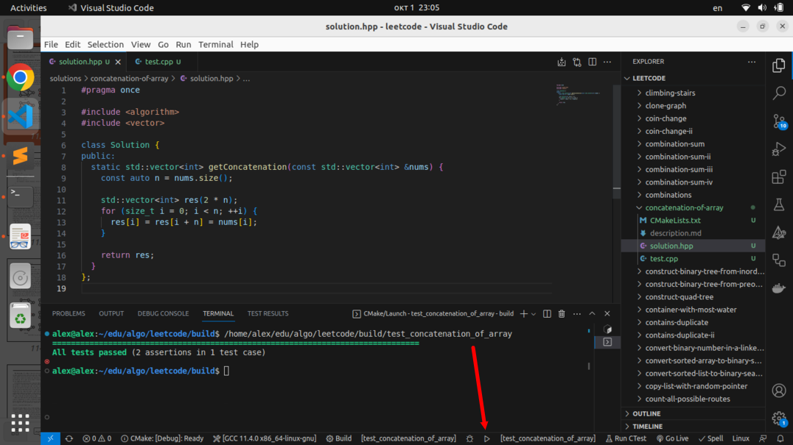

# LeetCode

LeetCode С++ solutions with VS Code.


## Setup VS Code

Install c++ compiler and cmake in Ubuntu:
```bash
sudo apt-get install build-essential
sudo apt-get install cmake
```

Install VS Code extensions (Ctrl+P):
```
ext install ms-vscode.cpptools
ext install ms-vscode.cpptools-extension-pack
ext install ms-vscode.cpptools-themes

ext install ms-vscode.cmake-tools
ext install twxs.cmake
ext install matepek.vscode-catch2-test-adapter

ext install ms-python.python
ext install ms-python.vscode-pylance
```

## Auto-Format in VS Code

Install clang-format in Ubuntu:

```bash
sudo apt install clang-format
```

Install VS Code extensions:

```
ext install xaver.clang-format
ext install ms-python.black-formatter
```

Add the following lines to your .vscode/settings.json file:

```json
{
    "editor.formatOnSave": true,
    "C_Cpp.default.configurationProvider": "ms-vscode.cmake-tools",
    "[python]": {
        "editor.defaultFormatter": "ms-python.black-formatter",
        "editor.formatOnSave": true
    },
    "python.formatting.provider": "none",
}
```

## Helper tool

Install helper tool:

```bash
python3 -m pip install leetcode/
```

Get problem by id:

```bash
leetcode pull 1929
```

The command above will generate several files, open them in the terminal:

```bash
code solutions/concatenation-of-array/solution.hpp
code solutions/concatenation-of-array/test.cpp
```

After writing the solution to the problem and the tests, use the VS Code status bar to run the tests:


Or use TestMate extension:


The command to get the LeetCode Daily question:

```bash
leetcode pull -d
```

## Accepted solutions

Due to [restrictions](https://github.com/orgs/community/discussions/23920) on the maximum number of characters in [README.md](./README.md) on the main page, the table below shows only part of the solved problems. The full list can be found in a separate file [PROBLEM_LIST.md](./PROBLEM_LIST.md).

<!-- accepted solution table -->

|№|Title|Code|Difficulty|Time / Space|Tags|Notes|
|-|-----|:--:|----------|:----------:|----|-----|
| 1. | [Two Sum](https://leetcode.com/problems/two-sum/) | [C++](./solutions/two-sum/solution.hpp) |  | O(N) / O(N)|   |  |
| 2. | [Add Two Numbers](https://leetcode.com/problems/add-two-numbers/) | [C++](./solutions/add-two-numbers/solution.hpp) |  | O(max(M,&nbsp;N)) / O(1)|    |  |
| 3. | [Longest Substring Without Repeating Characters](https://leetcode.com/problems/longest-substring-without-repeating-characters/) | [C++](./solutions/longest-substring-without-repeating-characters/solution.hpp) |  | O(N) / O(A)|    |  |
| 4. | [Median of Two Sorted Arrays](https://leetcode.com/problems/median-of-two-sorted-arrays/) | [C++](./solutions/median-of-two-sorted-arrays/solution.hpp) |  | O(log&nbsp;min(M,&nbsp;N)) / O(1)|    | [Medium](https://medium.com/@hazemu/1d3f2ecbeb46) |
| 5. | [Longest Palindromic Substring](https://leetcode.com/problems/longest-palindromic-substring/) | [C++](./solutions/longest-palindromic-substring/solution.hpp) |  | O(N) / O(N)|   | [Manacher's Algorithm](https://cp-algorithms.com/string/manacher.html) |
| 6. | [Zigzag Conversion](https://leetcode.com/problems/zigzag-conversion/) | [C++](./solutions/zigzag-conversion/solution.hpp) |  | O(N) / O(1)|  |  |
| 7. | [Reverse Integer](https://leetcode.com/problems/reverse-integer/) | [C++](./solutions/reverse-integer/solution.hpp) |  | O(logN) / O(1)|  |  |
| 8. | [String to Integer (atoi)](https://leetcode.com/problems/string-to-integer-atoi/) | [C++](./solutions/string-to-integer-atoi/solution.hpp) |  | O(N) / O(1)|  |  |
| 9. | [Palindrome Number](https://leetcode.com/problems/palindrome-number/) | [C++](./solutions/palindrome-number/solution.hpp) |  | O(logN) / O(1)|  |  |
| 10. | [Regular Expression Matching](https://leetcode.com/problems/regular-expression-matching/) | [C++](./solutions/regular-expression-matching/solution.hpp) |  | O(NM) / O(M)|    |  |
| 11. | [Container With Most Water](https://leetcode.com/problems/container-with-most-water/) | [C++](./solutions/container-with-most-water/solution.hpp) |  | O(N) / O(1)|    |  |
| 12. | [Integer to Roman](https://leetcode.com/problems/integer-to-roman/) | [C++](./solutions/integer-to-roman/solution.hpp) |  | O(N) / O(1)|    |  |
| 13. | [Roman to Integer](https://leetcode.com/problems/roman-to-integer/) | [C++](./solutions/roman-to-integer/solution.hpp) |  | O(N) / O(1)|    |  |
| 14. | [Longest Common Prefix](https://leetcode.com/problems/longest-common-prefix/) | [C++](./solutions/longest-common-prefix/solution.hpp) |  | O(NM) / O(1)|   |  |
| 15. | [3Sum](https://leetcode.com/problems/3sum/) | [C++](./solutions/3sum/solution.hpp) |  | O(N<sup>2</sup>) / O(N)|    |  |
| 16. | [3Sum Closest](https://leetcode.com/problems/3sum-closest/) | [C++](./solutions/3sum-closest/solution.hpp) |  | O(N<sup>2</sup>) / O(N)|    |  |
| 17. | [Letter Combinations of a Phone Number](https://leetcode.com/problems/letter-combinations-of-a-phone-number/) | [C++](./solutions/letter-combinations-of-a-phone-number/solution.hpp) |  | O(N4<sup>N</sup>) / O(N)|    |  |
| 18. | [4Sum](https://leetcode.com/problems/4sum/) | [C++](./solutions/4sum/solution.hpp) |  | O(N<sup>3</sup>) / O(N)|    |  |
| 19. | [Remove Nth Node From End of List](https://leetcode.com/problems/remove-nth-node-from-end-of-list/) | [C++](./solutions/remove-nth-node-from-end-of-list/solution.hpp) |  | O(N) / O(1)|   |  |
| 20. | [Valid Parentheses](https://leetcode.com/problems/valid-parentheses/) | [C++](./solutions/valid-parentheses/solution.hpp) |  | O(N) / O(N)|   |  |
| 21. | [Merge Two Sorted Lists](https://leetcode.com/problems/merge-two-sorted-lists/) | [C++](./solutions/merge-two-sorted-lists/solution.hpp) |  | O(N+M) / O(1)|   |  |
| 22. | [Generate Parentheses](https://leetcode.com/problems/generate-parentheses/) | [C++](./solutions/generate-parentheses/solution.hpp) |  | O(N4<sup>N</sup>) / O(N)|    |  |
| 23. | [Merge k Sorted Lists](https://leetcode.com/problems/merge-k-sorted-lists/) | [C++](./solutions/merge-k-sorted-lists/solution.hpp) |  | O(NKlogK) / O(K)|     |  |
| 24. | [Swap Nodes in Pairs](https://leetcode.com/problems/swap-nodes-in-pairs/) | [C++](./solutions/swap-nodes-in-pairs/solution.hpp) |  | O(N) / O(1)|   |  |
| 25. | [Reverse Nodes in k-Group](https://leetcode.com/problems/reverse-nodes-in-k-group/) | [C++](./solutions/reverse-nodes-in-k-group/solution.hpp) |  | O(N) / O(1)|   |  |
| 26. | [Remove Duplicates from Sorted Array](https://leetcode.com/problems/remove-duplicates-from-sorted-array/) | [C++](./solutions/remove-duplicates-from-sorted-array/solution.hpp) |  | O(N) / O(1)|   |  |
| 27. | [Remove Element](https://leetcode.com/problems/remove-element/) | [C++](./solutions/remove-element/solution.hpp) |  | O(N) / O(1)|   |  |
| 28. | [Find the Index of the First Occurrence in a String](https://leetcode.com/problems/find-the-index-of-the-first-occurrence-in-a-string/) | [C++](./solutions/find-the-index-of-the-first-occurrence-in-a-string/solution.hpp) |  | O(N) / O(M)|    | [Knuth-Morris-Pratt Algorithm](https://w.wiki/7$3A) |
| 29. | [Divide Two Integers](https://leetcode.com/problems/divide-two-integers/) | [C++](./solutions/divide-two-integers/solution.hpp) |  | O(log<sup>2</sup>N) / O(1)|   |  |
| 30. | [Substring with Concatenation of All Words](https://leetcode.com/problems/substring-with-concatenation-of-all-words/) | [C++](./solutions/substring-with-concatenation-of-all-words/solution.hpp) |  | O(NK) / O(M)|    |  |
| 31. | [Next Permutation](https://leetcode.com/problems/next-permutation/) | [C++](./solutions/next-permutation/solution.hpp) |  | O(N) / O(1)|   |  |
| 32. | [Longest Valid Parentheses](https://leetcode.com/problems/longest-valid-parentheses/) | [C++](./solutions/longest-valid-parentheses/solution.hpp) |  | O(N) / O(N)|    |  |
| 33. | [Search in Rotated Sorted Array](https://leetcode.com/problems/search-in-rotated-sorted-array/) | [C++](./solutions/search-in-rotated-sorted-array/solution.hpp) |  | O(logN) / O(1)|   |  |
| 34. | [Find First and Last Position of Element in Sorted Array](https://leetcode.com/problems/find-first-and-last-position-of-element-in-sorted-array/) | [C++](./solutions/find-first-and-last-position-of-element-in-sorted-array/solution.hpp) |  | O(logN) / O(1)|   |  |
| 35. | [Search Insert Position](https://leetcode.com/problems/search-insert-position/) | [C++](./solutions/search-insert-position/solution.hpp) |  | O(logN) / O(1)|   |  |
| 36. | [Valid Sudoku](https://leetcode.com/problems/valid-sudoku/) | [C++](./solutions/valid-sudoku/solution.hpp) |  | O(1) / O(1)|    |  |
| 37. | [Sudoku Solver](https://leetcode.com/problems/sudoku-solver/) | [C++](./solutions/sudoku-solver/solution.hpp) |  | O(N<sup>N<sup>2</sup></sup>) / O(N<sup>2</sup>)|     | [Sudoku solving](https://w.wiki/3F$y) |
| 38. | [Count and Say](https://leetcode.com/problems/count-and-say/) | [C++](./solutions/count-and-say/solution.hpp) |  | O(L<sup>N</sup>) / O(L<sup>N</sup>)|  | [Look and Say](https://w.wiki/7$3C) |
| 39. | [Combination Sum](https://leetcode.com/problems/combination-sum/) | [C++](./solutions/combination-sum/solution.hpp) |  | O(N<sup>1+T/M</sup>) / O(T/M)|   |  |
| 40. | [Combination Sum II](https://leetcode.com/problems/combination-sum-ii/) | [C++](./solutions/combination-sum-ii/solution.hpp) |  | O(N2<sup>N</sup>) / O(N)|   |  |
| 41. | [First Missing Positive](https://leetcode.com/problems/first-missing-positive/) | [C++](./solutions/first-missing-positive/solution.hpp) |  | O(N) / O(1)|   |  |
| 42. | [Trapping Rain Water](https://leetcode.com/problems/trapping-rain-water/) | [C++](./solutions/trapping-rain-water/solution.hpp) |  | O(N) / O(1)|      |  |
| 43. | [Multiply Strings](https://leetcode.com/problems/multiply-strings/) | [C++](./solutions/multiply-strings/solution.hpp) |  | O(NM) / O(N+M)|    |  |
| 44. | [Wildcard Matching](https://leetcode.com/problems/wildcard-matching/) | [C++](./solutions/wildcard-matching/solution.hpp) |  | O(NM) / O(1)|     |  |
| 45. | [Jump Game II](https://leetcode.com/problems/jump-game-ii/) | [C++](./solutions/jump-game-ii/solution.hpp) |  | O(N) / O(1)|    |  |
| 46. | [Permutations](https://leetcode.com/problems/permutations/) | [C++](./solutions/permutations/solution.hpp) |  | O(N!) / O(N)|   |  |
| 47. | [Permutations II](https://leetcode.com/problems/permutations-ii/) | [C++](./solutions/permutations-ii/solution.hpp) |  | O(N!) / O(N)|   |  |
| 48. | [Rotate Image](https://leetcode.com/problems/rotate-image/) | [C++](./solutions/rotate-image/solution.hpp) |  | O(N<sup>2</sup>) / O(1)|    |  |
| 49. | [Group Anagrams](https://leetcode.com/problems/group-anagrams/) | [C++](./solutions/group-anagrams/solution.hpp) |  | O(NM) / O(NM)|     |  |
| 50. | [Pow(x, n)](https://leetcode.com/problems/powx-n/) | [C++](./solutions/powx-n/solution.hpp) |  | O(log&nbsp;N) / O(1)|   | [Fast Exp](https://w.wiki/4LjE) |
| 51. | [N-Queens](https://leetcode.com/problems/n-queens/) | [C++](./solutions/n-queens/solution.hpp) |  | O(N!) / O(N<sup>2</sup>)|   |  |
| 52. | [N-Queens II](https://leetcode.com/problems/n-queens-ii/) | [C++](./solutions/n-queens-ii/solution.hpp) |  | O(N!) / O(N)|  | [Eight queens puzzle](https://w.wiki/84eA) |
| 53. | [Maximum Subarray](https://leetcode.com/problems/maximum-subarray/) | [C++](./solutions/maximum-subarray/solution.hpp) |  | O(N) / O(1)|    | [Kadane's algorithm](https://w.wiki/62dv) |
| 54. | [Spiral Matrix](https://leetcode.com/problems/spiral-matrix/) | [C++](./solutions/spiral-matrix/solution.hpp) |  | O(NM) / O(1)|    |  |
| 55. | [Jump Game](https://leetcode.com/problems/jump-game/) | [C++](./solutions/jump-game/solution.hpp) |  | O(N) / O(1)|    |  |
| 56. | [Merge Intervals](https://leetcode.com/problems/merge-intervals/) | [C++](./solutions/merge-intervals/solution.hpp) |  | O(NlogN) / O(N)|   |  |
| 57. | [Insert Interval](https://leetcode.com/problems/insert-interval/) | [C++](./solutions/insert-interval/solution.hpp) |  | O(N) / O(1)|  |  |
| 58. | [Length of Last Word](https://leetcode.com/problems/length-of-last-word/) | [C++](./solutions/length-of-last-word/solution.hpp) |  | O(N) / O(1)|  |  |
| 59. | [Spiral Matrix II](https://leetcode.com/problems/spiral-matrix-ii/) | [C++](./solutions/spiral-matrix-ii/solution.hpp) |  | O(N<sup>2</sup>) / O(1)|    |  |
| 60. | [Permutation Sequence](https://leetcode.com/problems/permutation-sequence/) | [C++](./solutions/permutation-sequence/solution.hpp) |  | O(N<sup>2</sup>) / O(N)|   |  |
| 61. | [Rotate List](https://leetcode.com/problems/rotate-list/) | [C++](./solutions/rotate-list/solution.hpp) |  | O(N) / O(1)|   |  |
| 62. | [Unique Paths](https://leetcode.com/problems/unique-paths/) | [C++](./solutions/unique-paths/solution.hpp) |  | O(min(N,&nbsp;M)) / O(1)|    |  |
| 63. | [Unique Paths II](https://leetcode.com/problems/unique-paths-ii/) | [C++](./solutions/unique-paths-ii/solution.hpp) |  | O(NM) / O(N)|    |  |
| 64. | [Minimum Path Sum](https://leetcode.com/problems/minimum-path-sum/) | [C++](./solutions/minimum-path-sum/solution.hpp) |  | O(NM) / O(1)|    |  |
| 65. | [Valid Number](https://leetcode.com/problems/valid-number/) | [C++](./solutions/valid-number/solution.hpp) |  | O(N) / O(1)|  |  |
| 66. | [Plus One](https://leetcode.com/problems/plus-one/) | [C++](./solutions/plus-one/solution.hpp) |  | O(N) / O(1)|   |  |
| 67. | [Add Binary](https://leetcode.com/problems/add-binary/) | [C++](./solutions/add-binary/solution.hpp) |  | O(max(N,&nbsp;M)) / O(1)|     |  |
| 68. | [Text Justification](https://leetcode.com/problems/text-justification/) | [C++](./solutions/text-justification/solution.hpp) |  | O(NM) / O(W)|    |  |
| 69. | [Sqrt(x)](https://leetcode.com/problems/sqrtx/) | [C++](./solutions/sqrtx/solution.hpp) |  | O(logN) / O(1)|   |  |
| 70. | [Climbing Stairs](https://leetcode.com/problems/climbing-stairs/) | [C++](./solutions/climbing-stairs/solution.hpp) |  | O(N) / O(1)|    |  |
| 71. | [Simplify Path](https://leetcode.com/problems/simplify-path/) | [C++](./solutions/simplify-path/solution.hpp) |  | O(N) / O(N)|   |  |
| 72. | [Edit Distance](https://leetcode.com/problems/edit-distance/) | [C++](./solutions/edit-distance/solution.hpp) |  | O(NM) / O(min(N,&nbsp;M))|   |  |
| 73. | [Set Matrix Zeroes](https://leetcode.com/problems/set-matrix-zeroes/) | [C++](./solutions/set-matrix-zeroes/solution.hpp) |  | O(NM) / O(1)|    |  |
| 74. | [Search a 2D Matrix](https://leetcode.com/problems/search-a-2d-matrix/) | [C++](./solutions/search-a-2d-matrix/solution.hpp) |  | O(NMlogNM) / O(1)|    |  |
| 75. | [Sort Colors](https://leetcode.com/problems/sort-colors/) | [C++](./solutions/sort-colors/solution.hpp) |  | O(N) / O(1)|    |  |
| 76. | [Minimum Window Substring](https://leetcode.com/problems/minimum-window-substring/) | [C++](./solutions/minimum-window-substring/solution.hpp) |  | O(N+M) / O(A)|    |  |
| 77. | [Combinations](https://leetcode.com/problems/combinations/) | [C++](./solutions/combinations/solution.hpp) |  | O(KC(N,K)) / O(K)|  |  |
| 78. | [Subsets](https://leetcode.com/problems/subsets/) | [C++](./solutions/subsets/solution.hpp) |  | O(N2<sup>N</sup>) / O(N)|    |  |
| 79. | [Word Search](https://leetcode.com/problems/word-search/) | [C++](./solutions/word-search/solution.hpp) |  | O(NM4<sup>K</sup>) / O(K)|    |  |
| 80. | [Remove Duplicates from Sorted Array II](https://leetcode.com/problems/remove-duplicates-from-sorted-array-ii/) | [C++](./solutions/remove-duplicates-from-sorted-array-ii/solution.hpp) |  | O(N) / O(1)|   |  |
| 81. | [Search in Rotated Sorted Array II](https://leetcode.com/problems/search-in-rotated-sorted-array-ii/) | [C++](./solutions/search-in-rotated-sorted-array-ii/solution.hpp) |  | O(N) / O(1)|   |  |
| 82. | [Remove Duplicates from Sorted List II](https://leetcode.com/problems/remove-duplicates-from-sorted-list-ii/) | [C++](./solutions/remove-duplicates-from-sorted-list-ii/solution.hpp) |  | O(N) / O(1)|   |  |
| 83. | [Remove Duplicates from Sorted List](https://leetcode.com/problems/remove-duplicates-from-sorted-list/) | [C++](./solutions/remove-duplicates-from-sorted-list/solution.hpp) |  | O(N) / O(1)|  |  |
| 84. | [Largest Rectangle in Histogram](https://leetcode.com/problems/largest-rectangle-in-histogram/) | [C++](./solutions/largest-rectangle-in-histogram/solution.hpp) |  | O(N) / O(N)|    |  |
| 85. | [Maximal Rectangle](https://leetcode.com/problems/maximal-rectangle/) | [C++](./solutions/maximal-rectangle/solution.hpp) |  | O(MN) / O(N)|      |  |
| 86. | [Partition List](https://leetcode.com/problems/partition-list/) | [C++](./solutions/partition-list/solution.hpp) |  | O(N) / O(1)|   |  |
| 87. | [Scramble String](https://leetcode.com/problems/scramble-string/) | [C++](./solutions/scramble-string/solution.hpp) |  | O(N<sup>4</sup>) / O(N<sup>3</sup>)|   |  |
| 88. | [Merge Sorted Array](https://leetcode.com/problems/merge-sorted-array/) | [C++](./solutions/merge-sorted-array/solution.hpp) |  | O(N+M) / O(1)|    |  |
| 89. | [Gray Code](https://leetcode.com/problems/gray-code/) | [C++](./solutions/gray-code/solution.hpp) |  | O(2<sup>N</sup>) / O(1)|    | [Gray code](https://w.wiki/84e8) |
| 90. | [Subsets II](https://leetcode.com/problems/subsets-ii/) | [C++](./solutions/subsets-ii/solution.hpp) |  | O(N2<sup>N</sup>) / O(N)|    |  |
| 91. | [Decode Ways](https://leetcode.com/problems/decode-ways/) | [C++](./solutions/decode-ways/solution.hpp) |  | O(N) / O(N)|   |  |
| 92. | [Reverse Linked List II](https://leetcode.com/problems/reverse-linked-list-ii/) | [C++](./solutions/reverse-linked-list-ii/solution.hpp) |  | O(N) / O(1)|  |  |
| 93. | [Restore IP Addresses](https://leetcode.com/problems/restore-ip-addresses/) | [C++](./solutions/restore-ip-addresses/solution.hpp) |  | O(NM<sup>N</sup>) / O(N)|   |  |
| 94. | [Binary Tree Inorder Traversal](https://leetcode.com/problems/binary-tree-inorder-traversal/) | [C++](./solutions/binary-tree-inorder-traversal/solution.hpp) |  | O(N) / O(N)|     |  |
| 95. | [Unique Binary Search Trees II](https://leetcode.com/problems/unique-binary-search-trees-ii/) | [C++](./solutions/unique-binary-search-trees-ii/solution.hpp) |  | O(G(N)) / O(G(N))|      |  |
| 96. | [Unique Binary Search Trees](https://leetcode.com/problems/unique-binary-search-trees/) | [C++](./solutions/unique-binary-search-trees/solution.hpp) |  | O(N) / O(1)|      | [Catalan Number](https://w.wiki/845b) |
| 97. | [Interleaving String](https://leetcode.com/problems/interleaving-string/) | [C++](./solutions/interleaving-string/solution.hpp) |  | O(NM) / O(min(N,&nbsp;M))|   |  |
| 98. | [Validate Binary Search Tree](https://leetcode.com/problems/validate-binary-search-tree/) | [C++](./solutions/validate-binary-search-tree/solution.hpp) |  | O(N) / O(N)|     |  |
| 99. | [Recover Binary Search Tree](https://leetcode.com/problems/recover-binary-search-tree/) | [C++](./solutions/recover-binary-search-tree/solution.hpp) |  | O(N) / O(1)|     | [Threaded Binary Tree](https://w.wiki/84dw) |
| 100. | [Same Tree](https://leetcode.com/problems/same-tree/) | [C++](./solutions/same-tree/solution.hpp) |  | O(min(N,&nbsp;M)) / O(min(N,&nbsp;M))|     |  |
| 101. | [Symmetric Tree](https://leetcode.com/problems/symmetric-tree/) | [C++](./solutions/symmetric-tree/solution.hpp) |  | O(N) / O(N)|     |  |
| 102. | [Binary Tree Level Order Traversal](https://leetcode.com/problems/binary-tree-level-order-traversal/) | [C++](./solutions/binary-tree-level-order-traversal/solution.hpp) |  | O(N) / O(N)|    |  |
| 103. | [Binary Tree Zigzag Level Order Traversal](https://leetcode.com/problems/binary-tree-zigzag-level-order-traversal/) | [C++](./solutions/binary-tree-zigzag-level-order-traversal/solution.hpp) |  | O(N) / O(N)|    |  |
| 104. | [Maximum Depth of Binary Tree](https://leetcode.com/problems/maximum-depth-of-binary-tree/) | [C++](./solutions/maximum-depth-of-binary-tree/solution.hpp) |  | O(N) / O(N)|     |  |
| 105. | [Construct Binary Tree from Preorder and Inorder Traversal](https://leetcode.com/problems/construct-binary-tree-from-preorder-and-inorder-traversal/) | [C++](./solutions/construct-binary-tree-from-preorder-and-inorder-traversal/solution.hpp) |  | O(N) / O(N)|      |  |
| 106. | [Construct Binary Tree from Inorder and Postorder Traversal](https://leetcode.com/problems/construct-binary-tree-from-inorder-and-postorder-traversal/) | [C++](./solutions/construct-binary-tree-from-inorder-and-postorder-traversal/solution.hpp) |  | O(N) / O(N)|      |  |
| 107. | [Binary Tree Level Order Traversal II](https://leetcode.com/problems/binary-tree-level-order-traversal-ii/) | [C++](./solutions/binary-tree-level-order-traversal-ii/solution.hpp) |  | O(N) / O(N)|    |  |
| 108. | [Convert Sorted Array to Binary Search Tree](https://leetcode.com/problems/convert-sorted-array-to-binary-search-tree/) | [C++](./solutions/convert-sorted-array-to-binary-search-tree/solution.hpp) |  | O(N) / O(logN)|      |  |
| 109. | [Convert Sorted List to Binary Search Tree](https://leetcode.com/problems/convert-sorted-list-to-binary-search-tree/) | [C++](./solutions/convert-sorted-list-to-binary-search-tree/solution.hpp) |  | O(N) / O(logN)|      |  |
| 110. | [Balanced Binary Tree](https://leetcode.com/problems/balanced-binary-tree/) | [C++](./solutions/balanced-binary-tree/solution.hpp) |  | O(N) / O(N)|    |  |
| 111. | [Minimum Depth of Binary Tree](https://leetcode.com/problems/minimum-depth-of-binary-tree/) | [C++](./solutions/minimum-depth-of-binary-tree/solution.hpp) |  | O(N) / O(N)|     |  |
| 112. | [Path Sum](https://leetcode.com/problems/path-sum/) | [C++](./solutions/path-sum/solution.hpp) |  | O(N) / O(N)|     |  |
| 113. | [Path Sum II](https://leetcode.com/problems/path-sum-ii/) | [C++](./solutions/path-sum-ii/solution.hpp) |  | O(N<sup>2</sup>) / O(N)|     |  |
| 114. | [Flatten Binary Tree to Linked List](https://leetcode.com/problems/flatten-binary-tree-to-linked-list/) | [C++](./solutions/flatten-binary-tree-to-linked-list/solution.hpp) |  | O(N) / O(1)|      |  |
| 115. | [Distinct Subsequences](https://leetcode.com/problems/distinct-subsequences/) | [C++](./solutions/distinct-subsequences/solution.hpp) |  | O(NM) / O(min(N,&nbsp;M))|   |  |
| 116. | [Populating Next Right Pointers in Each Node](https://leetcode.com/problems/populating-next-right-pointers-in-each-node/) | [C++](./solutions/populating-next-right-pointers-in-each-node/solution.hpp) |  | O(N) / O(1)|      |  |
| 117. | [Populating Next Right Pointers in Each Node II](https://leetcode.com/problems/populating-next-right-pointers-in-each-node-ii/) | [C++](./solutions/populating-next-right-pointers-in-each-node-ii/solution.hpp) |  | O(N) / O(1)|      |  |
| 118. | [Pascal's Triangle](https://leetcode.com/problems/pascals-triangle/) | [C++](./solutions/pascals-triangle/solution.hpp) |  | O(N<sup>2</sup>) / O(N<sup>2</sup>)|   |  |
| 119. | [Pascal's Triangle II](https://leetcode.com/problems/pascals-triangle-ii/) | [C++](./solutions/pascals-triangle-ii/solution.hpp) |  | O(N<sup>2</sup>) / O(N)|   |  |
| 120. | [Triangle](https://leetcode.com/problems/triangle/) | [C++](./solutions/triangle/solution.hpp) |  | O(N<sup>2</sup>) / O(N)|   |  |
| 121. | [Best Time to Buy and Sell Stock](https://leetcode.com/problems/best-time-to-buy-and-sell-stock/) | [C++](./solutions/best-time-to-buy-and-sell-stock/solution.hpp) |  | O(N) / O(1)|   |  |
| 122. | [Best Time to Buy and Sell Stock II](https://leetcode.com/problems/best-time-to-buy-and-sell-stock-ii/) | [C++](./solutions/best-time-to-buy-and-sell-stock-ii/solution.hpp) |  | O(N) / O(1)|    |  |
| 123. | [Best Time to Buy and Sell Stock III](https://leetcode.com/problems/best-time-to-buy-and-sell-stock-iii/) | [C++](./solutions/best-time-to-buy-and-sell-stock-iii/solution.hpp) |  | O(N) / O(1)|   |  |
| 124. | [Binary Tree Maximum Path Sum](https://leetcode.com/problems/binary-tree-maximum-path-sum/) | [C++](./solutions/binary-tree-maximum-path-sum/solution.hpp) |  | O(N) / O(N)|     |  |
| 125. | [Valid Palindrome](https://leetcode.com/problems/valid-palindrome/) | [C++](./solutions/valid-palindrome/solution.hpp) |  | O(N) / O(1)|   |  |
| 126. | [Word Ladder II](https://leetcode.com/problems/word-ladder-ii/) | [C++](./solutions/word-ladder-ii/solution.hpp) |  | O(NA<sup>K</sup>) / O(NK)|     |  |
| 127. | [Word Ladder](https://leetcode.com/problems/word-ladder/) | [C++](./solutions/word-ladder/solution.hpp) |  | O(NA<sup>K</sup>) / O(N)|    |  |
| 128. | [Longest Consecutive Sequence](https://leetcode.com/problems/longest-consecutive-sequence/) | [C++](./solutions/longest-consecutive-sequence/solution.hpp) |  | O(N) / O(N)|    |  |
| 129. | [Sum Root to Leaf Numbers](https://leetcode.com/problems/sum-root-to-leaf-numbers/) | [C++](./solutions/sum-root-to-leaf-numbers/solution.hpp) |  | O(N) / O(N)|    |  |
| 130. | [Surrounded Regions](https://leetcode.com/problems/surrounded-regions/) | [C++](./solutions/surrounded-regions/solution.hpp) |  | O(NM) / O(1)|      |  |
| 131. | [Palindrome Partitioning](https://leetcode.com/problems/palindrome-partitioning/) | [C++](./solutions/palindrome-partitioning/solution.hpp) |  | O(N2<sup>N</sup>) / O(N)|    |  |
| 132. | [Palindrome Partitioning II](https://leetcode.com/problems/palindrome-partitioning-ii/) | [C++](./solutions/palindrome-partitioning-ii/solution.hpp) |  | O(N<sup>2</sup>) / O(N)|   | [Manacher's Algorithm](https://cp-algorithms.com/string/manacher.html) |
| 133. | [Clone Graph](https://leetcode.com/problems/clone-graph/) | [C++](./solutions/clone-graph/solution.hpp) |  | O(V+E) / O(V)|     |  |
| 134. | [Gas Station](https://leetcode.com/problems/gas-station/) | [C++](./solutions/gas-station/solution.hpp) |  | O(N) / O(1)|   |  |
| 135. | [Candy](https://leetcode.com/problems/candy/) | [C++](./solutions/candy/solution.hpp) |  | O(N) / O(N)|   |  |
| 136. | [Single Number](https://leetcode.com/problems/single-number/) | [C++](./solutions/single-number/solution.hpp) |  | O(N) / O(1)|   |  |
| 137. | [Single Number II](https://leetcode.com/problems/single-number-ii/) | [C++](./solutions/single-number-ii/solution.hpp) |  | O(N) / O(1)|   |  |
| 138. | [Copy List with Random Pointer](https://leetcode.com/problems/copy-list-with-random-pointer/) | [C++](./solutions/copy-list-with-random-pointer/solution.hpp) |  | O(N) / O(N)|   |  |
| 139. | [Word Break](https://leetcode.com/problems/word-break/) | [C++](./solutions/word-break/solution.hpp) |  | O(NK<sup>2</sup>) / O(M+N)|       |  |
| 140. | [Word Break II](https://leetcode.com/problems/word-break-ii/) | [C++](./solutions/word-break-ii/solution.hpp) |  | O(2<sup>N</sup>) / O(2<sup>N</sup>)|        |  |
| 141. | [Linked List Cycle](https://leetcode.com/problems/linked-list-cycle/) | [C++](./solutions/linked-list-cycle/solution.hpp) |  | O(N) / O(1)|    |  |
| 142. | [Linked List Cycle II](https://leetcode.com/problems/linked-list-cycle-ii/) | [C++](./solutions/linked-list-cycle-ii/solution.hpp) |  | O(N) / O(1)|    |  |
| 143. | [Reorder List](https://leetcode.com/problems/reorder-list/) | [C++](./solutions/reorder-list/solution.hpp) |  | O(N) / O(1)|     |  |
| 144. | [Binary Tree Preorder Traversal](https://leetcode.com/problems/binary-tree-preorder-traversal/) | [C++](./solutions/binary-tree-preorder-traversal/solution.hpp) |  | O(N) / O(N)|     |  |
| 145. | [Binary Tree Postorder Traversal](https://leetcode.com/problems/binary-tree-postorder-traversal/) | [C++](./solutions/binary-tree-postorder-traversal/solution.hpp) |  | O(N) / O(N)|     |  |
| 146. | [LRU Cache](https://leetcode.com/problems/lru-cache/) | [C++](./solutions/lru-cache/solution.hpp) |  | O(1) / O(C)|     |  |
| 147. | [Insertion Sort List](https://leetcode.com/problems/insertion-sort-list/) | [C++](./solutions/insertion-sort-list/solution.hpp) |  | O(N<sup>2</sup>) / O(1)|   |  |
| 148. | [Sort List](https://leetcode.com/problems/sort-list/) | [C++](./solutions/sort-list/solution.hpp) |  | O(NlogN) / O(1)|      |  |
| 149. | [Max Points on a Line](https://leetcode.com/problems/max-points-on-a-line/) | [C++](./solutions/max-points-on-a-line/solution.hpp) |  | O(N<sup>2</sup>) / O(N)|     |  |
| 150. | [Evaluate Reverse Polish Notation](https://leetcode.com/problems/evaluate-reverse-polish-notation/) | [C++](./solutions/evaluate-reverse-polish-notation/solution.hpp) |  | O(N) / O(N)|    |  |
| 151. | [Reverse Words in a String](https://leetcode.com/problems/reverse-words-in-a-string/) | [C++](./solutions/reverse-words-in-a-string/solution.hpp) |  | O(N) / O(1)|   |  |
| 152. | [Maximum Product Subarray](https://leetcode.com/problems/maximum-product-subarray/) | [C++](./solutions/maximum-product-subarray/solution.hpp) |  | O(N) / O(1)|   |  |
| 153. | [Find Minimum in Rotated Sorted Array](https://leetcode.com/problems/find-minimum-in-rotated-sorted-array/) | [C++](./solutions/find-minimum-in-rotated-sorted-array/solution.hpp) |  | O(logN) / O(1)|   |  |
| 154. | [Find Minimum in Rotated Sorted Array II](https://leetcode.com/problems/find-minimum-in-rotated-sorted-array-ii/) | [C++](./solutions/find-minimum-in-rotated-sorted-array-ii/solution.hpp) |  | O(N) / O(1)|   |  |
| 155. | [Min Stack](https://leetcode.com/problems/min-stack/) | [C++](./solutions/min-stack/solution.hpp) |  | O(1) / O(N)|   |  |
| 159. | [Longest Substring with At Most Two Distinct Characters 🔒](https://leetcode.com/problems/longest-substring-with-at-most-two-distinct-characters/) | [C++](./solutions/longest-substring-with-at-most-two-distinct-characters/solution.hpp) |  | O(N) / O(A)|    |  |
| 160. | [Intersection of Two Linked Lists](https://leetcode.com/problems/intersection-of-two-linked-lists/) | [C++](./solutions/intersection-of-two-linked-lists/solution.hpp) |  | O(N+M) / O(1)|    |  |
| 161. | [One Edit Distance 🔒](https://leetcode.com/problems/one-edit-distance/) | [C++](./solutions/one-edit-distance/solution.hpp) |  | O(N) / O(1)|   |  |
| 162. | [Find Peak Element](https://leetcode.com/problems/find-peak-element/) | [C++](./solutions/find-peak-element/solution.hpp) |  | O(logN) / O(1)|   |  |
| 163. | [Missing Ranges 🔒](https://leetcode.com/problems/missing-ranges/) | [C++](./solutions/missing-ranges/solution.hpp) |  | O(N) / O(1)|  |  |
| 164. | [Maximum Gap](https://leetcode.com/problems/maximum-gap/) | [C++](./solutions/maximum-gap/solution.hpp) |  | O(N) / O(N)|     |  |
| 165. | [Compare Version Numbers](https://leetcode.com/problems/compare-version-numbers/) | [C++](./solutions/compare-version-numbers/solution.hpp) |  | O(N) / O(1)|   |  |
| 166. | [Fraction to Recurring Decimal](https://leetcode.com/problems/fraction-to-recurring-decimal/) | [C++](./solutions/fraction-to-recurring-decimal/solution.hpp) |  | O(N) / O(1)|    |  |
| 167. | [Two Sum II - Input Array Is Sorted](https://leetcode.com/problems/two-sum-ii-input-array-is-sorted/) | [C++](./solutions/two-sum-ii-input-array-is-sorted/solution.hpp) |  | O(N) / O(1)|    |  |
| 168. | [Excel Sheet Column Title](https://leetcode.com/problems/excel-sheet-column-title/) | [C++](./solutions/excel-sheet-column-title/solution.hpp) |  | O(logN) / O(1)|   |  |
| 169. | [Majority Element](https://leetcode.com/problems/majority-element/) | [C++](./solutions/majority-element/solution.hpp) |  | O(N) / O(1)|      |  |
| 171. | [Excel Sheet Column Number](https://leetcode.com/problems/excel-sheet-column-number/) | [C++](./solutions/excel-sheet-column-number/solution.hpp) |  | O(N) / O(1)|   |  |
| 172. | [Factorial Trailing Zeroes](https://leetcode.com/problems/factorial-trailing-zeroes/) | [C++](./solutions/factorial-trailing-zeroes/solution.hpp) |  | O(logN) / O(1)|  |  |
| 173. | [Binary Search Tree Iterator](https://leetcode.com/problems/binary-search-tree-iterator/) | [C++](./solutions/binary-search-tree-iterator/solution.hpp) |  | O(1) / O(1)|       |  |
| 174. | [Dungeon Game](https://leetcode.com/problems/dungeon-game/) | [C++](./solutions/dungeon-game/solution.hpp) |  | O(NM) / O(N)|    |  |
| 175. | [Combine Two Tables](https://leetcode.com/problems/combine-two-tables/) | [SQL](./extra/sql/combine-two-tables/solution.sql), [PY](./extra/pandas/combine-two-tables/solution.py) |  | |  |  |
| 176. | [Second Highest Salary](https://leetcode.com/problems/second-highest-salary/) | [SQL](./extra/sql/second-highest-salary/solution.sql), [PY](./extra/pandas/second-highest-salary/solution.py) |  | |  |  |
| 177. | [Nth Highest Salary](https://leetcode.com/problems/nth-highest-salary/) | [SQL](./extra/sql/nth-highest-salary/solution.sql), [PY](./extra/pandas/nth-highest-salary/solution.py) |  | |  |  |
| 178. | [Rank Scores](https://leetcode.com/problems/rank-scores/) | [SQL](./extra/sql/rank-scores/solution.sql), [PY](./extra/pandas/rank-scores/solution.py) |  | |  |  |
| 179. | [Largest Number](https://leetcode.com/problems/largest-number/) | [C++](./solutions/largest-number/solution.hpp) |  | O(NlogN) / O(N)|     |  |
| 180. | [Consecutive Numbers](https://leetcode.com/problems/consecutive-numbers/) | [SQL](./extra/sql/consecutive-numbers/solution.sql), [PY](./extra/pandas/consecutive-numbers/solution.py) |  | |  |  |
| 181. | [Employees Earning More Than Their Managers](https://leetcode.com/problems/employees-earning-more-than-their-managers/) | [SQL](./extra/sql/employees-earning-more-than-their-managers/solution.sql), [PY](./extra/pandas/employees-earning-more-than-their-managers/solution.py) |  | |  |  |
| 182. | [Duplicate Emails](https://leetcode.com/problems/duplicate-emails/) | [SQL](./extra/sql/duplicate-emails/solution.sql), [PY](./extra/pandas/duplicate-emails/solution.py) |  | |  |  |
| 183. | [Customers Who Never Order](https://leetcode.com/problems/customers-who-never-order/) | [SQL](./extra/sql/customers-who-never-order/solution.sql), [PY](./extra/pandas/customers-who-never-order/solution.py) |  | |  |  |
| 184. | [Department Highest Salary](https://leetcode.com/problems/department-highest-salary/) | [SQL](./extra/sql/department-highest-salary/solution.sql), [PY](./extra/pandas/department-highest-salary/solution.py) |  | |  |  |
| 185. | [Department Top Three Salaries](https://leetcode.com/problems/department-top-three-salaries/) | [SQL](./extra/sql/department-top-three-salaries/solution.sql), [PY](./extra/pandas/department-top-three-salaries/solution.py) |  | |  |  |
| 186. | [Reverse Words in a String II 🔒](https://leetcode.com/problems/reverse-words-in-a-string-ii/) | [C++](./solutions/reverse-words-in-a-string-ii/solution.hpp) |  | O(N) / O(1)|   |  |
| 187. | [Repeated DNA Sequences](https://leetcode.com/problems/repeated-dna-sequences/) | [C++](./solutions/repeated-dna-sequences/solution.hpp) |  | O(NK) / O(4<sup>K</sup>/W)|       |  |
| 188. | [Best Time to Buy and Sell Stock IV](https://leetcode.com/problems/best-time-to-buy-and-sell-stock-iv/) | [C++](./solutions/best-time-to-buy-and-sell-stock-iv/solution.hpp) |  | O(NK) / O(K)|   |  |
| 189. | [Rotate Array](https://leetcode.com/problems/rotate-array/) | [C++](./solutions/rotate-array/solution.hpp) |  | O(N) / O(1)|    |  |
| 190. | [Reverse Bits](https://leetcode.com/problems/reverse-bits/) | [C++](./solutions/reverse-bits/solution.hpp) |  | O(loglogN) / O(1)|   |  |
| 191. | [Number of 1 Bits](https://leetcode.com/problems/number-of-1-bits/) | [C++](./solutions/number-of-1-bits/solution.hpp) |  | O(1) / O(1)|   |  |
| 192. | [Word Frequency](https://leetcode.com/problems/word-frequency/) | [SH](./extra/bash/word-frequency/solution.sh) |  | |  |  |
| 193. | [Valid Phone Numbers](https://leetcode.com/problems/valid-phone-numbers/) | [SH](./extra/bash/valid-phone-numbers/solution.sh) |  | |  |  |
| 194. | [Transpose File](https://leetcode.com/problems/transpose-file/) | [SH](./extra/bash/transpose-file/solution.sh) |  | |  |  |
| 195. | [Tenth Line](https://leetcode.com/problems/tenth-line/) | [SH](./extra/bash/tenth-line/solution.sh) |  | |  |  |
| 196. | [Delete Duplicate Emails](https://leetcode.com/problems/delete-duplicate-emails/) | [SQL](./extra/sql/delete-duplicate-emails/solution.sql), [PY](./extra/pandas/delete-duplicate-emails/solution.py) |  | |  |  |
| 197. | [Rising Temperature](https://leetcode.com/problems/rising-temperature/) | [SQL](./extra/sql/rising-temperature/solution.sql), [PY](./extra/pandas/rising-temperature/solution.py) |  | |  |  |
| 198. | [House Robber](https://leetcode.com/problems/house-robber/) | [C++](./solutions/house-robber/solution.hpp) |  | O(N) / O(1)|   |  |
| 199. | [Binary Tree Right Side View](https://leetcode.com/problems/binary-tree-right-side-view/) | [C++](./solutions/binary-tree-right-side-view/solution.hpp) |  | O(N) / O(N)|     |  |
| 200. | [Number of Islands](https://leetcode.com/problems/number-of-islands/) | [C++](./solutions/number-of-islands/solution.hpp) |  | O(NM) / O(NM)|      |  |
| 201. | [Bitwise AND of Numbers Range](https://leetcode.com/problems/bitwise-and-of-numbers-range/) | [C++](./solutions/bitwise-and-of-numbers-range/solution.hpp) |  | O(logM) / O(1)|  |  |
| 202. | [Happy Number](https://leetcode.com/problems/happy-number/) | [C++](./solutions/happy-number/solution.hpp) |  | O(logN) / O(1)|    | [Floyd's Cycle](https://w.wiki/8Mdx) |
| 203. | [Remove Linked List Elements](https://leetcode.com/problems/remove-linked-list-elements/) | [C++](./solutions/remove-linked-list-elements/solution.hpp) |  | O(N) / O(1)|   |  |
| 204. | [Count Primes](https://leetcode.com/problems/count-primes/) | [C++](./solutions/count-primes/solution.hpp) |  | O(NloglogN) / O(N)|     | [Sieve of Eratosthenes](https://w.wiki/cYa) |
| 205. | [Isomorphic Strings](https://leetcode.com/problems/isomorphic-strings/) | [C++](./solutions/isomorphic-strings/solution.hpp) |  | O(N) / O(N)|   |  |
| 206. | [Reverse Linked List](https://leetcode.com/problems/reverse-linked-list/) | [C++](./solutions/reverse-linked-list/solution.hpp) |  | O(N) / O(1)|   |  |
| 207. | [Course Schedule](https://leetcode.com/problems/course-schedule/) | [C++](./solutions/course-schedule/solution.hpp) |  | O(V+E) / O(V+E)|     | [Kahn's algorithm](https://w.wiki/8MeV) |
| 208. | [Implement Trie (Prefix Tree)](https://leetcode.com/problems/implement-trie-prefix-tree/) | [C++](./solutions/implement-trie-prefix-tree/solution.hpp) |  | O(QM) / O(QM)|     |  |
| 209. | [Minimum Size Subarray Sum](https://leetcode.com/problems/minimum-size-subarray-sum/) | [C++](./solutions/minimum-size-subarray-sum/solution.hpp) |  | O(N) / O(1)|     |  |
| 210. | [Course Schedule II](https://leetcode.com/problems/course-schedule-ii/) | [C++](./solutions/course-schedule-ii/solution.hpp) |  | O(V+E) / O(V+E)|     | [Kahn's algorithm](https://w.wiki/8MeV) |
| 211. | [Design Add and Search Words Data Structure](https://leetcode.com/problems/design-add-and-search-words-data-structure/) | [C++](./solutions/design-add-and-search-words-data-structure/solution.hpp) |  | O(QM) / O(QM)|     |  |
| 212. | [Word Search II](https://leetcode.com/problems/word-search-ii/) | [C++](./solutions/word-search-ii/solution.hpp) |  | |      |  |
| 213. | [House Robber II](https://leetcode.com/problems/house-robber-ii/) | [C++](./solutions/house-robber-ii/solution.hpp) |  | O(N) / O(1)|   |  |
| 214. | [Shortest Palindrome](https://leetcode.com/problems/shortest-palindrome/) | [C++](./solutions/shortest-palindrome/solution.hpp) |  | O(N) / O(N)|     |  |
| 215. | [Kth Largest Element in an Array](https://leetcode.com/problems/kth-largest-element-in-an-array/) | [C++](./solutions/kth-largest-element-in-an-array/solution.hpp) |  | |      |  |
| 216. | [Combination Sum III](https://leetcode.com/problems/combination-sum-iii/) | [C++](./solutions/combination-sum-iii/solution.hpp) |  | |   |  |
| 217. | [Contains Duplicate](https://leetcode.com/problems/contains-duplicate/) | [C++](./solutions/contains-duplicate/solution.hpp) |  | O(N) / O(N)|    |  |
| 218. | [The Skyline Problem](https://leetcode.com/problems/the-skyline-problem/) | [C++](./solutions/the-skyline-problem/solution.hpp) |  | O(NlogN) / O(N)|        |  |
| 219. | [Contains Duplicate II](https://leetcode.com/problems/contains-duplicate-ii/) | [C++](./solutions/contains-duplicate-ii/solution.hpp) |  | O(N) / O(K)|    |  |
| 220. | [Contains Duplicate III](https://leetcode.com/problems/contains-duplicate-iii/) | [C++](./solutions/contains-duplicate-iii/solution.hpp) |  | O(NlogK) / O(K)|      |  |
| 221. | [Maximal Square](https://leetcode.com/problems/maximal-square/) | [C++](./solutions/maximal-square/solution.hpp) |  | O(NM) / O(NM)|    |  |
| 222. | [Count Complete Tree Nodes](https://leetcode.com/problems/count-complete-tree-nodes/) | [C++](./solutions/count-complete-tree-nodes/solution.hpp) |  | |     |  |
| 223. | [Rectangle Area](https://leetcode.com/problems/rectangle-area/) | [C++](./solutions/rectangle-area/solution.hpp) |  | O(1) / O(1)|   |  |
| 224. | [Basic Calculator](https://leetcode.com/problems/basic-calculator/) | [C++](./solutions/basic-calculator/solution.hpp) |  | |     |  |
| 225. | [Implement Stack using Queues](https://leetcode.com/problems/implement-stack-using-queues/) | [C++](./solutions/implement-stack-using-queues/solution.hpp) |  | O(N<sup>2</sup>) / O(N)|    |  |
| 226. | [Invert Binary Tree](https://leetcode.com/problems/invert-binary-tree/) | [C++](./solutions/invert-binary-tree/solution.hpp) |  | |     |  |
| 227. | [Basic Calculator II](https://leetcode.com/problems/basic-calculator-ii/) | [C++](./solutions/basic-calculator-ii/solution.hpp) |  | |    |  |
| 228. | [Summary Ranges](https://leetcode.com/problems/summary-ranges/) | [C++](./solutions/summary-ranges/solution.hpp) |  | |  |  |
| 229. | [Majority Element II](https://leetcode.com/problems/majority-element-ii/) | [C++](./solutions/majority-element-ii/solution.hpp) |  | |     |  |
| 230. | [Kth Smallest Element in a BST](https://leetcode.com/problems/kth-smallest-element-in-a-bst/) | [C++](./solutions/kth-smallest-element-in-a-bst/solution.hpp) |  | |     |  |
| 231. | [Power of Two](https://leetcode.com/problems/power-of-two/) | [C++](./solutions/power-of-two/solution.hpp) |  | |    |  |
| 232. | [Implement Queue using Stacks](https://leetcode.com/problems/implement-queue-using-stacks/) | [C++](./solutions/implement-queue-using-stacks/solution.hpp) |  | |    |  |
| 233. | [Number of Digit One](https://leetcode.com/problems/number-of-digit-one/) | [C++](./solutions/number-of-digit-one/solution.hpp) |  | |    |  |
| 234. | [Palindrome Linked List](https://leetcode.com/problems/palindrome-linked-list/) | [C++](./solutions/palindrome-linked-list/solution.hpp) |  | |     |  |
| 235. | [Lowest Common Ancestor of a Binary Search Tree](https://leetcode.com/problems/lowest-common-ancestor-of-a-binary-search-tree/) | [C++](./solutions/lowest-common-ancestor-of-a-binary-search-tree/solution.hpp) |  | |     |  |
| 236. | [Lowest Common Ancestor of a Binary Tree](https://leetcode.com/problems/lowest-common-ancestor-of-a-binary-tree/) | [C++](./solutions/lowest-common-ancestor-of-a-binary-tree/solution.hpp) |  | |    |  |
| 237. | [Delete Node in a Linked List](https://leetcode.com/problems/delete-node-in-a-linked-list/) | [C++](./solutions/delete-node-in-a-linked-list/solution.hpp) |  | |  |  |
| 238. | [Product of Array Except Self](https://leetcode.com/problems/product-of-array-except-self/) | [C++](./solutions/product-of-array-except-self/solution.hpp) |  | |   |  |
| 239. | [Sliding Window Maximum](https://leetcode.com/problems/sliding-window-maximum/) | [C++](./solutions/sliding-window-maximum/solution.hpp) |  | |      |  |
| 240. | [Search a 2D Matrix II](https://leetcode.com/problems/search-a-2d-matrix-ii/) | [C++](./solutions/search-a-2d-matrix-ii/solution.hpp) |  | |     |  |
| 241. | [Different Ways to Add Parentheses](https://leetcode.com/problems/different-ways-to-add-parentheses/) | [C++](./solutions/different-ways-to-add-parentheses/solution.hpp) |  | |      |  |
| 242. | [Valid Anagram](https://leetcode.com/problems/valid-anagram/) | [C++](./solutions/valid-anagram/solution.hpp) |  | O(N) / O(A)|    |  |
| 246. | [Strobogrammatic Number 🔒](https://leetcode.com/problems/strobogrammatic-number/) | [C++](./solutions/strobogrammatic-number/solution.hpp) |  | O(N) / O(1)|    |  |
| 247. | [Strobogrammatic Number II 🔒](https://leetcode.com/problems/strobogrammatic-number-ii/) | [C++](./solutions/strobogrammatic-number-ii/solution.hpp) |  | O(N5<sup>N</sup>) / O(N5<sup>N</sup>)|    |  |
| 249. | [Group Shifted Strings 🔒](https://leetcode.com/problems/group-shifted-strings/) | [C++](./solutions/group-shifted-strings/solution.hpp) |  | O(NK) / O(NK)|    |  |
| 250. | [Count Univalue Subtrees 🔒](https://leetcode.com/problems/count-univalue-subtrees/) | [C++](./solutions/count-univalue-subtrees/solution.hpp) |  | O(N) / O(N)|    |  |
| 252. | [Meeting Rooms 🔒](https://leetcode.com/problems/meeting-rooms/) | [C++](./solutions/meeting-rooms/solution.hpp) |  | O(NlogN) / O(N)|   |  |
| 253. | [Meeting Rooms II 🔒](https://leetcode.com/problems/meeting-rooms-ii/) | [C++](./solutions/meeting-rooms-ii/solution.hpp) |  | O(NlogN) / O(N)|       |  |
| 254. | [Factor Combinations 🔒](https://leetcode.com/problems/factor-combinations/) | [C++](./solutions/factor-combinations/solution.hpp) |  | O(N<sup>1.5</sup>) / O(logN)|  |  |
| 255. | [Verify Preorder Sequence in Binary Search Tree 🔒](https://leetcode.com/problems/verify-preorder-sequence-in-binary-search-tree/) | [C++](./solutions/verify-preorder-sequence-in-binary-search-tree/solution.hpp) |  | O(N) / O(N)|       |  |
| 256. | [Paint House 🔒](https://leetcode.com/problems/paint-house/) | [C++](./solutions/paint-house/solution.hpp) |  | O(N) / O(1)|   |  |
| 257. | [Binary Tree Paths](https://leetcode.com/problems/binary-tree-paths/) | [C++](./solutions/binary-tree-paths/solution.hpp) |  | |      |  |
| 258. | [Add Digits](https://leetcode.com/problems/add-digits/) | [C++](./solutions/add-digits/solution.hpp) |  | O(1) / O(1)|    |  |
| 260. | [Single Number III](https://leetcode.com/problems/single-number-iii/) | [C++](./solutions/single-number-iii/solution.hpp) |  | |   |  |
| 261. | [Graph Valid Tree 🔒](https://leetcode.com/problems/graph-valid-tree/) | [C++](./solutions/graph-valid-tree/solution.hpp) |  | O(N) / O(N)|     |  |
| 262. | [Trips and Users](https://leetcode.com/problems/trips-and-users/) | [SQL](./extra/sql/trips-and-users/solution.sql), [PY](./extra/pandas/trips-and-users/solution.py) |  | |  |  |
| 263. | [Ugly Number](https://leetcode.com/problems/ugly-number/) | [C++](./solutions/ugly-number/solution.hpp) |  | |  |  |
| 264. | [Ugly Number II](https://leetcode.com/problems/ugly-number-ii/) | [C++](./solutions/ugly-number-ii/solution.hpp) |  | |     |  |
| 265. | [Paint House II 🔒](https://leetcode.com/problems/paint-house-ii/) | [C++](./solutions/paint-house-ii/solution.hpp) |  | O(NK) / O(1)|   |  |
| 266. | [Palindrome Permutation 🔒](https://leetcode.com/problems/palindrome-permutation/) | [C++](./solutions/palindrome-permutation/solution.hpp) |  | O(N) / O(A)|    |  |
| 268. | [Missing Number](https://leetcode.com/problems/missing-number/) | [C++](./solutions/missing-number/solution.hpp) |  | |       |  |
| 269. | [Alien Dictionary 🔒](https://leetcode.com/problems/alien-dictionary/) | [C++](./solutions/alien-dictionary/solution.hpp) |  | O(NK) / O(A<sup>2</sup>)|       |  |
| 270. | [Closest Binary Search Tree Value 🔒](https://leetcode.com/problems/closest-binary-search-tree-value/) | [C++](./solutions/closest-binary-search-tree-value/solution.hpp) |  | O(N) / O(1)|      |  |
| 271. | [Encode and Decode Strings 🔒](https://leetcode.com/problems/encode-and-decode-strings/) | [C++](./solutions/encode-and-decode-strings/solution.hpp) |  | O(N) / O(N)|    |  |
| 272. | [Closest Binary Search Tree Value II 🔒](https://leetcode.com/problems/closest-binary-search-tree-value-ii/) | [C++](./solutions/closest-binary-search-tree-value-ii/solution.hpp) |  | O(N) / O(N)|        |  |
| 273. | [Integer to English Words](https://leetcode.com/problems/integer-to-english-words/) | [C++](./solutions/integer-to-english-words/solution.hpp) |  | O(logN) / O(logN)|    |  |
| 274. | [H-Index](https://leetcode.com/problems/h-index/) | [C++](./solutions/h-index/solution.hpp) |  | |    |  |
| 275. | [H-Index II](https://leetcode.com/problems/h-index-ii/) | [C++](./solutions/h-index-ii/solution.hpp) |  | |   |  |
| 276. | [Paint Fence 🔒](https://leetcode.com/problems/paint-fence/) | [C++](./solutions/paint-fence/solution.hpp) |  | O(N) / O(1)|  |  |
| 277. | [Find the Celebrity 🔒](https://leetcode.com/problems/find-the-celebrity/) | [C++](./solutions/find-the-celebrity/solution.hpp) |  | O(N) / O(1)|    |  |
| 278. | [First Bad Version](https://leetcode.com/problems/first-bad-version/) | [C++](./solutions/first-bad-version/solution.hpp) |  | |   |  |
| 279. | [Perfect Squares](https://leetcode.com/problems/perfect-squares/) | [C++](./solutions/perfect-squares/solution.hpp) |  | |    |  |
| 280. | [Wiggle Sort 🔒](https://leetcode.com/problems/wiggle-sort/) | [C++](./solutions/wiggle-sort/solution.hpp) |  | O(N) / O(1)|    |  |
| 281. | [Zigzag Iterator 🔒](https://leetcode.com/problems/zigzag-iterator/) | [C++](./solutions/zigzag-iterator/solution.hpp) |  | O(Q) / O(1)|     |  |
| 283. | [Move Zeroes](https://leetcode.com/problems/move-zeroes/) | [C++](./solutions/move-zeroes/solution.hpp) |  | |   |  |
| 284. | [Peeking Iterator](https://leetcode.com/problems/peeking-iterator/) | [C++](./solutions/peeking-iterator/solution.hpp) |  | O(1) / O(1)|    |  |
| 286. | [Walls and Gates 🔒](https://leetcode.com/problems/walls-and-gates/) | [C++](./solutions/walls-and-gates/solution.hpp) |  | O(MN) / O(MN)|    |  |
| 287. | [Find the Duplicate Number](https://leetcode.com/problems/find-the-duplicate-number/) | [C++](./solutions/find-the-duplicate-number/solution.hpp) |  | |     |  |
| 289. | [Game of Life](https://leetcode.com/problems/game-of-life/) | [C++](./solutions/game-of-life/solution.hpp) |  | |    |  |
| 290. | [Word Pattern](https://leetcode.com/problems/word-pattern/) | [C++](./solutions/word-pattern/solution.hpp) |  | |   |  |
| 292. | [Nim Game](https://leetcode.com/problems/nim-game/) | [C++](./solutions/nim-game/solution.hpp) |  | |    |  |
| 295. | [Find Median from Data Stream](https://leetcode.com/problems/find-median-from-data-stream/) | [C++](./solutions/find-median-from-data-stream/solution.hpp) |  | |      |  |
| 297. | [Serialize and Deserialize Binary Tree](https://leetcode.com/problems/serialize-and-deserialize-binary-tree/) | [C++](./solutions/serialize-and-deserialize-binary-tree/solution.hpp) |  | |       |  |
| 298. | [Binary Tree Longest Consecutive Sequence 🔒](https://leetcode.com/problems/binary-tree-longest-consecutive-sequence/) | [C++](./solutions/binary-tree-longest-consecutive-sequence/solution.hpp) |  | O(N) / O(N)|    |  |
| 299. | [Bulls and Cows](https://leetcode.com/problems/bulls-and-cows/) | [C++](./solutions/bulls-and-cows/solution.hpp) |  | |    |  |
| 300. | [Longest Increasing Subsequence](https://leetcode.com/problems/longest-increasing-subsequence/) | [C++](./solutions/longest-increasing-subsequence/solution.hpp) |  | O(NlogN) / O(N)|    |  |
| 303. | [Range Sum Query - Immutable](https://leetcode.com/problems/range-sum-query-immutable/) | [C++](./solutions/range-sum-query-immutable/solution.hpp) |  | O(N+M) / O(N)|    |  |
| 304. | [Range Sum Query 2D - Immutable](https://leetcode.com/problems/range-sum-query-2d-immutable/) | [C++](./solutions/range-sum-query-2d-immutable/solution.hpp) |  | |     |  |
| 305. | [Number of Islands II 🔒](https://leetcode.com/problems/number-of-islands-ii/) | [C++](./solutions/number-of-islands-ii/solution.hpp) |  | O(MN+T&alpha;(MN)) / O(MN)|   |  |
| 306. | [Additive Number](https://leetcode.com/problems/additive-number/) | [C++](./solutions/additive-number/solution.hpp) |  | O(N<sup>2</sup>) / O(N)|   |  |
| 307. | [Range Sum Query - Mutable](https://leetcode.com/problems/range-sum-query-mutable/) | [C++](./solutions/range-sum-query-mutable/solution.hpp) |  | O(N+QlogN) / O(N)|     | [FenwickTree](https://w.wiki/8Cy3), [SegmentTree](https://w.wiki/8Cy4) |
| 309. | [Best Time to Buy and Sell Stock with Cooldown](https://leetcode.com/problems/best-time-to-buy-and-sell-stock-with-cooldown/) | [C++](./solutions/best-time-to-buy-and-sell-stock-with-cooldown/solution.hpp) |  | |   |  |
| 311. | [Sparse Matrix Multiplication 🔒](https://leetcode.com/problems/sparse-matrix-multiplication/) | [C++](./solutions/sparse-matrix-multiplication/solution.hpp) |  | O(NMK) / O(MK+KN)|    |  |
| 312. | [Burst Balloons](https://leetcode.com/problems/burst-balloons/) | [C++](./solutions/burst-balloons/solution.hpp) |  | O(N<sup>3</sup>) / O(N<sup>2</sup>)|   |  |
| 313. | [Super Ugly Number](https://leetcode.com/problems/super-ugly-number/) | [C++](./solutions/super-ugly-number/solution.hpp) |  | O(NK) / O(N+K)|    |  |
| 314. | [Binary Tree Vertical Order Traversal 🔒](https://leetcode.com/problems/binary-tree-vertical-order-traversal/) | [C++](./solutions/binary-tree-vertical-order-traversal/solution.hpp) |  | O(N) / O(N)|      |  |
| 315. | [Count of Smaller Numbers After Self](https://leetcode.com/problems/count-of-smaller-numbers-after-self/) | [C++](./solutions/count-of-smaller-numbers-after-self/solution.hpp) |  | O(NlogN) / O(N)|        |  |
| 316. | [Remove Duplicate Letters](https://leetcode.com/problems/remove-duplicate-letters/) | [C++](./solutions/remove-duplicate-letters/solution.hpp) |  | |     |  |
| 317. | [Shortest Distance from All Buildings 🔒](https://leetcode.com/problems/shortest-distance-from-all-buildings/) | [C++](./solutions/shortest-distance-from-all-buildings/solution.hpp) |  | O(M<sup>2</sup>N<sup>2</sup>) / O(MN)|    |  |
| 318. | [Maximum Product of Word Lengths](https://leetcode.com/problems/maximum-product-of-word-lengths/) | [C++](./solutions/maximum-product-of-word-lengths/solution.hpp) |  | O(N<sup>2</sup>) / O(N)|    |  |
| 319. | [Bulb Switcher](https://leetcode.com/problems/bulb-switcher/) | [C++](./solutions/bulb-switcher/solution.hpp) |  | |   |  |
| 321. | [Create Maximum Number](https://leetcode.com/problems/create-maximum-number/) | [C++](./solutions/create-maximum-number/solution.hpp) |  | O(K(N+M)<sup>2</sup>) / O(N+M)|    |  |
| 322. | [Coin Change](https://leetcode.com/problems/coin-change/) | [C++](./solutions/coin-change/solution.hpp) |  | |    |  |
| 323. | [Number of Connected Components in an Undirected Graph 🔒](https://leetcode.com/problems/number-of-connected-components-in-an-undirected-graph/) | [C++](./solutions/number-of-connected-components-in-an-undirected-graph/solution.hpp) |  | O(E&alpha;(V)) / O(V)|     |  |
| 326. | [Power of Three](https://leetcode.com/problems/power-of-three/) | [C++](./solutions/power-of-three/solution.hpp) |  | |   |  |
| 327. | [Count of Range Sum](https://leetcode.com/problems/count-of-range-sum/) | [C++](./solutions/count-of-range-sum/solution.hpp) |  | O(NlogN) / O(N)|        |  |
| 328. | [Odd Even Linked List](https://leetcode.com/problems/odd-even-linked-list/) | [C++](./solutions/odd-even-linked-list/solution.hpp) |  | |  |  |
| 329. | [Longest Increasing Path in a Matrix](https://leetcode.com/problems/longest-increasing-path-in-a-matrix/) | [C++](./solutions/longest-increasing-path-in-a-matrix/solution.hpp) |  | O(NM) / O(NM)|         |  |
| 330. | [Patching Array](https://leetcode.com/problems/patching-array/) | [C++](./solutions/patching-array/solution.hpp) |  | O(logN) / O(1)|   |  |
| 332. | [Reconstruct Itinerary](https://leetcode.com/problems/reconstruct-itinerary/) | [C++](./solutions/reconstruct-itinerary/solution.hpp) |  | |    |  |
| 333. | [Largest BST Subtree 🔒](https://leetcode.com/problems/largest-bst-subtree/) | [C++](./solutions/largest-bst-subtree/solution.hpp) |  | O(N) / O(N)|      |  |
| 334. | [Increasing Triplet Subsequence](https://leetcode.com/problems/increasing-triplet-subsequence/) | [C++](./solutions/increasing-triplet-subsequence/solution.hpp) |  | |   |  |
| 336. | [Palindrome Pairs](https://leetcode.com/problems/palindrome-pairs/) | [C++](./solutions/palindrome-pairs/solution.hpp) |  | O(NK) / O(N+K)|     |  |
| 337. | [House Robber III](https://leetcode.com/problems/house-robber-iii/) | [C++](./solutions/house-robber-iii/solution.hpp) |  | O(N) / O(N)|     |  |
| 338. | [Counting Bits](https://leetcode.com/problems/counting-bits/) | [C++](./solutions/counting-bits/solution.hpp) |  | |   |  |
| 340. | [Longest Substring with At Most K Distinct Characters 🔒](https://leetcode.com/problems/longest-substring-with-at-most-k-distinct-characters/) | [C++](./solutions/longest-substring-with-at-most-k-distinct-characters/solution.hpp) |  | O(N) / O(A)|    |  |
| 341. | [Flatten Nested List Iterator](https://leetcode.com/problems/flatten-nested-list-iterator/) | [C++](./solutions/flatten-nested-list-iterator/solution.hpp) |  | |       |  |
| 342. | [Power of Four](https://leetcode.com/problems/power-of-four/) | [C++](./solutions/power-of-four/solution.hpp) |  | |    |  |
| 343. | [Integer Break](https://leetcode.com/problems/integer-break/) | [C++](./solutions/integer-break/solution.hpp) |  | |   |  |
| 344. | [Reverse String](https://leetcode.com/problems/reverse-string/) | [C++](./solutions/reverse-string/solution.hpp) |  | |   |  |
| 345. | [Reverse Vowels of a String](https://leetcode.com/problems/reverse-vowels-of-a-string/) | [C++](./solutions/reverse-vowels-of-a-string/solution.hpp) |  | |   |  |
| 346. | [Moving Average from Data Stream 🔒](https://leetcode.com/problems/moving-average-from-data-stream/) | [C++](./solutions/moving-average-from-data-stream/solution.hpp) |  | O(Q) / O(size)|     |  |
| 347. | [Top K Frequent Elements](https://leetcode.com/problems/top-k-frequent-elements/) | [C++](./solutions/top-k-frequent-elements/solution.hpp) |  | |         |  |
| 348. | [Design Tic-Tac-Toe 🔒](https://leetcode.com/problems/design-tic-tac-toe/) | [C++](./solutions/design-tic-tac-toe/solution.hpp) |  | O(N<sup>2</sup>) / O(N)|      |  |
| 349. | [Intersection of Two Arrays](https://leetcode.com/problems/intersection-of-two-arrays/) | [C++](./solutions/intersection-of-two-arrays/solution.hpp) |  | |      |  |
| 350. | [Intersection of Two Arrays II](https://leetcode.com/problems/intersection-of-two-arrays-ii/) | [C++](./solutions/intersection-of-two-arrays-ii/solution.hpp) |  | |      |  |
| 353. | [Design Snake Game 🔒](https://leetcode.com/problems/design-snake-game/) | [C++](./solutions/design-snake-game/solution.hpp) |  | O(Q+WH) / O(WH+N)|      |  |
| 354. | [Russian Doll Envelopes](https://leetcode.com/problems/russian-doll-envelopes/) | [C++](./solutions/russian-doll-envelopes/solution.hpp) |  | O(NlogN) / O(N)|     |  |
| 355. | [Design Twitter](https://leetcode.com/problems/design-twitter/) | [C++](./solutions/design-twitter/solution.hpp) |  | O(Q(N+KlogN)) / O(N)|     |  |
| 357. | [Count Numbers with Unique Digits](https://leetcode.com/problems/count-numbers-with-unique-digits/) | [C++](./solutions/count-numbers-with-unique-digits/solution.hpp) |  | O(N) / O(1)|    |  |
| 358. | [Rearrange String k Distance Apart 🔒](https://leetcode.com/problems/rearrange-string-k-distance-apart/) | [C++](./solutions/rearrange-string-k-distance-apart/solution.hpp) |  | O(NlogA) / O(min(A,K))|       |  |
| 359. | [Logger Rate Limiter 🔒](https://leetcode.com/problems/logger-rate-limiter/) | [C++](./solutions/logger-rate-limiter/solution.hpp) |  | O(Q) / O(Q)|    |  |
| 365. | [Water and Jug Problem](https://leetcode.com/problems/water-and-jug-problem/) | [C++](./solutions/water-and-jug-problem/solution.hpp) |  | |    |  |
| 366. | [Find Leaves of Binary Tree 🔒](https://leetcode.com/problems/find-leaves-of-binary-tree/) | [C++](./solutions/find-leaves-of-binary-tree/solution.hpp) |  | O(N) / O(N)|    |  |
| 367. | [Valid Perfect Square](https://leetcode.com/problems/valid-perfect-square/) | [C++](./solutions/valid-perfect-square/solution.hpp) |  | |   |  |
| 369. | [Plus One Linked List 🔒](https://leetcode.com/problems/plus-one-linked-list/) | [C++](./solutions/plus-one-linked-list/solution.hpp) |  | O(N) / O(1)|   |  |
| 371. | [Sum of Two Integers](https://leetcode.com/problems/sum-of-two-integers/) | [C++](./solutions/sum-of-two-integers/solution.hpp) |  | O(1) / O(1)|   |  |
| 372. | [Super Pow](https://leetcode.com/problems/super-pow/) | [C++](./solutions/super-pow/solution.hpp) |  | O(N) / O(1)|   |  |
| 373. | [Find K Pairs with Smallest Sums](https://leetcode.com/problems/find-k-pairs-with-smallest-sums/) | [C++](./solutions/find-k-pairs-with-smallest-sums/solution.hpp) |  | O(KlogK) / O(K)|   |  |
| 374. | [Guess Number Higher or Lower](https://leetcode.com/problems/guess-number-higher-or-lower/) | [C++](./solutions/guess-number-higher-or-lower/solution.hpp) |  | |   |  |
| 375. | [Guess Number Higher or Lower II](https://leetcode.com/problems/guess-number-higher-or-lower-ii/) | [C++](./solutions/guess-number-higher-or-lower-ii/solution.hpp) |  | O(N<sup>3</sup>) / O(N<sup>2</sup>)|    |  |
| 376. | [Wiggle Subsequence](https://leetcode.com/problems/wiggle-subsequence/) | [C++](./solutions/wiggle-subsequence/solution.hpp) |  | |    |  |
| 377. | [Combination Sum IV](https://leetcode.com/problems/combination-sum-iv/) | [C++](./solutions/combination-sum-iv/solution.hpp) |  | |   |  |
| 380. | [Insert Delete GetRandom O(1)](https://leetcode.com/problems/insert-delete-getrandom-o1/) | [C++](./solutions/insert-delete-getrandom-o1/solution.hpp) |  | O(Q) / O(Q)|      |  |
| 382. | [Linked List Random Node](https://leetcode.com/problems/linked-list-random-node/) | [C++](./solutions/linked-list-random-node/solution.hpp) |  | |     |  |
| 383. | [Ransom Note](https://leetcode.com/problems/ransom-note/) | [C++](./solutions/ransom-note/solution.hpp) |  | |    |  |
| 384. | [Shuffle an Array](https://leetcode.com/problems/shuffle-an-array/) | [C++](./solutions/shuffle-an-array/solution.hpp) |  | |    |  |
| 386. | [Lexicographical Numbers](https://leetcode.com/problems/lexicographical-numbers/) | [C++](./solutions/lexicographical-numbers/solution.hpp) |  | O(N) / O(1)|   |  |
| 387. | [First Unique Character in a String](https://leetcode.com/problems/first-unique-character-in-a-string/) | [C++](./solutions/first-unique-character-in-a-string/solution.hpp) |  | O(N) / O(A)|     |  |
| 388. | [Longest Absolute File Path](https://leetcode.com/problems/longest-absolute-file-path/) | [C++](./solutions/longest-absolute-file-path/solution.hpp) |  | O(N) / O(N)|    |  |
| 389. | [Find the Difference](https://leetcode.com/problems/find-the-difference/) | [C++](./solutions/find-the-difference/solution.hpp) |  | |     |  |
| 390. | [Elimination Game](https://leetcode.com/problems/elimination-game/) | [C++](./solutions/elimination-game/solution.hpp) |  | O(logN) / O(logN)|   |  |
| 391. | [Perfect Rectangle](https://leetcode.com/problems/perfect-rectangle/) | [C++](./solutions/perfect-rectangle/solution.hpp) |  | O(N) / O(N)|   |  |
| 392. | [Is Subsequence](https://leetcode.com/problems/is-subsequence/) | [C++](./solutions/is-subsequence/solution.hpp) |  | O(N+M) / O(1)|    |  |
| 393. | [UTF-8 Validation](https://leetcode.com/problems/utf-8-validation/) | [C++](./solutions/utf-8-validation/solution.hpp) |  | O(N) / O(1)|   |  |
| 394. | [Decode String](https://leetcode.com/problems/decode-string/) | [C++](./solutions/decode-string/solution.hpp) |  | O(KM) / O(M)|    |  |
| 395. | [Longest Substring with At Least K Repeating Characters](https://leetcode.com/problems/longest-substring-with-at-least-k-repeating-characters/) | [C++](./solutions/longest-substring-with-at-least-k-repeating-characters/solution.hpp) |  | O(NA) / O(A)|     |  |
| 396. | [Rotate Function](https://leetcode.com/problems/rotate-function/) | [C++](./solutions/rotate-function/solution.hpp) |  | O(N) / O(1)|    |  |
| 397. | [Integer Replacement](https://leetcode.com/problems/integer-replacement/) | [C++](./solutions/integer-replacement/solution.hpp) |  | O(logN) / O(1)|     |  |
| 398. | [Random Pick Index](https://leetcode.com/problems/random-pick-index/) | [C++](./solutions/random-pick-index/solution.hpp) |  | O(N+Q) / |     |  |
| 399. | [Evaluate Division](https://leetcode.com/problems/evaluate-division/) | [C++](./solutions/evaluate-division/solution.hpp) |  | |       |  |
| 400. | [Nth Digit](https://leetcode.com/problems/nth-digit/) | [C++](./solutions/nth-digit/solution.hpp) |  | O(logN) / O(logN)|   |  |
| 401. | [Binary Watch](https://leetcode.com/problems/binary-watch/) | [C++](./solutions/binary-watch/solution.hpp) |  | |   |  |
| 402. | [Remove K Digits](https://leetcode.com/problems/remove-k-digits/) | [C++](./solutions/remove-k-digits/solution.hpp) |  | O(N) / O(N)|     |  |
| 403. | [Frog Jump](https://leetcode.com/problems/frog-jump/) | [C++](./solutions/frog-jump/solution.hpp) |  | |   |  |
| 404. | [Sum of Left Leaves](https://leetcode.com/problems/sum-of-left-leaves/) | [C++](./solutions/sum-of-left-leaves/solution.hpp) |  | |     |  |
| 405. | [Convert a Number to Hexadecimal](https://leetcode.com/problems/convert-a-number-to-hexadecimal/) | [C++](./solutions/convert-a-number-to-hexadecimal/solution.hpp) |  | |   |  |
| 406. | [Queue Reconstruction by Height](https://leetcode.com/problems/queue-reconstruction-by-height/) | [C++](./solutions/queue-reconstruction-by-height/solution.hpp) |  | O(NlogN) / O(N)|      |  |
| 407. | [Trapping Rain Water II](https://leetcode.com/problems/trapping-rain-water-ii/) | [C++](./solutions/trapping-rain-water-ii/solution.hpp) |  | O(NMlogNM) / O(NM)|     |  |
| 409. | [Longest Palindrome](https://leetcode.com/problems/longest-palindrome/) | [C++](./solutions/longest-palindrome/solution.hpp) |  | O(N) / O(A)|    |  |
| 410. | [Split Array Largest Sum](https://leetcode.com/problems/split-array-largest-sum/) | [C++](./solutions/split-array-largest-sum/solution.hpp) |  | O(NlogM) / O(1)|      |  |
| 412. | [Fizz Buzz](https://leetcode.com/problems/fizz-buzz/) | [C++](./solutions/fizz-buzz/solution.hpp) |  | |    |  |
| 413. | [Arithmetic Slices](https://leetcode.com/problems/arithmetic-slices/) | [C++](./solutions/arithmetic-slices/solution.hpp) |  | |   |  |
| 414. | [Third Maximum Number](https://leetcode.com/problems/third-maximum-number/) | [C++](./solutions/third-maximum-number/solution.hpp) |  | |   |  |
| 415. | [Add Strings](https://leetcode.com/problems/add-strings/) | [C++](./solutions/add-strings/solution.hpp) |  | |    |  |
| 416. | [Partition Equal Subset Sum](https://leetcode.com/problems/partition-equal-subset-sum/) | [C++](./solutions/partition-equal-subset-sum/solution.hpp) |  | |   |  |
| 417. | [Pacific Atlantic Water Flow](https://leetcode.com/problems/pacific-atlantic-water-flow/) | [C++](./solutions/pacific-atlantic-water-flow/solution.hpp) |  | |     |  |
| 419. | [Battleships in a Board](https://leetcode.com/problems/battleships-in-a-board/) | [C++](./solutions/battleships-in-a-board/solution.hpp) |  | O(NM) / O(1)|    |  |
| 421. | [Maximum XOR of Two Numbers in an Array](https://leetcode.com/problems/maximum-xor-of-two-numbers-in-an-array/) | [C++](./solutions/maximum-xor-of-two-numbers-in-an-array/solution.hpp) |  | O(NK) / O(N)|     |  |
| 422. | [Valid Word Square 🔒](https://leetcode.com/problems/valid-word-square/) | [C++](./solutions/valid-word-square/solution.hpp) |  | O(NM) / O(1)|   |  |
| 423. | [Reconstruct Original Digits from English](https://leetcode.com/problems/reconstruct-original-digits-from-english/) | [C++](./solutions/reconstruct-original-digits-from-english/solution.hpp) |  | O(N) / O(1)|    |  |
| 424. | [Longest Repeating Character Replacement](https://leetcode.com/problems/longest-repeating-character-replacement/) | [C++](./solutions/longest-repeating-character-replacement/solution.hpp) |  | |    |  |
| 427. | [Construct Quad Tree](https://leetcode.com/problems/construct-quad-tree/) | [C++](./solutions/construct-quad-tree/solution.hpp) |  | |     |  |
| 428. | [Serialize and Deserialize N-ary Tree 🔒](https://leetcode.com/problems/serialize-and-deserialize-n-ary-tree/) | [C++](./solutions/serialize-and-deserialize-n-ary-tree/solution.hpp) |  | O(N) / O(N)|     |  |
| 429. | [N-ary Tree Level Order Traversal](https://leetcode.com/problems/n-ary-tree-level-order-traversal/) | [C++](./solutions/n-ary-tree-level-order-traversal/solution.hpp) |  | |   |  |
| 431. | [Encode N-ary Tree to Binary Tree 🔒](https://leetcode.com/problems/encode-n-ary-tree-to-binary-tree/) | [C++](./solutions/encode-n-ary-tree-to-binary-tree/solution.hpp) |  | O(N) / O(N)|      |  |
| 432. | [All O`one Data Structure](https://leetcode.com/problems/all-oone-data-structure/) | [C++](./solutions/all-oone-data-structure/solution.hpp) |  | O(N) / O(N)|     |  |
| 433. | [Minimum Genetic Mutation](https://leetcode.com/problems/minimum-genetic-mutation/) | [C++](./solutions/minimum-genetic-mutation/solution.hpp) |  | |    |  |
| 434. | [Number of Segments in a String](https://leetcode.com/problems/number-of-segments-in-a-string/) | [C++](./solutions/number-of-segments-in-a-string/solution.hpp) |  | |  |  |
| 435. | [Non-overlapping Intervals](https://leetcode.com/problems/non-overlapping-intervals/) | [C++](./solutions/non-overlapping-intervals/solution.hpp) |  | |     |  |
| 436. | [Find Right Interval](https://leetcode.com/problems/find-right-interval/) | [C++](./solutions/find-right-interval/solution.hpp) |  | |    |  |
| 437. | [Path Sum III](https://leetcode.com/problems/path-sum-iii/) | [C++](./solutions/path-sum-iii/solution.hpp) |  | |    |  |
| 438. | [Find All Anagrams in a String](https://leetcode.com/problems/find-all-anagrams-in-a-string/) | [C++](./solutions/find-all-anagrams-in-a-string/solution.hpp) |  | |    |  |
| 439. | [Ternary Expression Parser 🔒](https://leetcode.com/problems/ternary-expression-parser/) | [C++](./solutions/ternary-expression-parser/solution.hpp) |  | O(N) / O(N)|    |  |
| 441. | [Arranging Coins](https://leetcode.com/problems/arranging-coins/) | [C++](./solutions/arranging-coins/solution.hpp) |  | |   |  |
| 442. | [Find All Duplicates in an Array](https://leetcode.com/problems/find-all-duplicates-in-an-array/) | [C++](./solutions/find-all-duplicates-in-an-array/solution.hpp) |  | O(N) / O(1)|   |  |
| 443. | [String Compression](https://leetcode.com/problems/string-compression/) | [C++](./solutions/string-compression/solution.hpp) |  | |   |  |
| 445. | [Add Two Numbers II](https://leetcode.com/problems/add-two-numbers-ii/) | [C++](./solutions/add-two-numbers-ii/solution.hpp) |  | |    |  |
| 446. | [Arithmetic Slices II - Subsequence](https://leetcode.com/problems/arithmetic-slices-ii-subsequence/) | [C++](./solutions/arithmetic-slices-ii-subsequence/solution.hpp) |  | O(N<sup>2</sup>) / O(N<sup>2</sup>)|   |  |
| 448. | [Find All Numbers Disappeared in an Array](https://leetcode.com/problems/find-all-numbers-disappeared-in-an-array/) | [C++](./solutions/find-all-numbers-disappeared-in-an-array/solution.hpp) |  | |   |  |
| 450. | [Delete Node in a BST](https://leetcode.com/problems/delete-node-in-a-bst/) | [C++](./solutions/delete-node-in-a-bst/solution.hpp) |  | |    |  |
| 451. | [Sort Characters By Frequency](https://leetcode.com/problems/sort-characters-by-frequency/) | [C++](./solutions/sort-characters-by-frequency/solution.hpp) |  | |       |  |
| 452. | [Minimum Number of Arrows to Burst Balloons](https://leetcode.com/problems/minimum-number-of-arrows-to-burst-balloons/) | [C++](./solutions/minimum-number-of-arrows-to-burst-balloons/solution.hpp) |  | |    |  |
| 453. | [Minimum Moves to Equal Array Elements](https://leetcode.com/problems/minimum-moves-to-equal-array-elements/) | [C++](./solutions/minimum-moves-to-equal-array-elements/solution.hpp) |  | O(N) / O(1)|   |  |
| 454. | [4Sum II](https://leetcode.com/problems/4sum-ii/) | [C++](./solutions/4sum-ii/solution.hpp) |  | O(N<sup>2</sup>) / O(N<sup>2</sup>)|   |  |
| 455. | [Assign Cookies](https://leetcode.com/problems/assign-cookies/) | [C++](./solutions/assign-cookies/solution.hpp) |  | |     |  |
| 456. | [132 Pattern](https://leetcode.com/problems/132-pattern/) | [C++](./solutions/132-pattern/solution.hpp) |  | |      |  |
| 458. | [Poor Pigs](https://leetcode.com/problems/poor-pigs/) | [C++](./solutions/poor-pigs/solution.hpp) |  | |    |  |
| 459. | [Repeated Substring Pattern](https://leetcode.com/problems/repeated-substring-pattern/) | [C++](./solutions/repeated-substring-pattern/solution.hpp) |  | |   |  |
| 461. | [Hamming Distance](https://leetcode.com/problems/hamming-distance/) | [C++](./solutions/hamming-distance/solution.hpp) |  | |  |  |
| 462. | [Minimum Moves to Equal Array Elements II](https://leetcode.com/problems/minimum-moves-to-equal-array-elements-ii/) | [C++](./solutions/minimum-moves-to-equal-array-elements-ii/solution.hpp) |  | O(NlogN) / O(N)|    |  |
| 463. | [Island Perimeter](https://leetcode.com/problems/island-perimeter/) | [C++](./solutions/island-perimeter/solution.hpp) |  | |     |  |
| 465. | [Optimal Account Balancing 🔒](https://leetcode.com/problems/optimal-account-balancing/) | [C++](./solutions/optimal-account-balancing/solution.hpp) |  | O(N2<sup>N</sup>) / O(2<sup>N</sup>)|      |  |
| 470. | [Implement Rand10() Using Rand7()](https://leetcode.com/problems/implement-rand10-using-rand7/) | [C++](./solutions/implement-rand10-using-rand7/solution.hpp) |  | O(1) / O(1)|     |  |
| 472. | [Concatenated Words](https://leetcode.com/problems/concatenated-words/) | [C++](./solutions/concatenated-words/solution.hpp) |  | O(NM<sup>3</sup>) / O(N+M)|      |  |
| 474. | [Ones and Zeroes](https://leetcode.com/problems/ones-and-zeroes/) | [C++](./solutions/ones-and-zeroes/solution.hpp) |  | O(MNK+KL) / O(MN)|    |  |
| 476. | [Number Complement](https://leetcode.com/problems/number-complement/) | [C++](./solutions/number-complement/solution.hpp) |  | |  |  |
| 480. | [Sliding Window Median](https://leetcode.com/problems/sliding-window-median/) | [C++](./solutions/sliding-window-median/solution.hpp) |  | O(NlogK) / O(K)|     |  |
| 482. | [License Key Formatting](https://leetcode.com/problems/license-key-formatting/) | [C++](./solutions/license-key-formatting/solution.hpp) |  | |  |  |
| 484. | [Find Permutation 🔒](https://leetcode.com/problems/find-permutation/) | [C++](./solutions/find-permutation/solution.hpp) |  | O(N) / O(1)|     |  |
| 485. | [Max Consecutive Ones](https://leetcode.com/problems/max-consecutive-ones/) | [C++](./solutions/max-consecutive-ones/solution.hpp) |  | |  |  |
| 486. | [Predict the Winner](https://leetcode.com/problems/predict-the-winner/) | [C++](./solutions/predict-the-winner/solution.hpp) |  | |      |  |
| 487. | [Max Consecutive Ones II 🔒](https://leetcode.com/problems/max-consecutive-ones-ii/) | [C++](./solutions/max-consecutive-ones-ii/solution.hpp) |  | O(N) / O(1)|    |  |
| 490. | [The Maze 🔒](https://leetcode.com/problems/the-maze/) | [C++](./solutions/the-maze/solution.hpp) |  | O(MN(M+N)) / O(MN)|     |  |
| 492. | [Construct the Rectangle](https://leetcode.com/problems/construct-the-rectangle/) | [C++](./solutions/construct-the-rectangle/solution.hpp) |  | |  |  |
| 493. | [Reverse Pairs](https://leetcode.com/problems/reverse-pairs/) | [C++](./solutions/reverse-pairs/solution.hpp) |  | O(NlogN) / O(N)|        | [FenwickTree](https://w.wiki/8Cy3), [SegmentTree](https://w.wiki/8Cy4) |
| 495. | [Teemo Attacking](https://leetcode.com/problems/teemo-attacking/) | [C++](./solutions/teemo-attacking/solution.hpp) |  | |   |  |
| 496. | [Next Greater Element I](https://leetcode.com/problems/next-greater-element-i/) | [C++](./solutions/next-greater-element-i/solution.hpp) |  | |     |  |
| 499. | [The Maze III 🔒](https://leetcode.com/problems/the-maze-iii/) | [C++](./solutions/the-maze-iii/solution.hpp) |  | O(NMlogNM) / O(NM)|         |  |
| 500. | [Keyboard Row](https://leetcode.com/problems/keyboard-row/) | [C++](./solutions/keyboard-row/solution.hpp) |  | |    |  |
| 501. | [Find Mode in Binary Search Tree](https://leetcode.com/problems/find-mode-in-binary-search-tree/) | [C++](./solutions/find-mode-in-binary-search-tree/solution.hpp) |  | |     |  |
| 502. | [IPO](https://leetcode.com/problems/ipo/) | [C++](./solutions/ipo/solution.hpp) |  | |     |  |
| 503. | [Next Greater Element II](https://leetcode.com/problems/next-greater-element-ii/) | [C++](./solutions/next-greater-element-ii/solution.hpp) |  | |    |  |
| 504. | [Base 7](https://leetcode.com/problems/base-7/) | [C++](./solutions/base-7/solution.hpp) |  | |  |  |
| 505. | [The Maze II 🔒](https://leetcode.com/problems/the-maze-ii/) | [C++](./solutions/the-maze-ii/solution.hpp) |  | O(MN&nbsp;max(M,N)) / O(MN)|        |  |
| 506. | [Relative Ranks](https://leetcode.com/problems/relative-ranks/) | [C++](./solutions/relative-ranks/solution.hpp) |  | |    |  |
| 507. | [Perfect Number](https://leetcode.com/problems/perfect-number/) | [C++](./solutions/perfect-number/solution.hpp) |  | |  |  |
| 509. | [Fibonacci Number](https://leetcode.com/problems/fibonacci-number/) | [C++](./solutions/fibonacci-number/solution.hpp) |  | |     |  |
| 511. | [Game Play Analysis I](https://leetcode.com/problems/game-play-analysis-i/) | [SQL](./extra/sql/game-play-analysis-i/solution.sql), [PY](./extra/pandas/game-play-analysis-i/solution.py) |  | |  |  |
| 512. | [Game Play Analysis II 🔒](https://leetcode.com/problems/game-play-analysis-ii/) | [SQL](./extra/sql/game-play-analysis-ii/solution.sql), [PY](./extra/pandas/game-play-analysis-ii/solution.py) |  | |  |  |
| 513. | [Find Bottom Left Tree Value](https://leetcode.com/problems/find-bottom-left-tree-value/) | [C++](./solutions/find-bottom-left-tree-value/solution.hpp) |  | O(N) / O(N)|     |  |
| 515. | [Find Largest Value in Each Tree Row](https://leetcode.com/problems/find-largest-value-in-each-tree-row/) | [C++](./solutions/find-largest-value-in-each-tree-row/solution.hpp) |  | |     |  |
| 516. | [Longest Palindromic Subsequence](https://leetcode.com/problems/longest-palindromic-subsequence/) | [C++](./solutions/longest-palindromic-subsequence/solution.hpp) |  | |   |  |
| 518. | [Coin Change II](https://leetcode.com/problems/coin-change-ii/) | [C++](./solutions/coin-change-ii/solution.hpp) |  | |   |  |
| 520. | [Detect Capital](https://leetcode.com/problems/detect-capital/) | [C++](./solutions/detect-capital/solution.hpp) |  | |  |  |
| 521. | [Longest Uncommon Subsequence I](https://leetcode.com/problems/longest-uncommon-subsequence-i/) | [C++](./solutions/longest-uncommon-subsequence-i/solution.hpp) |  | |  |  |
| 526. | [Beautiful Arrangement](https://leetcode.com/problems/beautiful-arrangement/) | [C++](./solutions/beautiful-arrangement/solution.hpp) |  | O(N2<sup>N</sup>) / O(2<sup>N</sup>)|      |  |
| 528. | [Random Pick with Weight](https://leetcode.com/problems/random-pick-with-weight/) | [C++](./solutions/random-pick-with-weight/solution.hpp) |  | |      |  |
| 530. | [Minimum Absolute Difference in BST](https://leetcode.com/problems/minimum-absolute-difference-in-bst/) | [C++](./solutions/minimum-absolute-difference-in-bst/solution.hpp) |  | |      |  |
| 531. | [Lonely Pixel I 🔒](https://leetcode.com/problems/lonely-pixel-i/) | [C++](./solutions/lonely-pixel-i/solution.hpp) |  | O(MN) / O(M+N)|    |  |
| 534. | [Game Play Analysis III 🔒](https://leetcode.com/problems/game-play-analysis-iii/) | [SQL](./extra/sql/game-play-analysis-iii/solution.sql), [PY](./extra/pandas/game-play-analysis-iii/solution.py) |  | |  |  |
| 535. | [Encode and Decode TinyURL](https://leetcode.com/problems/encode-and-decode-tinyurl/) | [C++](./solutions/encode-and-decode-tinyurl/solution.hpp) |  | O(NM) / O(NM)|     |  |
| 537. | [Complex Number Multiplication](https://leetcode.com/problems/complex-number-multiplication/) | [C++](./solutions/complex-number-multiplication/solution.hpp) |  | O(1) / O(1)|    |  |
| 538. | [Convert BST to Greater Tree](https://leetcode.com/problems/convert-bst-to-greater-tree/) | [C++](./solutions/convert-bst-to-greater-tree/solution.hpp) |  | O(N) / O(N)|     |  |
| 540. | [Single Element in a Sorted Array](https://leetcode.com/problems/single-element-in-a-sorted-array/) | [C++](./solutions/single-element-in-a-sorted-array/solution.hpp) |  | |   |  |
| 541. | [Reverse String II](https://leetcode.com/problems/reverse-string-ii/) | [C++](./solutions/reverse-string-ii/solution.hpp) |  | |   |  |
| 542. | [01 Matrix](https://leetcode.com/problems/01-matrix/) | [C++](./solutions/01-matrix/solution.hpp) |  | |     |  |
| 543. | [Diameter of Binary Tree](https://leetcode.com/problems/diameter-of-binary-tree/) | [C++](./solutions/diameter-of-binary-tree/solution.hpp) |  | |    |  |
| 545. | [Boundary of Binary Tree 🔒](https://leetcode.com/problems/boundary-of-binary-tree/) | [C++](./solutions/boundary-of-binary-tree/solution.hpp) |  | O(N) / O(N)|    |  |
| 547. | [Number of Provinces](https://leetcode.com/problems/number-of-provinces/) | [C++](./solutions/number-of-provinces/solution.hpp) |  | |     |  |
| 549. | [Binary Tree Longest Consecutive Sequence II 🔒](https://leetcode.com/problems/binary-tree-longest-consecutive-sequence-ii/) | [C++](./solutions/binary-tree-longest-consecutive-sequence-ii/solution.hpp) |  | O(N) / O(N)|    |  |
| 550. | [Game Play Analysis IV](https://leetcode.com/problems/game-play-analysis-iv/) | [SQL](./extra/sql/game-play-analysis-iv/solution.sql), [PY](./extra/pandas/game-play-analysis-iv/solution.py) |  | |  |  |
| 551. | [Student Attendance Record I](https://leetcode.com/problems/student-attendance-record-i/) | [C++](./solutions/student-attendance-record-i/solution.hpp) |  | |  |  |
| 556. | [Next Greater Element III](https://leetcode.com/problems/next-greater-element-iii/) | [C++](./solutions/next-greater-element-iii/solution.hpp) |  | |    |  |
| 557. | [Reverse Words in a String III](https://leetcode.com/problems/reverse-words-in-a-string-iii/) | [C++](./solutions/reverse-words-in-a-string-iii/solution.hpp) |  | |   |  |
| 559. | [Maximum Depth of N-ary Tree](https://leetcode.com/problems/maximum-depth-of-n-ary-tree/) | [C++](./solutions/maximum-depth-of-n-ary-tree/solution.hpp) |  | |    |  |
| 560. | [Subarray Sum Equals K](https://leetcode.com/problems/subarray-sum-equals-k/) | [C++](./solutions/subarray-sum-equals-k/solution.hpp) |  | |    |  |
| 561. | [Array Partition](https://leetcode.com/problems/array-partition/) | [C++](./solutions/array-partition/solution.hpp) |  | |     |  |
| 563. | [Binary Tree Tilt](https://leetcode.com/problems/binary-tree-tilt/) | [C++](./solutions/binary-tree-tilt/solution.hpp) |  | |    |  |
| 566. | [Reshape the Matrix](https://leetcode.com/problems/reshape-the-matrix/) | [C++](./solutions/reshape-the-matrix/solution.hpp) |  | |    |  |
| 567. | [Permutation in String](https://leetcode.com/problems/permutation-in-string/) | [C++](./solutions/permutation-in-string/solution.hpp) |  | |     |  |
| 570. | [Managers with at Least 5 Direct Reports](https://leetcode.com/problems/managers-with-at-least-5-direct-reports/) | [SQL](./extra/sql/managers-with-at-least-5-direct-reports/solution.sql), [PY](./extra/pandas/managers-with-at-least-5-direct-reports/solution.py) |  | |  |  |
| 572. | [Subtree of Another Tree](https://leetcode.com/problems/subtree-of-another-tree/) | [C++](./solutions/subtree-of-another-tree/solution.hpp) |  | |      |  |
| 575. | [Distribute Candies](https://leetcode.com/problems/distribute-candies/) | [C++](./solutions/distribute-candies/solution.hpp) |  | |   |  |
| 577. | [Employee Bonus](https://leetcode.com/problems/employee-bonus/) | [SQL](./extra/sql/employee-bonus/solution.sql), [PY](./extra/pandas/employee-bonus/solution.py) |  | |  |  |
| 582. | [Kill Process 🔒](https://leetcode.com/problems/kill-process/) | [C++](./solutions/kill-process/solution.hpp) |  | O(N) / O(N)|      |  |
| 583. | [Delete Operation for Two Strings](https://leetcode.com/problems/delete-operation-for-two-strings/) | [C++](./solutions/delete-operation-for-two-strings/solution.hpp) |  | |   |  |
| 584. | [Find Customer Referee](https://leetcode.com/problems/find-customer-referee/) | [SQL](./extra/sql/find-customer-referee/solution.sql), [PY](./extra/pandas/find-customer-referee/solution.py) |  | |  |  |
| 585. | [Investments in 2016](https://leetcode.com/problems/investments-in-2016/) | [SQL](./extra/sql/investments-in-2016/solution.sql), [PY](./extra/pandas/investments-in-2016/solution.py) |  | |  |  |
| 586. | [Customer Placing the Largest Number of Orders](https://leetcode.com/problems/customer-placing-the-largest-number-of-orders/) | [SQL](./extra/sql/customer-placing-the-largest-number-of-orders/solution.sql), [PY](./extra/pandas/customer-placing-the-largest-number-of-orders/solution.py) |  | |  |  |
| 588. | [Design In-Memory File System 🔒](https://leetcode.com/problems/design-in-memory-file-system/) | [C++](./solutions/design-in-memory-file-system/solution.hpp) |  | O(Q(M+N+KlogK)) / O(QM)|     |  |
| 589. | [N-ary Tree Preorder Traversal](https://leetcode.com/problems/n-ary-tree-preorder-traversal/) | [C++](./solutions/n-ary-tree-preorder-traversal/solution.hpp) |  | |    |  |
| 590. | [N-ary Tree Postorder Traversal](https://leetcode.com/problems/n-ary-tree-postorder-traversal/) | [C++](./solutions/n-ary-tree-postorder-traversal/solution.hpp) |  | |    |  |
| 594. | [Longest Harmonious Subsequence](https://leetcode.com/problems/longest-harmonious-subsequence/) | [C++](./solutions/longest-harmonious-subsequence/solution.hpp) |  | |    |  |
| 595. | [Big Countries](https://leetcode.com/problems/big-countries/) | [SQL](./extra/sql/big-countries/solution.sql), [PY](./extra/pandas/big-countries/solution.py) |  | |  |  |
| 596. | [Classes More Than 5 Students](https://leetcode.com/problems/classes-more-than-5-students/) | [SQL](./extra/sql/classes-more-than-5-students/solution.sql), [PY](./extra/pandas/classes-more-than-5-students/solution.py) |  | |  |  |
| 598. | [Range Addition II](https://leetcode.com/problems/range-addition-ii/) | [C++](./solutions/range-addition-ii/solution.hpp) |  | |   |  |
| 599. | [Minimum Index Sum of Two Lists](https://leetcode.com/problems/minimum-index-sum-of-two-lists/) | [C++](./solutions/minimum-index-sum-of-two-lists/solution.hpp) |  | |    |  |
| 601. | [Human Traffic of Stadium](https://leetcode.com/problems/human-traffic-of-stadium/) | [SQL](./extra/sql/human-traffic-of-stadium/solution.sql), [PY](./extra/pandas/human-traffic-of-stadium/solution.py) |  | |  |  |
| 602. | [Friend Requests II: Who Has the Most Friends](https://leetcode.com/problems/friend-requests-ii-who-has-the-most-friends/) | [SQL](./extra/sql/friend-requests-ii-who-has-the-most-friends/solution.sql), [PY](./extra/pandas/friend-requests-ii-who-has-the-most-friends/solution.py) |  | |  |  |
| 603. | [Consecutive Available Seats 🔒](https://leetcode.com/problems/consecutive-available-seats/) | [SQL](./extra/sql/consecutive-available-seats/solution.sql), [PY](./extra/pandas/consecutive-available-seats/solution.py) |  | |  |  |
| 604. | [Design Compressed String Iterator 🔒](https://leetcode.com/problems/design-compressed-string-iterator/) | [C++](./solutions/design-compressed-string-iterator/solution.hpp) |  | |     |  |
| 605. | [Can Place Flowers](https://leetcode.com/problems/can-place-flowers/) | [C++](./solutions/can-place-flowers/solution.hpp) |  | |   |  |
| 606. | [Construct String from Binary Tree](https://leetcode.com/problems/construct-string-from-binary-tree/) | [C++](./solutions/construct-string-from-binary-tree/solution.hpp) |  | |     |  |
| 607. | [Sales Person](https://leetcode.com/problems/sales-person/) | [SQL](./extra/sql/sales-person/solution.sql), [PY](./extra/pandas/sales-person/solution.py) |  | |  |  |
| 608. | [Tree Node](https://leetcode.com/problems/tree-node/) | [SQL](./extra/sql/tree-node/solution.sql), [PY](./extra/pandas/tree-node/solution.py) |  | |  |  |
| 609. | [Find Duplicate File in System](https://leetcode.com/problems/find-duplicate-file-in-system/) | [C++](./solutions/find-duplicate-file-in-system/solution.hpp) |  | O(NK) / O(NK)|    |  |
| 610. | [Triangle Judgement](https://leetcode.com/problems/triangle-judgement/) | [SQL](./extra/sql/triangle-judgement/solution.sql), [PY](./extra/pandas/triangle-judgement/solution.py) |  | |  |  |
| 611. | [Valid Triangle Number](https://leetcode.com/problems/valid-triangle-number/) | [C++](./solutions/valid-triangle-number/solution.hpp) |  | |      |  |
| 613. | [Shortest Distance in a Line 🔒](https://leetcode.com/problems/shortest-distance-in-a-line/) | [SQL](./extra/sql/shortest-distance-in-a-line/solution.sql), [PY](./extra/pandas/shortest-distance-in-a-line/solution.py) |  | |  |  |
| 616. | [Add Bold Tag in String 🔒](https://leetcode.com/problems/add-bold-tag-in-string/) | [C++](./solutions/add-bold-tag-in-string/solution.hpp) |  | O(N<sup>2</sup>+MK) / O(N+MK)|      |  |
| 617. | [Merge Two Binary Trees](https://leetcode.com/problems/merge-two-binary-trees/) | [C++](./solutions/merge-two-binary-trees/solution.hpp) |  | |     |  |
| 619. | [Biggest Single Number](https://leetcode.com/problems/biggest-single-number/) | [SQL](./extra/sql/biggest-single-number/solution.sql), [PY](./extra/pandas/biggest-single-number/solution.py) |  | |  |  |
| 620. | [Not Boring Movies](https://leetcode.com/problems/not-boring-movies/) | [SQL](./extra/sql/not-boring-movies/solution.sql), [PY](./extra/pandas/not-boring-movies/solution.py) |  | |  |  |
| 621. | [Task Scheduler](https://leetcode.com/problems/task-scheduler/) | [C++](./solutions/task-scheduler/solution.hpp) |  | |       |  |
| 622. | [Design Circular Queue](https://leetcode.com/problems/design-circular-queue/) | [C++](./solutions/design-circular-queue/solution.hpp) |  | |     |  |
| 624. | [Maximum Distance in Arrays 🔒](https://leetcode.com/problems/maximum-distance-in-arrays/) | [C++](./solutions/maximum-distance-in-arrays/solution.hpp) |  | O(N) / O(1)|   |  |
| 626. | [Exchange Seats](https://leetcode.com/problems/exchange-seats/) | [SQL](./extra/sql/exchange-seats/solution.sql), [PY](./extra/pandas/exchange-seats/solution.py) |  | |  |  |
| 627. | [Swap Salary](https://leetcode.com/problems/swap-salary/) | [SQL](./extra/sql/swap-salary/solution.sql), [PY](./extra/pandas/swap-salary/solution.py) |  | |  |  |
| 628. | [Maximum Product of Three Numbers](https://leetcode.com/problems/maximum-product-of-three-numbers/) | [C++](./solutions/maximum-product-of-three-numbers/solution.hpp) |  | |    |  |
| 632. | [Smallest Range Covering Elements from K Lists](https://leetcode.com/problems/smallest-range-covering-elements-from-k-lists/) | [C++](./solutions/smallest-range-covering-elements-from-k-lists/solution.hpp) |  | |       |  |
| 633. | [Sum of Square Numbers](https://leetcode.com/problems/sum-of-square-numbers/) | [C++](./solutions/sum-of-square-numbers/solution.hpp) |  | |    |  |
| 637. | [Average of Levels in Binary Tree](https://leetcode.com/problems/average-of-levels-in-binary-tree/) | [C++](./solutions/average-of-levels-in-binary-tree/solution.hpp) |  | |     |  |
| 639. | [Decode Ways II](https://leetcode.com/problems/decode-ways-ii/) | [C++](./solutions/decode-ways-ii/solution.hpp) |  | O(N) / O(1)|   |  |
| 641. | [Design Circular Deque](https://leetcode.com/problems/design-circular-deque/) | [C++](./solutions/design-circular-deque/solution.hpp) |  | O(Q) / O(K)|     |  |
| 642. | [Design Search Autocomplete System 🔒](https://leetcode.com/problems/design-search-autocomplete-system/) | [C++](./solutions/design-search-autocomplete-system/solution.hpp) |  | O(NK+Q) / O(NK)|     |  |
| 643. | [Maximum Average Subarray I](https://leetcode.com/problems/maximum-average-subarray-i/) | [C++](./solutions/maximum-average-subarray-i/solution.hpp) |  | |   |  |
| 644. | [Maximum Average Subarray II 🔒](https://leetcode.com/problems/maximum-average-subarray-ii/) | [C++](./solutions/maximum-average-subarray-ii/solution.hpp) |  | O(Nlog(M/E)]) / O(1)|    |  |
| 645. | [Set Mismatch](https://leetcode.com/problems/set-mismatch/) | [C++](./solutions/set-mismatch/solution.hpp) |  | |     |  |
| 646. | [Maximum Length of Pair Chain](https://leetcode.com/problems/maximum-length-of-pair-chain/) | [C++](./solutions/maximum-length-of-pair-chain/solution.hpp) |  | |     |  |
| 647. | [Palindromic Substrings](https://leetcode.com/problems/palindromic-substrings/) | [C++](./solutions/palindromic-substrings/solution.hpp) |  | O(N) / O(N)|   | [Manacher's Algorithm](https://cp-algorithms.com/string/manacher.html) |
| 648. | [Replace Words](https://leetcode.com/problems/replace-words/) | [C++](./solutions/replace-words/solution.hpp) |  | O(MK+N) / O(MK)|     |  |
| 649. | [Dota2 Senate](https://leetcode.com/problems/dota2-senate/) | [C++](./solutions/dota2-senate/solution.hpp) |  | |    |  |
| 651. | [4 Keys Keyboard 🔒](https://leetcode.com/problems/4-keys-keyboard/) | [C++](./solutions/4-keys-keyboard/solution.hpp) |  | O(N) / O(N)|   |  |
| 652. | [Find Duplicate Subtrees](https://leetcode.com/problems/find-duplicate-subtrees/) | [C++](./solutions/find-duplicate-subtrees/solution.hpp) |  | |     |  |
| 653. | [Two Sum IV - Input is a BST](https://leetcode.com/problems/two-sum-iv-input-is-a-bst/) | [C++](./solutions/two-sum-iv-input-is-a-bst/solution.hpp) |  | |        |  |
| 654. | [Maximum Binary Tree](https://leetcode.com/problems/maximum-binary-tree/) | [C++](./solutions/maximum-binary-tree/solution.hpp) |  | O(N) / O(N)|       |  |
| 655. | [Print Binary Tree](https://leetcode.com/problems/print-binary-tree/) | [C++](./solutions/print-binary-tree/solution.hpp) |  | O(N) / O(N)|     |  |
| 657. | [Robot Return to Origin](https://leetcode.com/problems/robot-return-to-origin/) | [C++](./solutions/robot-return-to-origin/solution.hpp) |  | |   |  |
| 658. | [Find K Closest Elements](https://leetcode.com/problems/find-k-closest-elements/) | [C++](./solutions/find-k-closest-elements/solution.hpp) |  | |       |  |
| 661. | [Image Smoother](https://leetcode.com/problems/image-smoother/) | [C++](./solutions/image-smoother/solution.hpp) |  | |   |  |
| 662. | [Maximum Width of Binary Tree](https://leetcode.com/problems/maximum-width-of-binary-tree/) | [C++](./solutions/maximum-width-of-binary-tree/solution.hpp) |  | |     |  |
| 664. | [Strange Printer](https://leetcode.com/problems/strange-printer/) | [C++](./solutions/strange-printer/solution.hpp) |  | |   |  |
| 669. | [Trim a Binary Search Tree](https://leetcode.com/problems/trim-a-binary-search-tree/) | [C++](./solutions/trim-a-binary-search-tree/solution.hpp) |  | O(N) / O(N)|     |  |
| 671. | [Second Minimum Node In a Binary Tree](https://leetcode.com/problems/second-minimum-node-in-a-binary-tree/) | [C++](./solutions/second-minimum-node-in-a-binary-tree/solution.hpp) |  | |    |  |
| 673. | [Number of Longest Increasing Subsequence](https://leetcode.com/problems/number-of-longest-increasing-subsequence/) | [C++](./solutions/number-of-longest-increasing-subsequence/solution.hpp) |  | |     |  |
| 674. | [Longest Continuous Increasing Subsequence](https://leetcode.com/problems/longest-continuous-increasing-subsequence/) | [C++](./solutions/longest-continuous-increasing-subsequence/solution.hpp) |  | |  |  |
| 680. | [Valid Palindrome II](https://leetcode.com/problems/valid-palindrome-ii/) | [C++](./solutions/valid-palindrome-ii/solution.hpp) |  | |    |  |
| 682. | [Baseball Game](https://leetcode.com/problems/baseball-game/) | [C++](./solutions/baseball-game/solution.hpp) |  | |    |  |
| 684. | [Redundant Connection](https://leetcode.com/problems/redundant-connection/) | [C++](./solutions/redundant-connection/solution.hpp) |  | O(N) / O(N)|     |  |
| 686. | [Repeated String Match](https://leetcode.com/problems/repeated-string-match/) | [C++](./solutions/repeated-string-match/solution.hpp) |  | |   |  |
| 688. | [Knight Probability in Chessboard](https://leetcode.com/problems/knight-probability-in-chessboard/) | [C++](./solutions/knight-probability-in-chessboard/solution.hpp) |  | |  |  |
| 690. | [Employee Importance](https://leetcode.com/problems/employee-importance/) | [C++](./solutions/employee-importance/solution.hpp) |  | O(N) / O(N)|    |  |
| 692. | [Top K Frequent Words](https://leetcode.com/problems/top-k-frequent-words/) | [C++](./solutions/top-k-frequent-words/solution.hpp) |  | |        |  |
| 693. | [Binary Number with Alternating Bits](https://leetcode.com/problems/binary-number-with-alternating-bits/) | [C++](./solutions/binary-number-with-alternating-bits/solution.hpp) |  | |  |  |
| 694. | [Number of Distinct Islands 🔒](https://leetcode.com/problems/number-of-distinct-islands/) | [C++](./solutions/number-of-distinct-islands/solution.hpp) |  | O(MN) / O(MN)|      |  |
| 695. | [Max Area of Island](https://leetcode.com/problems/max-area-of-island/) | [C++](./solutions/max-area-of-island/solution.hpp) |  | |      |  |
| 696. | [Count Binary Substrings](https://leetcode.com/problems/count-binary-substrings/) | [C++](./solutions/count-binary-substrings/solution.hpp) |  | |   |  |
| 697. | [Degree of an Array](https://leetcode.com/problems/degree-of-an-array/) | [C++](./solutions/degree-of-an-array/solution.hpp) |  | |   |  |
| 698. | [Partition to K Equal Sum Subsets](https://leetcode.com/problems/partition-to-k-equal-sum-subsets/) | [C++](./solutions/partition-to-k-equal-sum-subsets/solution.hpp) |  | O(N2<sup>N</sup>) / O(2<sup>N</sup>)|       |  |
| 700. | [Search in a Binary Search Tree](https://leetcode.com/problems/search-in-a-binary-search-tree/) | [C++](./solutions/search-in-a-binary-search-tree/solution.hpp) |  | |    |  |
| 701. | [Insert into a Binary Search Tree](https://leetcode.com/problems/insert-into-a-binary-search-tree/) | [C++](./solutions/insert-into-a-binary-search-tree/solution.hpp) |  | |    |  |
| 702. | [Search in a Sorted Array of Unknown Size 🔒](https://leetcode.com/problems/search-in-a-sorted-array-of-unknown-size/) | [C++](./solutions/search-in-a-sorted-array-of-unknown-size/solution.hpp) |  | O(logN) / O(1)|    |  |
| 703. | [Kth Largest Element in a Stream](https://leetcode.com/problems/kth-largest-element-in-a-stream/) | [C++](./solutions/kth-largest-element-in-a-stream/solution.hpp) |  | |       |  |
| 704. | [Binary Search](https://leetcode.com/problems/binary-search/) | [C++](./solutions/binary-search/solution.hpp) |  | |   |  |
| 705. | [Design HashSet](https://leetcode.com/problems/design-hashset/) | [C++](./solutions/design-hashset/solution.hpp) |  | |      |  |
| 706. | [Design HashMap](https://leetcode.com/problems/design-hashmap/) | [C++](./solutions/design-hashmap/solution.hpp) |  | |      |  |
| 707. | [Design Linked List](https://leetcode.com/problems/design-linked-list/) | [C++](./solutions/design-linked-list/solution.hpp) |  | |   |  |
| 708. | [Insert into a Sorted Circular Linked List 🔒](https://leetcode.com/problems/insert-into-a-sorted-circular-linked-list/) | [C++](./solutions/insert-into-a-sorted-circular-linked-list/solution.hpp) |  | |  |  |
| 709. | [To Lower Case](https://leetcode.com/problems/to-lower-case/) | [C++](./solutions/to-lower-case/solution.hpp) |  | |  |  |
| 712. | [Minimum ASCII Delete Sum for Two Strings](https://leetcode.com/problems/minimum-ascii-delete-sum-for-two-strings/) | [C++](./solutions/minimum-ascii-delete-sum-for-two-strings/solution.hpp) |  | |   |  |
| 713. | [Subarray Product Less Than K](https://leetcode.com/problems/subarray-product-less-than-k/) | [C++](./solutions/subarray-product-less-than-k/solution.hpp) |  | |   |  |
| 714. | [Best Time to Buy and Sell Stock with Transaction Fee](https://leetcode.com/problems/best-time-to-buy-and-sell-stock-with-transaction-fee/) | [C++](./solutions/best-time-to-buy-and-sell-stock-with-transaction-fee/solution.hpp) |  | |    |  |
| 716. | [Max Stack 🔒](https://leetcode.com/problems/max-stack/) | [C++](./solutions/max-stack/solution.hpp) |  | O(QlogQ) / O(Q)|      |  |
| 717. | [1-bit and 2-bit Characters](https://leetcode.com/problems/1-bit-and-2-bit-characters/) | [C++](./solutions/1-bit-and-2-bit-characters/solution.hpp) |  | |  |  |
| 718. | [Maximum Length of Repeated Subarray](https://leetcode.com/problems/maximum-length-of-repeated-subarray/) | [C++](./solutions/maximum-length-of-repeated-subarray/solution.hpp) |  | O(NMlog&nbsp;min(N,M)) / O(M+N)|       |  |
| 721. | [Accounts Merge](https://leetcode.com/problems/accounts-merge/) | [C++](./solutions/accounts-merge/solution.hpp) |  | O(NKlogNK+NK&alpha;(N)) / O(NK)|        |  |
| 723. | [Candy Crush 🔒](https://leetcode.com/problems/candy-crush/) | [C++](./solutions/candy-crush/solution.hpp) |  | O(N<sup>2</sup>M<sup>2</sup>) / O(NM)|     |  |
| 724. | [Find Pivot Index](https://leetcode.com/problems/find-pivot-index/) | [C++](./solutions/find-pivot-index/solution.hpp) |  | |   |  |
| 725. | [Split Linked List in Parts](https://leetcode.com/problems/split-linked-list-in-parts/) | [C++](./solutions/split-linked-list-in-parts/solution.hpp) |  | |  |  |
| 728. | [Self Dividing Numbers](https://leetcode.com/problems/self-dividing-numbers/) | [C++](./solutions/self-dividing-numbers/solution.hpp) |  | |  |  |
| 729. | [My Calendar I](https://leetcode.com/problems/my-calendar-i/) | [C++](./solutions/my-calendar-i/solution.hpp) |  | |     |  |
| 731. | [My Calendar II](https://leetcode.com/problems/my-calendar-ii/) | [C++](./solutions/my-calendar-ii/solution.hpp) |  | |     |  |
| 732. | [My Calendar III](https://leetcode.com/problems/my-calendar-iii/) | [C++](./solutions/my-calendar-iii/solution.hpp) |  | |     |  |
| 733. | [Flood Fill](https://leetcode.com/problems/flood-fill/) | [C++](./solutions/flood-fill/solution.hpp) |  | |     |  |
| 734. | [Sentence Similarity 🔒](https://leetcode.com/problems/sentence-similarity/) | [C++](./solutions/sentence-similarity/solution.hpp) |  | O(MK+NK) / O(M)|    |  |
| 735. | [Asteroid Collision](https://leetcode.com/problems/asteroid-collision/) | [C++](./solutions/asteroid-collision/solution.hpp) |  | |    |  |
| 739. | [Daily Temperatures](https://leetcode.com/problems/daily-temperatures/) | [C++](./solutions/daily-temperatures/solution.hpp) |  | |    |  |
| 740. | [Delete and Earn](https://leetcode.com/problems/delete-and-earn/) | [C++](./solutions/delete-and-earn/solution.hpp) |  | |    |  |
| 741. | [Cherry Pickup](https://leetcode.com/problems/cherry-pickup/) | [C++](./solutions/cherry-pickup/solution.hpp) |  | |    |  |
| 744. | [Find Smallest Letter Greater Than Target](https://leetcode.com/problems/find-smallest-letter-greater-than-target/) | [C++](./solutions/find-smallest-letter-greater-than-target/solution.hpp) |  | |   |  |
| 746. | [Min Cost Climbing Stairs](https://leetcode.com/problems/min-cost-climbing-stairs/) | [C++](./solutions/min-cost-climbing-stairs/solution.hpp) |  | |   |  |
| 747. | [Largest Number At Least Twice of Others](https://leetcode.com/problems/largest-number-at-least-twice-of-others/) | [C++](./solutions/largest-number-at-least-twice-of-others/solution.hpp) |  | |   |  |
| 748. | [Shortest Completing Word](https://leetcode.com/problems/shortest-completing-word/) | [C++](./solutions/shortest-completing-word/solution.hpp) |  | |    |  |
| 752. | [Open the Lock](https://leetcode.com/problems/open-the-lock/) | [C++](./solutions/open-the-lock/solution.hpp) |  | |     |  |
| 753. | [Cracking the Safe](https://leetcode.com/problems/cracking-the-safe/) | [C++](./solutions/cracking-the-safe/solution.hpp) |  | O(nk<sup>n</sup>) / O(k<sup>n</sup>)|    | [de Bruijn sequence](https://w.wiki/8aUi) |
| 758. | [Bold Words in String 🔒](https://leetcode.com/problems/bold-words-in-string/) | [C++](./solutions/bold-words-in-string/solution.hpp) |  | O(N<sup>2</sup>+MK) / O(N+MK)|      |  |
| 760. | [Find Anagram Mappings 🔒](https://leetcode.com/problems/find-anagram-mappings/) | [C++](./solutions/find-anagram-mappings/solution.hpp) |  | O(N) / O(N)|   |  |
| 762. | [Prime Number of Set Bits in Binary Representation](https://leetcode.com/problems/prime-number-of-set-bits-in-binary-representation/) | [C++](./solutions/prime-number-of-set-bits-in-binary-representation/solution.hpp) |  | |   |  |
| 763. | [Partition Labels](https://leetcode.com/problems/partition-labels/) | [C++](./solutions/partition-labels/solution.hpp) |  | |     |  |
| 765. | [Couples Holding Hands](https://leetcode.com/problems/couples-holding-hands/) | [C++](./solutions/couples-holding-hands/solution.hpp) |  | O(N) / O(N)|      |  |
| 766. | [Toeplitz Matrix](https://leetcode.com/problems/toeplitz-matrix/) | [C++](./solutions/toeplitz-matrix/solution.hpp) |  | |   |  |
| 767. | [Reorganize String](https://leetcode.com/problems/reorganize-string/) | [C++](./solutions/reorganize-string/solution.hpp) |  | |       |  |
| 771. | [Jewels and Stones](https://leetcode.com/problems/jewels-and-stones/) | [C++](./solutions/jewels-and-stones/solution.hpp) |  | |   |  |
| 772. | [Basic Calculator III 🔒](https://leetcode.com/problems/basic-calculator-iii/) | [C++](./solutions/basic-calculator-iii/solution.hpp) |  | O(N) / O(N)|     |  |
| 773. | [Sliding Puzzle](https://leetcode.com/problems/sliding-puzzle/) | [C++](./solutions/sliding-puzzle/solution.hpp) |  | |    |  |
| 778. | [Swim in Rising Water](https://leetcode.com/problems/swim-in-rising-water/) | [C++](./solutions/swim-in-rising-water/solution.hpp) |  | O(N<sup>2</sup>logN) / O(N<sup>2</sup>)|        |  |
| 779. | [K-th Symbol in Grammar](https://leetcode.com/problems/k-th-symbol-in-grammar/) | [C++](./solutions/k-th-symbol-in-grammar/solution.hpp) |  | |    |  |
| 783. | [Minimum Distance Between BST Nodes](https://leetcode.com/problems/minimum-distance-between-bst-nodes/) | [C++](./solutions/minimum-distance-between-bst-nodes/solution.hpp) |  | |      |  |
| 784. | [Letter Case Permutation](https://leetcode.com/problems/letter-case-permutation/) | [C++](./solutions/letter-case-permutation/solution.hpp) |  | |    |  |
| 785. | [Is Graph Bipartite?](https://leetcode.com/problems/is-graph-bipartite/) | [C++](./solutions/is-graph-bipartite/solution.hpp) |  | |     |  |
| 787. | [Cheapest Flights Within K Stops](https://leetcode.com/problems/cheapest-flights-within-k-stops/) | [C++](./solutions/cheapest-flights-within-k-stops/solution.hpp) |  | |       |  |
| 790. | [Domino and Tromino Tiling](https://leetcode.com/problems/domino-and-tromino-tiling/) | [C++](./solutions/domino-and-tromino-tiling/solution.hpp) |  | |  |  |
| 791. | [Custom Sort String](https://leetcode.com/problems/custom-sort-string/) | [C++](./solutions/custom-sort-string/solution.hpp) |  | O(N) / O(A)|    |  |
| 796. | [Rotate String](https://leetcode.com/problems/rotate-string/) | [C++](./solutions/rotate-string/solution.hpp) |  | |   |  |
| 797. | [All Paths From Source to Target](https://leetcode.com/problems/all-paths-from-source-to-target/) | [C++](./solutions/all-paths-from-source-to-target/solution.hpp) |  | |     |  |
| 799. | [Champagne Tower](https://leetcode.com/problems/champagne-tower/) | [C++](./solutions/champagne-tower/solution.hpp) |  | |  |  |
| 802. | [Find Eventual Safe States](https://leetcode.com/problems/find-eventual-safe-states/) | [C++](./solutions/find-eventual-safe-states/solution.hpp) |  | |     |  |
| 803. | [Bricks Falling When Hit](https://leetcode.com/problems/bricks-falling-when-hit/) | [C++](./solutions/bricks-falling-when-hit/solution.hpp) |  | O(NMK&nbsp;a(NM)) / O(NM)|    |  |
| 804. | [Unique Morse Code Words](https://leetcode.com/problems/unique-morse-code-words/) | [C++](./solutions/unique-morse-code-words/solution.hpp) |  | |    |  |
| 806. | [Number of Lines To Write String](https://leetcode.com/problems/number-of-lines-to-write-string/) | [C++](./solutions/number-of-lines-to-write-string/solution.hpp) |  | |   |  |
| 807. | [Max Increase to Keep City Skyline](https://leetcode.com/problems/max-increase-to-keep-city-skyline/) | [C++](./solutions/max-increase-to-keep-city-skyline/solution.hpp) |  | O(N<sup>2</sup>) / O(N)|    |  |
| 808. | [Soup Servings](https://leetcode.com/problems/soup-servings/) | [C++](./solutions/soup-servings/solution.hpp) |  | |    |  |
| 811. | [Subdomain Visit Count](https://leetcode.com/problems/subdomain-visit-count/) | [C++](./solutions/subdomain-visit-count/solution.hpp) |  | O(N) / O(N)|     |  |
| 812. | [Largest Triangle Area](https://leetcode.com/problems/largest-triangle-area/) | [C++](./solutions/largest-triangle-area/solution.hpp) |  | |    |  |
| 814. | [Binary Tree Pruning](https://leetcode.com/problems/binary-tree-pruning/) | [C++](./solutions/binary-tree-pruning/solution.hpp) |  | O(N) / O(N)|    |  |
| 815. | [Bus Routes](https://leetcode.com/problems/bus-routes/) | [C++](./solutions/bus-routes/solution.hpp) |  | |    |  |
| 817. | [Linked List Components](https://leetcode.com/problems/linked-list-components/) | [C++](./solutions/linked-list-components/solution.hpp) |  | O(N) / O(N)|    |  |
| 818. | [Race Car](https://leetcode.com/problems/race-car/) | [C++](./solutions/race-car/solution.hpp) |  | O(TlogT) / O(T)|  |  |
| 819. | [Most Common Word](https://leetcode.com/problems/most-common-word/) | [C++](./solutions/most-common-word/solution.hpp) |  | |    |  |
| 821. | [Shortest Distance to a Character](https://leetcode.com/problems/shortest-distance-to-a-character/) | [C++](./solutions/shortest-distance-to-a-character/solution.hpp) |  | |    |  |
| 823. | [Binary Trees With Factors](https://leetcode.com/problems/binary-trees-with-factors/) | [C++](./solutions/binary-trees-with-factors/solution.hpp) |  | |     |  |
| 824. | [Goat Latin](https://leetcode.com/problems/goat-latin/) | [C++](./solutions/goat-latin/solution.hpp) |  | |  |  |
| 826. | [Most Profit Assigning Work](https://leetcode.com/problems/most-profit-assigning-work/) | [C++](./solutions/most-profit-assigning-work/solution.hpp) |  | |      |  |
| 830. | [Positions of Large Groups](https://leetcode.com/problems/positions-of-large-groups/) | [C++](./solutions/positions-of-large-groups/solution.hpp) |  | |  |  |
| 832. | [Flipping an Image](https://leetcode.com/problems/flipping-an-image/) | [C++](./solutions/flipping-an-image/solution.hpp) |  | |     |  |
| 836. | [Rectangle Overlap](https://leetcode.com/problems/rectangle-overlap/) | [C++](./solutions/rectangle-overlap/solution.hpp) |  | |   |  |
| 837. | [New 21 Game](https://leetcode.com/problems/new-21-game/) | [C++](./solutions/new-21-game/solution.hpp) |  | |     |  |
| 838. | [Push Dominoes](https://leetcode.com/problems/push-dominoes/) | [C++](./solutions/push-dominoes/solution.hpp) |  | O(N) / O(1)|    |  |
| 839. | [Similar String Groups](https://leetcode.com/problems/similar-string-groups/) | [C++](./solutions/similar-string-groups/solution.hpp) |  | |       |  |
| 841. | [Keys and Rooms](https://leetcode.com/problems/keys-and-rooms/) | [C++](./solutions/keys-and-rooms/solution.hpp) |  | |    |  |
| 843. | [Guess the Word](https://leetcode.com/problems/guess-the-word/) | [C++](./solutions/guess-the-word/solution.hpp) |  | |      |  |
| 844. | [Backspace String Compare](https://leetcode.com/problems/backspace-string-compare/) | [C++](./solutions/backspace-string-compare/solution.hpp) |  | |     |  |
| 847. | [Shortest Path Visiting All Nodes](https://leetcode.com/problems/shortest-path-visiting-all-nodes/) | [C++](./solutions/shortest-path-visiting-all-nodes/solution.hpp) |  | |      |  |
| 852. | [Peak Index in a Mountain Array](https://leetcode.com/problems/peak-index-in-a-mountain-array/) | [C++](./solutions/peak-index-in-a-mountain-array/solution.hpp) |  | |   |  |
| 856. | [Score of Parentheses](https://leetcode.com/problems/score-of-parentheses/) | [C++](./solutions/score-of-parentheses/solution.hpp) |  | O(N) / O(N)|   |  |
| 859. | [Buddy Strings](https://leetcode.com/problems/buddy-strings/) | [C++](./solutions/buddy-strings/solution.hpp) |  | |   |  |
| 860. | [Lemonade Change](https://leetcode.com/problems/lemonade-change/) | [C++](./solutions/lemonade-change/solution.hpp) |  | |   |  |
| 861. | [Score After Flipping Matrix](https://leetcode.com/problems/score-after-flipping-matrix/) | [C++](./solutions/score-after-flipping-matrix/solution.hpp) |  | O(NM) / O(1)|     |  |
| 863. | [All Nodes Distance K in Binary Tree](https://leetcode.com/problems/all-nodes-distance-k-in-binary-tree/) | [C++](./solutions/all-nodes-distance-k-in-binary-tree/solution.hpp) |  | |     |  |
| 864. | [Shortest Path to Get All Keys](https://leetcode.com/problems/shortest-path-to-get-all-keys/) | [C++](./solutions/shortest-path-to-get-all-keys/solution.hpp) |  | |     |  |
| 867. | [Transpose Matrix](https://leetcode.com/problems/transpose-matrix/) | [C++](./solutions/transpose-matrix/solution.hpp) |  | |    |  |
| 868. | [Binary Gap](https://leetcode.com/problems/binary-gap/) | [C++](./solutions/binary-gap/solution.hpp) |  | |  |  |
| 869. | [Reordered Power of 2](https://leetcode.com/problems/reordered-power-of-2/) | [C++](./solutions/reordered-power-of-2/solution.hpp) |  | O(logN) / O(logN)|     |  |
| 872. | [Leaf-Similar Trees](https://leetcode.com/problems/leaf-similar-trees/) | [C++](./solutions/leaf-similar-trees/solution.hpp) |  | |    |  |
| 875. | [Koko Eating Bananas](https://leetcode.com/problems/koko-eating-bananas/) | [C++](./solutions/koko-eating-bananas/solution.hpp) |  | |   |  |
| 876. | [Middle of the Linked List](https://leetcode.com/problems/middle-of-the-linked-list/) | [C++](./solutions/middle-of-the-linked-list/solution.hpp) |  | |   |  |
| 877. | [Stone Game](https://leetcode.com/problems/stone-game/) | [C++](./solutions/stone-game/solution.hpp) |  | O(1) / O(1)|     |  |
| 879. | [Profitable Schemes](https://leetcode.com/problems/profitable-schemes/) | [C++](./solutions/profitable-schemes/solution.hpp) |  | |   |  |
| 880. | [Decoded String at Index](https://leetcode.com/problems/decoded-string-at-index/) | [C++](./solutions/decoded-string-at-index/solution.hpp) |  | |   |  |
| 881. | [Boats to Save People](https://leetcode.com/problems/boats-to-save-people/) | [C++](./solutions/boats-to-save-people/solution.hpp) |  | |     |  |
| 883. | [Projection Area of 3D Shapes](https://leetcode.com/problems/projection-area-of-3d-shapes/) | [C++](./solutions/projection-area-of-3d-shapes/solution.hpp) |  | |     |  |
| 884. | [Uncommon Words from Two Sentences](https://leetcode.com/problems/uncommon-words-from-two-sentences/) | [C++](./solutions/uncommon-words-from-two-sentences/solution.hpp) |  | |   |  |
| 886. | [Possible Bipartition](https://leetcode.com/problems/possible-bipartition/) | [C++](./solutions/possible-bipartition/solution.hpp) |  | |     |  |
| 887. | [Super Egg Drop](https://leetcode.com/problems/super-egg-drop/) | [C++](./solutions/super-egg-drop/solution.hpp) |  | O(KlogN) / O(1)|    |  |
| 888. | [Fair Candy Swap](https://leetcode.com/problems/fair-candy-swap/) | [C++](./solutions/fair-candy-swap/solution.hpp) |  | |     |  |
| 889. | [Construct Binary Tree from Preorder and Postorder Traversal](https://leetcode.com/problems/construct-binary-tree-from-preorder-and-postorder-traversal/) | [C++](./solutions/construct-binary-tree-from-preorder-and-postorder-traversal/solution.hpp) |  | O(N) / O(N)|      |  |
| 890. | [Find and Replace Pattern](https://leetcode.com/problems/find-and-replace-pattern/) | [C++](./solutions/find-and-replace-pattern/solution.hpp) |  | O(NK) / O(A)|    |  |
| 892. | [Surface Area of 3D Shapes](https://leetcode.com/problems/surface-area-of-3d-shapes/) | [C++](./solutions/surface-area-of-3d-shapes/solution.hpp) |  | |     |  |
| 894. | [All Possible Full Binary Trees](https://leetcode.com/problems/all-possible-full-binary-trees/) | [C++](./solutions/all-possible-full-binary-trees/solution.hpp) |  | |      |  |
| 895. | [Maximum Frequency Stack](https://leetcode.com/problems/maximum-frequency-stack/) | [C++](./solutions/maximum-frequency-stack/solution.hpp) |  | |     |  |
| 896. | [Monotonic Array](https://leetcode.com/problems/monotonic-array/) | [C++](./solutions/monotonic-array/solution.hpp) |  | |  |  |
| 897. | [Increasing Order Search Tree](https://leetcode.com/problems/increasing-order-search-tree/) | [C++](./solutions/increasing-order-search-tree/solution.hpp) |  | |      |  |
| 899. | [Orderly Queue](https://leetcode.com/problems/orderly-queue/) | [C++](./solutions/orderly-queue/solution.hpp) |  | |    |  |
| 901. | [Online Stock Span](https://leetcode.com/problems/online-stock-span/) | [C++](./solutions/online-stock-span/solution.hpp) |  | |     |  |
| 905. | [Sort Array By Parity](https://leetcode.com/problems/sort-array-by-parity/) | [C++](./solutions/sort-array-by-parity/solution.hpp) |  | |    |  |
| 908. | [Smallest Range I](https://leetcode.com/problems/smallest-range-i/) | [C++](./solutions/smallest-range-i/solution.hpp) |  | |   |  |
| 909. | [Snakes and Ladders](https://leetcode.com/problems/snakes-and-ladders/) | [C++](./solutions/snakes-and-ladders/solution.hpp) |  | |    |  |
| 910. | [Smallest Range II](https://leetcode.com/problems/smallest-range-ii/) | [C++](./solutions/smallest-range-ii/solution.hpp) |  | |     |  |
| 911. | [Online Election](https://leetcode.com/problems/online-election/) | [C++](./solutions/online-election/solution.hpp) |  | |     |  |
| 912. | [Sort an Array](https://leetcode.com/problems/sort-an-array/) | [C++](./solutions/sort-an-array/solution.hpp) |  | |         |  |
| 914. | [X of a Kind in a Deck of Cards](https://leetcode.com/problems/x-of-a-kind-in-a-deck-of-cards/) | [C++](./solutions/x-of-a-kind-in-a-deck-of-cards/solution.hpp) |  | |      |  |
| 917. | [Reverse Only Letters](https://leetcode.com/problems/reverse-only-letters/) | [C++](./solutions/reverse-only-letters/solution.hpp) |  | |   |  |
| 918. | [Maximum Sum Circular Subarray](https://leetcode.com/problems/maximum-sum-circular-subarray/) | [C++](./solutions/maximum-sum-circular-subarray/solution.hpp) |  | |      |  |
| 920. | [Number of Music Playlists](https://leetcode.com/problems/number-of-music-playlists/) | [C++](./solutions/number-of-music-playlists/solution.hpp) |  | |    |  |
| 921. | [Minimum Add to Make Parentheses Valid](https://leetcode.com/problems/minimum-add-to-make-parentheses-valid/) | [C++](./solutions/minimum-add-to-make-parentheses-valid/solution.hpp) |  | O(N) / O(1)|    |  |
| 922. | [Sort Array By Parity II](https://leetcode.com/problems/sort-array-by-parity-ii/) | [C++](./solutions/sort-array-by-parity-ii/solution.hpp) |  | |    |  |
| 925. | [Long Pressed Name](https://leetcode.com/problems/long-pressed-name/) | [C++](./solutions/long-pressed-name/solution.hpp) |  | |   |  |
| 929. | [Unique Email Addresses](https://leetcode.com/problems/unique-email-addresses/) | [C++](./solutions/unique-email-addresses/solution.hpp) |  | |    |  |
| 931. | [Minimum Falling Path Sum](https://leetcode.com/problems/minimum-falling-path-sum/) | [C++](./solutions/minimum-falling-path-sum/solution.hpp) |  | |    |  |
| 933. | [Number of Recent Calls](https://leetcode.com/problems/number-of-recent-calls/) | [C++](./solutions/number-of-recent-calls/solution.hpp) |  | |    |  |
| 934. | [Shortest Bridge](https://leetcode.com/problems/shortest-bridge/) | [C++](./solutions/shortest-bridge/solution.hpp) |  | |     |  |
| 935. | [Knight Dialer](https://leetcode.com/problems/knight-dialer/) | [C++](./solutions/knight-dialer/solution.hpp) |  | O(logN) / O(1)|  |  |
| 938. | [Range Sum of BST](https://leetcode.com/problems/range-sum-of-bst/) | [C++](./solutions/range-sum-of-bst/solution.hpp) |  | |     |  |
| 941. | [Valid Mountain Array](https://leetcode.com/problems/valid-mountain-array/) | [C++](./solutions/valid-mountain-array/solution.hpp) |  | |  |  |
| 942. | [DI String Match](https://leetcode.com/problems/di-string-match/) | [C++](./solutions/di-string-match/solution.hpp) |  | |     |  |
| 944. | [Delete Columns to Make Sorted](https://leetcode.com/problems/delete-columns-to-make-sorted/) | [C++](./solutions/delete-columns-to-make-sorted/solution.hpp) |  | |   |  |
| 946. | [Validate Stack Sequences](https://leetcode.com/problems/validate-stack-sequences/) | [C++](./solutions/validate-stack-sequences/solution.hpp) |  | |    |  |
| 947. | [Most Stones Removed with Same Row or Column](https://leetcode.com/problems/most-stones-removed-with-same-row-or-column/) | [C++](./solutions/most-stones-removed-with-same-row-or-column/solution.hpp) |  | |     |  |
| 949. | [Largest Time for Given Digits](https://leetcode.com/problems/largest-time-for-given-digits/) | [C++](./solutions/largest-time-for-given-digits/solution.hpp) |  | |   |  |
| 950. | [Reveal Cards In Increasing Order](https://leetcode.com/problems/reveal-cards-in-increasing-order/) | [C++](./solutions/reveal-cards-in-increasing-order/solution.hpp) |  | O(N) / O(N)|     |  |
| 951. | [Flip Equivalent Binary Trees](https://leetcode.com/problems/flip-equivalent-binary-trees/) | [C++](./solutions/flip-equivalent-binary-trees/solution.hpp) |  | O(N) / O(N)|    |  |
| 952. | [Largest Component Size by Common Factor](https://leetcode.com/problems/largest-component-size-by-common-factor/) | [C++](./solutions/largest-component-size-by-common-factor/solution.hpp) |  | O(NM<sup>0.5</sup>) / O(M)|      |  |
| 953. | [Verifying an Alien Dictionary](https://leetcode.com/problems/verifying-an-alien-dictionary/) | [C++](./solutions/verifying-an-alien-dictionary/solution.hpp) |  | |    |  |
| 956. | [Tallest Billboard](https://leetcode.com/problems/tallest-billboard/) | [C++](./solutions/tallest-billboard/solution.hpp) |  | |   |  |
| 958. | [Check Completeness of a Binary Tree](https://leetcode.com/problems/check-completeness-of-a-binary-tree/) | [C++](./solutions/check-completeness-of-a-binary-tree/solution.hpp) |  | |    |  |
| 959. | [Regions Cut By Slashes](https://leetcode.com/problems/regions-cut-by-slashes/) | [C++](./solutions/regions-cut-by-slashes/solution.hpp) |  | O(N<sup>2</sup>) / O(N<sup>2</sup>)|       |  |
| 961. | [N-Repeated Element in Size 2N Array](https://leetcode.com/problems/n-repeated-element-in-size-2n-array/) | [C++](./solutions/n-repeated-element-in-size-2n-array/solution.hpp) |  | |   |  |
| 965. | [Univalued Binary Tree](https://leetcode.com/problems/univalued-binary-tree/) | [C++](./solutions/univalued-binary-tree/solution.hpp) |  | |     |  |
| 968. | [Binary Tree Cameras](https://leetcode.com/problems/binary-tree-cameras/) | [C++](./solutions/binary-tree-cameras/solution.hpp) |  | O(N) / O(N)|     |  |
| 973. | [K Closest Points to Origin](https://leetcode.com/problems/k-closest-points-to-origin/) | [C++](./solutions/k-closest-points-to-origin/solution.hpp) |  | |        |  |
| 976. | [Largest Perimeter Triangle](https://leetcode.com/problems/largest-perimeter-triangle/) | [C++](./solutions/largest-perimeter-triangle/solution.hpp) |  | |     |  |
| 977. | [Squares of a Sorted Array](https://leetcode.com/problems/squares-of-a-sorted-array/) | [C++](./solutions/squares-of-a-sorted-array/solution.hpp) |  | |    |  |
| 980. | [Unique Paths III](https://leetcode.com/problems/unique-paths-iii/) | [C++](./solutions/unique-paths-iii/solution.hpp) |  | |     |  |
| 981. | [Time Based Key-Value Store](https://leetcode.com/problems/time-based-key-value-store/) | [C++](./solutions/time-based-key-value-store/solution.hpp) |  | |     |  |
| 983. | [Minimum Cost For Tickets](https://leetcode.com/problems/minimum-cost-for-tickets/) | [C++](./solutions/minimum-cost-for-tickets/solution.hpp) |  | |   |  |
| 985. | [Sum of Even Numbers After Queries](https://leetcode.com/problems/sum-of-even-numbers-after-queries/) | [C++](./solutions/sum-of-even-numbers-after-queries/solution.hpp) |  | O(N+Q) / O(N)|   |  |
| 986. | [Interval List Intersections](https://leetcode.com/problems/interval-list-intersections/) | [C++](./solutions/interval-list-intersections/solution.hpp) |  | |   |  |
| 989. | [Add to Array-Form of Integer](https://leetcode.com/problems/add-to-array-form-of-integer/) | [C++](./solutions/add-to-array-form-of-integer/solution.hpp) |  | |   |  |
| 990. | [Satisfiability of Equality Equations](https://leetcode.com/problems/satisfiability-of-equality-equations/) | [C++](./solutions/satisfiability-of-equality-equations/solution.hpp) |  | O(N) / O(A)|     |  |
| 993. | [Cousins in Binary Tree](https://leetcode.com/problems/cousins-in-binary-tree/) | [C++](./solutions/cousins-in-binary-tree/solution.hpp) |  | |     |  |
| 994. | [Rotting Oranges](https://leetcode.com/problems/rotting-oranges/) | [C++](./solutions/rotting-oranges/solution.hpp) |  | |    |  |
| 997. | [Find the Town Judge](https://leetcode.com/problems/find-the-town-judge/) | [C++](./solutions/find-the-town-judge/solution.hpp) |  | |    |  |
| 998. | [Maximum Binary Tree II](https://leetcode.com/problems/maximum-binary-tree-ii/) | [C++](./solutions/maximum-binary-tree-ii/solution.hpp) |  | O(N) / O(N)|   |  |
| 999. | [Available Captures for Rook](https://leetcode.com/problems/available-captures-for-rook/) | [C++](./solutions/available-captures-for-rook/solution.hpp) |  | |    |  |
| 1002. | [Find Common Characters](https://leetcode.com/problems/find-common-characters/) | [C++](./solutions/find-common-characters/solution.hpp) |  | |    |  |
| 1004. | [Max Consecutive Ones III](https://leetcode.com/problems/max-consecutive-ones-iii/) | [C++](./solutions/max-consecutive-ones-iii/solution.hpp) |  | |     |  |
| 1005. | [Maximize Sum Of Array After K Negations](https://leetcode.com/problems/maximize-sum-of-array-after-k-negations/) | [C++](./solutions/maximize-sum-of-array-after-k-negations/solution.hpp) |  | |    |  |
| 1008. | [Construct Binary Search Tree from Preorder Traversal](https://leetcode.com/problems/construct-binary-search-tree-from-preorder-traversal/) | [C++](./solutions/construct-binary-search-tree-from-preorder-traversal/solution.hpp) |  | O(N) / O(logN)|       |  |
| 1009. | [Complement of Base 10 Integer](https://leetcode.com/problems/complement-of-base-10-integer/) | [C++](./solutions/complement-of-base-10-integer/solution.hpp) |  | |  |  |
| 1011. | [Capacity To Ship Packages Within D Days](https://leetcode.com/problems/capacity-to-ship-packages-within-d-days/) | [C++](./solutions/capacity-to-ship-packages-within-d-days/solution.hpp) |  | |   |  |
| 1013. | [Partition Array Into Three Parts With Equal Sum](https://leetcode.com/problems/partition-array-into-three-parts-with-equal-sum/) | [C++](./solutions/partition-array-into-three-parts-with-equal-sum/solution.hpp) |  | |   |  |
| 1014. | [Best Sightseeing Pair](https://leetcode.com/problems/best-sightseeing-pair/) | [C++](./solutions/best-sightseeing-pair/solution.hpp) |  | |   |  |
| 1018. | [Binary Prefix Divisible By 5](https://leetcode.com/problems/binary-prefix-divisible-by-5/) | [C++](./solutions/binary-prefix-divisible-by-5/solution.hpp) |  | |  |  |
| 1020. | [Number of Enclaves](https://leetcode.com/problems/number-of-enclaves/) | [C++](./solutions/number-of-enclaves/solution.hpp) |  | |      |  |
| 1021. | [Remove Outermost Parentheses](https://leetcode.com/problems/remove-outermost-parentheses/) | [C++](./solutions/remove-outermost-parentheses/solution.hpp) |  | |   |  |
| 1022. | [Sum of Root To Leaf Binary Numbers](https://leetcode.com/problems/sum-of-root-to-leaf-binary-numbers/) | [C++](./solutions/sum-of-root-to-leaf-binary-numbers/solution.hpp) |  | |    |  |
| 1025. | [Divisor Game](https://leetcode.com/problems/divisor-game/) | [C++](./solutions/divisor-game/solution.hpp) |  | |     |  |
| 1026. | [Maximum Difference Between Node and Ancestor](https://leetcode.com/problems/maximum-difference-between-node-and-ancestor/) | [C++](./solutions/maximum-difference-between-node-and-ancestor/solution.hpp) |  | O(N) / O(N)|    |  |
| 1027. | [Longest Arithmetic Subsequence](https://leetcode.com/problems/longest-arithmetic-subsequence/) | [C++](./solutions/longest-arithmetic-subsequence/solution.hpp) |  | |     |  |
| 1028. | [Recover a Tree From Preorder Traversal](https://leetcode.com/problems/recover-a-tree-from-preorder-traversal/) | [C++](./solutions/recover-a-tree-from-preorder-traversal/solution.hpp) |  | |     |  |
| 1030. | [Matrix Cells in Distance Order](https://leetcode.com/problems/matrix-cells-in-distance-order/) | [C++](./solutions/matrix-cells-in-distance-order/solution.hpp) |  | |      |  |
| 1035. | [Uncrossed Lines](https://leetcode.com/problems/uncrossed-lines/) | [C++](./solutions/uncrossed-lines/solution.hpp) |  | |   |  |
| 1037. | [Valid Boomerang](https://leetcode.com/problems/valid-boomerang/) | [C++](./solutions/valid-boomerang/solution.hpp) |  | |    |  |
| 1038. | [Binary Search Tree to Greater Sum Tree](https://leetcode.com/problems/binary-search-tree-to-greater-sum-tree/) | [C++](./solutions/binary-search-tree-to-greater-sum-tree/solution.hpp) |  | O(N) / O(N)|     |  |
| 1041. | [Robot Bounded In Circle](https://leetcode.com/problems/robot-bounded-in-circle/) | [C++](./solutions/robot-bounded-in-circle/solution.hpp) |  | O(N) / O(1)|    |  |
| 1043. | [Partition Array for Maximum Sum](https://leetcode.com/problems/partition-array-for-maximum-sum/) | [C++](./solutions/partition-array-for-maximum-sum/solution.hpp) |  | O(NK) / O(N)|   |  |
| 1044. | [Longest Duplicate Substring](https://leetcode.com/problems/longest-duplicate-substring/) | [C++](./solutions/longest-duplicate-substring/solution.hpp) |  | O(NlogN) / O(1)|       |  |
| 1045. | [Customers Who Bought All Products](https://leetcode.com/problems/customers-who-bought-all-products/) | [SQL](./extra/sql/customers-who-bought-all-products/solution.sql), [PY](./extra/pandas/customers-who-bought-all-products/solution.py) |  | |  |  |
| 1046. | [Last Stone Weight](https://leetcode.com/problems/last-stone-weight/) | [C++](./solutions/last-stone-weight/solution.hpp) |  | |   |  |
| 1047. | [Remove All Adjacent Duplicates In String](https://leetcode.com/problems/remove-all-adjacent-duplicates-in-string/) | [C++](./solutions/remove-all-adjacent-duplicates-in-string/solution.hpp) |  | |   |  |
| 1048. | [Longest String Chain](https://leetcode.com/problems/longest-string-chain/) | [C++](./solutions/longest-string-chain/solution.hpp) |  | |      |  |
| 1050. | [Actors and Directors Who Cooperated At Least Three Times](https://leetcode.com/problems/actors-and-directors-who-cooperated-at-least-three-times/) | [SQL](./extra/sql/actors-and-directors-who-cooperated-at-least-three-times/solution.sql), [PY](./extra/pandas/actors-and-directors-who-cooperated-at-least-three-times/solution.py) |  | |  |  |
| 1051. | [Height Checker](https://leetcode.com/problems/height-checker/) | [C++](./solutions/height-checker/solution.hpp) |  | |    |  |
| 1055. | [Shortest Way to Form String 🔒](https://leetcode.com/problems/shortest-way-to-form-string/) | [C++](./solutions/shortest-way-to-form-string/solution.hpp) |  | O(AS+T) / O(AS)|    |  |
| 1056. | [Confusing Number 🔒](https://leetcode.com/problems/confusing-number/) | [C++](./solutions/confusing-number/solution.hpp) |  | O(logN) / O(1)|  |  |
| 1057. | [Campus Bikes 🔒](https://leetcode.com/problems/campus-bikes/) | [C++](./solutions/campus-bikes/solution.hpp) |  | O(NM+K) / O(NM+K)|    |  |
| 1059. | [All Paths from Source Lead to Destination 🔒](https://leetcode.com/problems/all-paths-from-source-lead-to-destination/) | [C++](./solutions/all-paths-from-source-lead-to-destination/solution.hpp) |  | O(V+E) / O(V+E)|   |  |
| 1060. | [Missing Element in Sorted Array 🔒](https://leetcode.com/problems/missing-element-in-sorted-array/) | [C++](./solutions/missing-element-in-sorted-array/solution.hpp) |  | O(logN) / O(1)|   |  |
| 1061. | [Lexicographically Smallest Equivalent String](https://leetcode.com/problems/lexicographically-smallest-equivalent-string/) | [C++](./solutions/lexicographically-smallest-equivalent-string/solution.hpp) |  | O(N&nbsp;+&nbsp;M) / O(1)|   |  |
| 1066. | [Campus Bikes II 🔒](https://leetcode.com/problems/campus-bikes-ii/) | [C++](./solutions/campus-bikes-ii/solution.hpp) |  | O(M2<sup>M</sup>) / O(2<sup>M</sup>)|      |  |
| 1068. | [Product Sales Analysis I](https://leetcode.com/problems/product-sales-analysis-i/) | [SQL](./extra/sql/product-sales-analysis-i/solution.sql), [PY](./extra/pandas/product-sales-analysis-i/solution.py) |  | |  |  |
| 1070. | [Product Sales Analysis III](https://leetcode.com/problems/product-sales-analysis-iii/) | [SQL](./extra/sql/product-sales-analysis-iii/solution.sql), [PY](./extra/pandas/product-sales-analysis-iii/solution.py) |  | |  |  |
| 1071. | [Greatest Common Divisor of Strings](https://leetcode.com/problems/greatest-common-divisor-of-strings/) | [C++](./solutions/greatest-common-divisor-of-strings/solution.hpp) |  | |   |  |
| 1074. | [Number of Submatrices That Sum to Target](https://leetcode.com/problems/number-of-submatrices-that-sum-to-target/) | [C++](./solutions/number-of-submatrices-that-sum-to-target/solution.hpp) |  | |     |  |
| 1075. | [Project Employees I](https://leetcode.com/problems/project-employees-i/) | [SQL](./extra/sql/project-employees-i/solution.sql), [PY](./extra/pandas/project-employees-i/solution.py) |  | |  |  |
| 1077. | [Project Employees III 🔒](https://leetcode.com/problems/project-employees-iii/) | [SQL](./extra/sql/project-employees-iii/solution.sql), [PY](./extra/pandas/project-employees-iii/solution.py) |  | |  |  |
| 1078. | [Occurrences After Bigram](https://leetcode.com/problems/occurrences-after-bigram/) | [C++](./solutions/occurrences-after-bigram/solution.hpp) |  | |  |  |
| 1079. | [Letter Tile Possibilities](https://leetcode.com/problems/letter-tile-possibilities/) | [C++](./solutions/letter-tile-possibilities/solution.hpp) |  | O(N!) / O(N)|     |  |
| 1081. | [Smallest Subsequence of Distinct Characters](https://leetcode.com/problems/smallest-subsequence-of-distinct-characters/) | [C++](./solutions/smallest-subsequence-of-distinct-characters/solution.hpp) |  | |     |  |
| 1084. | [Sales Analysis III](https://leetcode.com/problems/sales-analysis-iii/) | [SQL](./extra/sql/sales-analysis-iii/solution.sql), [PY](./extra/pandas/sales-analysis-iii/solution.py) |  | |  |  |
| 1085. | [Sum of Digits in the Minimum Number 🔒](https://leetcode.com/problems/sum-of-digits-in-the-minimum-number/) | [C++](./solutions/sum-of-digits-in-the-minimum-number/solution.hpp) |  | O(logN) / O(1)|   |  |
| 1086. | [High Five 🔒](https://leetcode.com/problems/high-five/) | [C++](./solutions/high-five/solution.hpp) |  | O(NLogN) / O(N)|     |  |
| 1087. | [Brace Expansion 🔒](https://leetcode.com/problems/brace-expansion/) | [C++](./solutions/brace-expansion/solution.hpp) |  | O(N3<sup>N</sup>) / O(N3<sup>N</sup>)|    |  |
| 1089. | [Duplicate Zeros](https://leetcode.com/problems/duplicate-zeros/) | [C++](./solutions/duplicate-zeros/solution.hpp) |  | |   |  |
| 1091. | [Shortest Path in Binary Matrix](https://leetcode.com/problems/shortest-path-in-binary-matrix/) | [C++](./solutions/shortest-path-in-binary-matrix/solution.hpp) |  | |    |  |
| 1095. | [Find in Mountain Array](https://leetcode.com/problems/find-in-mountain-array/) | [C++](./solutions/find-in-mountain-array/solution.hpp) |  | |    |  |
| 1099. | [Two Sum Less Than K 🔒](https://leetcode.com/problems/two-sum-less-than-k/) | [C++](./solutions/two-sum-less-than-k/solution.hpp) |  | O(NLogN) / O(N)|     |  |
| 1100. | [Find K-Length Substrings With No Repeated Characters 🔒](https://leetcode.com/problems/find-k-length-substrings-with-no-repeated-characters/) | [C++](./solutions/find-k-length-substrings-with-no-repeated-characters/solution.hpp) |  | O(N) / O(A)|    |  |
| 1103. | [Distribute Candies to People](https://leetcode.com/problems/distribute-candies-to-people/) | [C++](./solutions/distribute-candies-to-people/solution.hpp) |  | |   |  |
| 1104. | [Path In Zigzag Labelled Binary Tree](https://leetcode.com/problems/path-in-zigzag-labelled-binary-tree/) | [C++](./solutions/path-in-zigzag-labelled-binary-tree/solution.hpp) |  | O(N) / O(1)|    |  |
| 1108. | [Defanging an IP Address](https://leetcode.com/problems/defanging-an-ip-address/) | [C++](./solutions/defanging-an-ip-address/solution.hpp) |  | |  |  |
| 1111. | [Maximum Nesting Depth of Two Valid Parentheses Strings](https://leetcode.com/problems/maximum-nesting-depth-of-two-valid-parentheses-strings/) | [C++](./solutions/maximum-nesting-depth-of-two-valid-parentheses-strings/solution.hpp) |  | O(N) / O(1)|   |  |
| 1112. | [Highest Grade For Each Student 🔒](https://leetcode.com/problems/highest-grade-for-each-student/) | [SQL](./extra/sql/highest-grade-for-each-student/solution.sql), [PY](./extra/pandas/highest-grade-for-each-student/solution.py) |  | |  |  |
| 1114. | [Print in Order](https://leetcode.com/problems/print-in-order/) | [C++](./solutions/print-in-order/solution.hpp) |  | O(1) / O(1)|  |  |
| 1118. | [Number of Days in a Month 🔒](https://leetcode.com/problems/number-of-days-in-a-month/) | [C++](./solutions/number-of-days-in-a-month/solution.hpp) |  | O(1) / O(1)|  |  |
| 1119. | [Remove Vowels from a String 🔒](https://leetcode.com/problems/remove-vowels-from-a-string/) | [C++](./solutions/remove-vowels-from-a-string/solution.hpp) |  | O(N) / O(1)|  |  |
| 1120. | [Maximum Average Subtree 🔒](https://leetcode.com/problems/maximum-average-subtree/) | [C++](./solutions/maximum-average-subtree/solution.hpp) |  | O(N) / O(N)|    |  |
| 1122. | [Relative Sort Array](https://leetcode.com/problems/relative-sort-array/) | [C++](./solutions/relative-sort-array/solution.hpp) |  | |     |  |
| 1125. | [Smallest Sufficient Team](https://leetcode.com/problems/smallest-sufficient-team/) | [C++](./solutions/smallest-sufficient-team/solution.hpp) |  | |     |  |
| 1128. | [Number of Equivalent Domino Pairs](https://leetcode.com/problems/number-of-equivalent-domino-pairs/) | [C++](./solutions/number-of-equivalent-domino-pairs/solution.hpp) |  | |    |  |
| 1129. | [Shortest Path with Alternating Colors](https://leetcode.com/problems/shortest-path-with-alternating-colors/) | [C++](./solutions/shortest-path-with-alternating-colors/solution.hpp) |  | |   |  |
| 1130. | [Minimum Cost Tree From Leaf Values](https://leetcode.com/problems/minimum-cost-tree-from-leaf-values/) | [C++](./solutions/minimum-cost-tree-from-leaf-values/solution.hpp) |  | O(N) / O(N)|      |  |
| 1133. | [Largest Unique Number 🔒](https://leetcode.com/problems/largest-unique-number/) | [C++](./solutions/largest-unique-number/solution.hpp) |  | O(N) / O(N)|    |  |
| 1134. | [Armstrong Number 🔒](https://leetcode.com/problems/armstrong-number/) | [C++](./solutions/armstrong-number/solution.hpp) |  | O(logN) / O(1)|  |  |
| 1135. | [Connecting Cities With Minimum Cost 🔒](https://leetcode.com/problems/connecting-cities-with-minimum-cost/) | [C++](./solutions/connecting-cities-with-minimum-cost/solution.hpp) |  | O(MlogM+M&alpha;(N)) / O(N+M)|     |  |
| 1136. | [Parallel Courses 🔒](https://leetcode.com/problems/parallel-courses/) | [C++](./solutions/parallel-courses/solution.hpp) |  | O(V+E) / O(V+E)|   |  |
| 1137. | [N-th Tribonacci Number](https://leetcode.com/problems/n-th-tribonacci-number/) | [C++](./solutions/n-th-tribonacci-number/solution.hpp) |  | |    |  |
| 1140. | [Stone Game II](https://leetcode.com/problems/stone-game-ii/) | [C++](./solutions/stone-game-ii/solution.hpp) |  | |      |  |
| 1141. | [User Activity for the Past 30 Days I](https://leetcode.com/problems/user-activity-for-the-past-30-days-i/) | [SQL](./extra/sql/user-activity-for-the-past-30-days-i/solution.sql), [PY](./extra/pandas/user-activity-for-the-past-30-days-i/solution.py) |  | |  |  |
| 1143. | [Longest Common Subsequence](https://leetcode.com/problems/longest-common-subsequence/) | [C++](./solutions/longest-common-subsequence/solution.hpp) |  | |   |  |
| 1146. | [Snapshot Array](https://leetcode.com/problems/snapshot-array/) | [C++](./solutions/snapshot-array/solution.hpp) |  | |     |  |
| 1148. | [Article Views I](https://leetcode.com/problems/article-views-i/) | [SQL](./extra/sql/article-views-i/solution.sql), [PY](./extra/pandas/article-views-i/solution.py) |  | |  |  |
| 1150. | [Check If a Number Is Majority Element in a Sorted Array 🔒](https://leetcode.com/problems/check-if-a-number-is-majority-element-in-a-sorted-array/) | [C++](./solutions/check-if-a-number-is-majority-element-in-a-sorted-array/solution.hpp) |  | O(logN) / O(1)|   |  |
| 1154. | [Day of the Year](https://leetcode.com/problems/day-of-the-year/) | [C++](./solutions/day-of-the-year/solution.hpp) |  | |   |  |
| 1155. | [Number of Dice Rolls With Target Sum](https://leetcode.com/problems/number-of-dice-rolls-with-target-sum/) | [C++](./solutions/number-of-dice-rolls-with-target-sum/solution.hpp) |  | O(NKT) / O(T)|  |  |
| 1158. | [Market Analysis I](https://leetcode.com/problems/market-analysis-i/) | [SQL](./extra/sql/market-analysis-i/solution.sql), [PY](./extra/pandas/market-analysis-i/solution.py) |  | |  |  |
| 1160. | [Find Words That Can Be Formed by Characters](https://leetcode.com/problems/find-words-that-can-be-formed-by-characters/) | [C++](./solutions/find-words-that-can-be-formed-by-characters/solution.hpp) |  | O(N+MK+MA) / O(A)|    |  |
| 1161. | [Maximum Level Sum of a Binary Tree](https://leetcode.com/problems/maximum-level-sum-of-a-binary-tree/) | [C++](./solutions/maximum-level-sum-of-a-binary-tree/solution.hpp) |  | |     |  |
| 1162. | [As Far from Land as Possible](https://leetcode.com/problems/as-far-from-land-as-possible/) | [C++](./solutions/as-far-from-land-as-possible/solution.hpp) |  | |     |  |
| 1164. | [Product Price at a Given Date](https://leetcode.com/problems/product-price-at-a-given-date/) | [SQL](./extra/sql/product-price-at-a-given-date/solution.sql), [PY](./extra/pandas/product-price-at-a-given-date/solution.py) |  | |  |  |
| 1165. | [Single-Row Keyboard 🔒](https://leetcode.com/problems/single-row-keyboard/) | [C++](./solutions/single-row-keyboard/solution.hpp) |  | O(N+A) / O(A)|   |  |
| 1167. | [Minimum Cost to Connect Sticks 🔒](https://leetcode.com/problems/minimum-cost-to-connect-sticks/) | [C++](./solutions/minimum-cost-to-connect-sticks/solution.hpp) |  | O(NlogN) / O(N)|    |  |
| 1168. | [Optimize Water Distribution in a Village 🔒](https://leetcode.com/problems/optimize-water-distribution-in-a-village/) | [C++](./solutions/optimize-water-distribution-in-a-village/solution.hpp) |  | O((M+N)log(M+N)) / O(M+N)|     |  |
| 1173. | [Immediate Food Delivery I 🔒](https://leetcode.com/problems/immediate-food-delivery-i/) | [SQL](./extra/sql/immediate-food-delivery-i/solution.sql), [PY](./extra/pandas/immediate-food-delivery-i/solution.py) |  | |  |  |
| 1174. | [Immediate Food Delivery II](https://leetcode.com/problems/immediate-food-delivery-ii/) | [SQL](./extra/sql/immediate-food-delivery-ii/solution.sql), [PY](./extra/pandas/immediate-food-delivery-ii/solution.py) |  | |  |  |
| 1175. | [Prime Arrangements](https://leetcode.com/problems/prime-arrangements/) | [C++](./solutions/prime-arrangements/solution.hpp) |  | |  |  |
| 1176. | [Diet Plan Performance 🔒](https://leetcode.com/problems/diet-plan-performance/) | [C++](./solutions/diet-plan-performance/solution.hpp) |  | O(N) / O(1)|   |  |
| 1179. | [Reformat Department Table](https://leetcode.com/problems/reformat-department-table/) | [SQL](./extra/sql/reformat-department-table/solution.sql), [PY](./extra/pandas/reformat-department-table/solution.py) |  | |  |  |
| 1180. | [Count Substrings with Only One Distinct Letter 🔒](https://leetcode.com/problems/count-substrings-with-only-one-distinct-letter/) | [C++](./solutions/count-substrings-with-only-one-distinct-letter/solution.hpp) |  | O(N) / O(1)|   |  |
| 1183. | [Maximum Number of Ones 🔒](https://leetcode.com/problems/maximum-number-of-ones/) | [C++](./solutions/maximum-number-of-ones/solution.hpp) |  | O(S<sup>2</sup>) / O(S<sup>2</sup>)|   |  |
| 1184. | [Distance Between Bus Stops](https://leetcode.com/problems/distance-between-bus-stops/) | [C++](./solutions/distance-between-bus-stops/solution.hpp) |  | |  |  |
| 1185. | [Day of the Week](https://leetcode.com/problems/day-of-the-week/) | [C++](./solutions/day-of-the-week/solution.hpp) |  | |  |  |
| 1187. | [Make Array Strictly Increasing](https://leetcode.com/problems/make-array-strictly-increasing/) | [C++](./solutions/make-array-strictly-increasing/solution.hpp) |  | |     |  |
| 1189. | [Maximum Number of Balloons](https://leetcode.com/problems/maximum-number-of-balloons/) | [C++](./solutions/maximum-number-of-balloons/solution.hpp) |  | |    |  |
| 1192. | [Critical Connections in a Network](https://leetcode.com/problems/critical-connections-in-a-network/) | [C++](./solutions/critical-connections-in-a-network/solution.hpp) |  | O(V+E) / O(V+E)|    | [Tarjan's Bridge Algo](https://w.wiki/8mUU) |
| 1193. | [Monthly Transactions I](https://leetcode.com/problems/monthly-transactions-i/) | [SQL](./extra/sql/monthly-transactions-i/solution.sql), [PY](./extra/pandas/monthly-transactions-i/solution.py) |  | |  |  |
| 1196. | [How Many Apples Can You Put into the Basket 🔒](https://leetcode.com/problems/how-many-apples-can-you-put-into-the-basket/) | [C++](./solutions/how-many-apples-can-you-put-into-the-basket/solution.hpp) |  | O(NlogN) / O(N)|    |  |
| 1197. | [Minimum Knight Moves 🔒](https://leetcode.com/problems/minimum-knight-moves/) | [C++](./solutions/minimum-knight-moves/solution.hpp) |  | O(XY) / O(XY)|  |  |
| 1198. | [Find Smallest Common Element in All Rows 🔒](https://leetcode.com/problems/find-smallest-common-element-in-all-rows/) | [C++](./solutions/find-smallest-common-element-in-all-rows/solution.hpp) |  | O(MN) / O(M)|      |  |
| 1200. | [Minimum Absolute Difference](https://leetcode.com/problems/minimum-absolute-difference/) | [C++](./solutions/minimum-absolute-difference/solution.hpp) |  | |   |  |
| 1201. | [Ugly Number III](https://leetcode.com/problems/ugly-number-iii/) | [C++](./solutions/ugly-number-iii/solution.hpp) |  | |    |  |
| 1202. | [Smallest String With Swaps](https://leetcode.com/problems/smallest-string-with-swaps/) | [C++](./solutions/smallest-string-with-swaps/solution.hpp) |  | O(N) / O(N)|        |  |
| 1203. | [Sort Items by Groups Respecting Dependencies](https://leetcode.com/problems/sort-items-by-groups-respecting-dependencies/) | [C++](./solutions/sort-items-by-groups-respecting-dependencies/solution.hpp) |  | |     |  |
| 1204. | [Last Person to Fit in the Bus](https://leetcode.com/problems/last-person-to-fit-in-the-bus/) | [SQL](./extra/sql/last-person-to-fit-in-the-bus/solution.sql), [PY](./extra/pandas/last-person-to-fit-in-the-bus/solution.py) |  | |  |  |
| 1207. | [Unique Number of Occurrences](https://leetcode.com/problems/unique-number-of-occurrences/) | [C++](./solutions/unique-number-of-occurrences/solution.hpp) |  | |   |  |
| 1209. | [Remove All Adjacent Duplicates in String II](https://leetcode.com/problems/remove-all-adjacent-duplicates-in-string-ii/) | [C++](./solutions/remove-all-adjacent-duplicates-in-string-ii/solution.hpp) |  | O(N) / O(N)|   |  |
| 1211. | [Queries Quality and Percentage](https://leetcode.com/problems/queries-quality-and-percentage/) | [SQL](./extra/sql/queries-quality-and-percentage/solution.sql), [PY](./extra/pandas/queries-quality-and-percentage/solution.py) |  | |  |  |
| 1212. | [Team Scores in Football Tournament 🔒](https://leetcode.com/problems/team-scores-in-football-tournament/) | [SQL](./extra/sql/team-scores-in-football-tournament/solution.sql), [PY](./extra/pandas/team-scores-in-football-tournament/solution.py) |  | |  |  |
| 1213. | [Intersection of Three Sorted Arrays 🔒](https://leetcode.com/problems/intersection-of-three-sorted-arrays/) | [C++](./solutions/intersection-of-three-sorted-arrays/solution.hpp) |  | O(N+M+K) / O(1)|     |  |
| 1214. | [Two Sum BSTs 🔒](https://leetcode.com/problems/two-sum-bsts/) | [C++](./solutions/two-sum-bsts/solution.hpp) |  | O(N+M) / O(1)|        |  |
| 1217. | [Minimum Cost to Move Chips to The Same Position](https://leetcode.com/problems/minimum-cost-to-move-chips-to-the-same-position/) | [C++](./solutions/minimum-cost-to-move-chips-to-the-same-position/solution.hpp) |  | |    |  |
| 1218. | [Longest Arithmetic Subsequence of Given Difference](https://leetcode.com/problems/longest-arithmetic-subsequence-of-given-difference/) | [C++](./solutions/longest-arithmetic-subsequence-of-given-difference/solution.hpp) |  | |    |  |
| 1219. | [Path with Maximum Gold](https://leetcode.com/problems/path-with-maximum-gold/) | [C++](./solutions/path-with-maximum-gold/solution.hpp) |  | O(K3<sup>K</sup>) / O(K)|    |  |
| 1220. | [Count Vowels Permutation](https://leetcode.com/problems/count-vowels-permutation/) | [C++](./solutions/count-vowels-permutation/solution.hpp) |  | |  |  |
| 1221. | [Split a String in Balanced Strings](https://leetcode.com/problems/split-a-string-in-balanced-strings/) | [C++](./solutions/split-a-string-in-balanced-strings/solution.hpp) |  | |    |  |
| 1222. | [Queens That Can Attack the King](https://leetcode.com/problems/queens-that-can-attack-the-king/) | [C++](./solutions/queens-that-can-attack-the-king/solution.hpp) |  | O(N<sup>2</sup>) / O(N<sup>2</sup>)|    |  |
| 1225. | [Report Contiguous Dates 🔒](https://leetcode.com/problems/report-contiguous-dates/) | [SQL](./extra/sql/report-contiguous-dates/solution.sql), [PY](./extra/pandas/report-contiguous-dates/solution.py) |  | |  |  |
| 1227. | [Airplane Seat Assignment Probability](https://leetcode.com/problems/airplane-seat-assignment-probability/) | [C++](./solutions/airplane-seat-assignment-probability/solution.hpp) |  | O(1) / O(1)|     |  |
| 1228. | [Missing Number In Arithmetic Progression 🔒](https://leetcode.com/problems/missing-number-in-arithmetic-progression/) | [C++](./solutions/missing-number-in-arithmetic-progression/solution.hpp) |  | O(N) / O(1)|   |  |
| 1230. | [Toss Strange Coins 🔒](https://leetcode.com/problems/toss-strange-coins/) | [C++](./solutions/toss-strange-coins/solution.hpp) |  | O(NT) / O(T)|    |  |
| 1231. | [Divide Chocolate 🔒](https://leetcode.com/problems/divide-chocolate/) | [C++](./solutions/divide-chocolate/solution.hpp) |  | O(NlogM) / O(1)|   |  |
| 1232. | [Check If It Is a Straight Line](https://leetcode.com/problems/check-if-it-is-a-straight-line/) | [C++](./solutions/check-if-it-is-a-straight-line/solution.hpp) |  | |    |  |
| 1235. | [Maximum Profit in Job Scheduling](https://leetcode.com/problems/maximum-profit-in-job-scheduling/) | [C++](./solutions/maximum-profit-in-job-scheduling/solution.hpp) |  | O(NlogN) / O(N)|     |  |
| 1236. | [Web Crawler 🔒](https://leetcode.com/problems/web-crawler/) | [C++](./solutions/web-crawler/solution.hpp) |  | |     |  |
| 1237. | [Find Positive Integer Solution for a Given Equation](https://leetcode.com/problems/find-positive-integer-solution-for-a-given-equation/) | [C++](./solutions/find-positive-integer-solution-for-a-given-equation/solution.hpp) |  | O(N) / O(1)|     |  |
| 1241. | [Number of Comments per Post 🔒](https://leetcode.com/problems/number-of-comments-per-post/) | [SQL](./extra/sql/number-of-comments-per-post/solution.sql), [PY](./extra/pandas/number-of-comments-per-post/solution.py) |  | |  |  |
| 1244. | [Design A Leaderboard 🔒](https://leetcode.com/problems/design-a-leaderboard/) | [C++](./solutions/design-a-leaderboard/solution.hpp) |  | O(QlogN+QK) / O(N)|    |  |
| 1248. | [Count Number of Nice Subarrays](https://leetcode.com/problems/count-number-of-nice-subarrays/) | [C++](./solutions/count-number-of-nice-subarrays/solution.hpp) |  | O(N) / O(1)|     |  |
| 1249. | [Minimum Remove to Make Valid Parentheses](https://leetcode.com/problems/minimum-remove-to-make-valid-parentheses/) | [C++](./solutions/minimum-remove-to-make-valid-parentheses/solution.hpp) |  | |   |  |
| 1250. | [Check If It Is a Good Array](https://leetcode.com/problems/check-if-it-is-a-good-array/) | [C++](./solutions/check-if-it-is-a-good-array/solution.hpp) |  | O(NlogM) / O(1)|    |  |
| 1251. | [Average Selling Price](https://leetcode.com/problems/average-selling-price/) | [SQL](./extra/sql/average-selling-price/solution.sql), [PY](./extra/pandas/average-selling-price/solution.py) |  | |  |  |
| 1252. | [Cells with Odd Values in a Matrix](https://leetcode.com/problems/cells-with-odd-values-in-a-matrix/) | [C++](./solutions/cells-with-odd-values-in-a-matrix/solution.hpp) |  | |    |  |
| 1254. | [Number of Closed Islands](https://leetcode.com/problems/number-of-closed-islands/) | [C++](./solutions/number-of-closed-islands/solution.hpp) |  | |      |  |
| 1255. | [Maximum Score Words Formed by Letters](https://leetcode.com/problems/maximum-score-words-formed-by-letters/) | [C++](./solutions/maximum-score-words-formed-by-letters/solution.hpp) |  | |       |  |
| 1259. | [Handshakes That Don't Cross 🔒](https://leetcode.com/problems/handshakes-that-dont-cross/) | [C++](./solutions/handshakes-that-dont-cross/solution.hpp) |  | O(N) / O(1)|   | [Catalan number](https://w.wiki/845b) |
| 1260. | [Shift 2D Grid](https://leetcode.com/problems/shift-2d-grid/) | [C++](./solutions/shift-2d-grid/solution.hpp) |  | |    |  |
| 1261. | [Find Elements in a Contaminated Binary Tree](https://leetcode.com/problems/find-elements-in-a-contaminated-binary-tree/) | [C++](./solutions/find-elements-in-a-contaminated-binary-tree/solution.hpp) |  | O(QlogT) / O(1)|       |  |
| 1262. | [Greatest Sum Divisible by Three](https://leetcode.com/problems/greatest-sum-divisible-by-three/) | [C++](./solutions/greatest-sum-divisible-by-three/solution.hpp) |  | O(N) / O(1)|     |  |
| 1264. | [Page Recommendations 🔒](https://leetcode.com/problems/page-recommendations/) | [SQL](./extra/sql/page-recommendations/solution.sql), [PY](./extra/pandas/page-recommendations/solution.py) |  | |  |  |
| 1265. | [Print Immutable Linked List in Reverse 🔒](https://leetcode.com/problems/print-immutable-linked-list-in-reverse/) | [C++](./solutions/print-immutable-linked-list-in-reverse/solution.hpp) |  | O(N) / O(N)|     |  |
| 1266. | [Minimum Time Visiting All Points](https://leetcode.com/problems/minimum-time-visiting-all-points/) | [C++](./solutions/minimum-time-visiting-all-points/solution.hpp) |  | |    |  |
| 1267. | [Count Servers that Communicate](https://leetcode.com/problems/count-servers-that-communicate/) | [C++](./solutions/count-servers-that-communicate/solution.hpp) |  | O(NM) / O(N+M)|       |  |
| 1268. | [Search Suggestions System](https://leetcode.com/problems/search-suggestions-system/) | [C++](./solutions/search-suggestions-system/solution.hpp) |  | |       |  |
| 1269. | [Number of Ways to Stay in the Same Place After Some Steps](https://leetcode.com/problems/number-of-ways-to-stay-in-the-same-place-after-some-steps/) | [C++](./solutions/number-of-ways-to-stay-in-the-same-place-after-some-steps/solution.hpp) |  | |  |  |
| 1270. | [All People Report to the Given Manager 🔒](https://leetcode.com/problems/all-people-report-to-the-given-manager/) | [SQL](./extra/sql/all-people-report-to-the-given-manager/solution.sql), [PY](./extra/pandas/all-people-report-to-the-given-manager/solution.py) |  | |  |  |
| 1271. | [Hexspeak 🔒](https://leetcode.com/problems/hexspeak/) | [C++](./solutions/hexspeak/solution.hpp) |  | O(N) / O(N)|   |  |
| 1272. | [Remove Interval 🔒](https://leetcode.com/problems/remove-interval/) | [C++](./solutions/remove-interval/solution.hpp) |  | O(N) / O(1)|  |  |
| 1275. | [Find Winner on a Tic Tac Toe Game](https://leetcode.com/problems/find-winner-on-a-tic-tac-toe-game/) | [C++](./solutions/find-winner-on-a-tic-tac-toe-game/solution.hpp) |  | |     |  |
| 1277. | [Count Square Submatrices with All Ones](https://leetcode.com/problems/count-square-submatrices-with-all-ones/) | [C++](./solutions/count-square-submatrices-with-all-ones/solution.hpp) |  | O(NM) / O(NM)|    |  |
| 1278. | [Palindrome Partitioning III](https://leetcode.com/problems/palindrome-partitioning-iii/) | [C++](./solutions/palindrome-partitioning-iii/solution.hpp) |  | O(N<sup>3</sup>) / O(N<sup>2</sup>)|   |  |
| 1280. | [Students and Examinations](https://leetcode.com/problems/students-and-examinations/) | [SQL](./extra/sql/students-and-examinations/solution.sql), [PY](./extra/pandas/students-and-examinations/solution.py) |  | |  |  |
| 1281. | [Subtract the Product and Sum of Digits of an Integer](https://leetcode.com/problems/subtract-the-product-and-sum-of-digits-of-an-integer/) | [C++](./solutions/subtract-the-product-and-sum-of-digits-of-an-integer/solution.hpp) |  | |  |  |
| 1282. | [Group the People Given the Group Size They Belong To](https://leetcode.com/problems/group-the-people-given-the-group-size-they-belong-to/) | [C++](./solutions/group-the-people-given-the-group-size-they-belong-to/solution.hpp) |  | |   |  |
| 1283. | [Find the Smallest Divisor Given a Threshold](https://leetcode.com/problems/find-the-smallest-divisor-given-a-threshold/) | [C++](./solutions/find-the-smallest-divisor-given-a-threshold/solution.hpp) |  | |   |  |
| 1284. | [Minimum Number of Flips to Convert Binary Matrix to Zero Matrix](https://leetcode.com/problems/minimum-number-of-flips-to-convert-binary-matrix-to-zero-matrix/) | [C++](./solutions/minimum-number-of-flips-to-convert-binary-matrix-to-zero-matrix/solution.hpp) |  | |     |  |
| 1285. | [Find the Start and End Number of Continuous Ranges 🔒](https://leetcode.com/problems/find-the-start-and-end-number-of-continuous-ranges/) | [SQL](./extra/sql/find-the-start-and-end-number-of-continuous-ranges/solution.sql), [PY](./extra/pandas/find-the-start-and-end-number-of-continuous-ranges/solution.py) |  | |  |  |
| 1287. | [Element Appearing More Than 25% In Sorted Array](https://leetcode.com/problems/element-appearing-more-than-25-in-sorted-array/) | [C++](./solutions/element-appearing-more-than-25-in-sorted-array/solution.hpp) |  | |  |  |
| 1290. | [Convert Binary Number in a Linked List to Integer](https://leetcode.com/problems/convert-binary-number-in-a-linked-list-to-integer/) | [C++](./solutions/convert-binary-number-in-a-linked-list-to-integer/solution.hpp) |  | |   |  |
| 1292. | [Maximum Side Length of a Square with Sum Less than or Equal to Threshold](https://leetcode.com/problems/maximum-side-length-of-a-square-with-sum-less-than-or-equal-to-threshold/) | [C++](./solutions/maximum-side-length-of-a-square-with-sum-less-than-or-equal-to-threshold/solution.hpp) |  | |     |  |
| 1295. | [Find Numbers with Even Number of Digits](https://leetcode.com/problems/find-numbers-with-even-number-of-digits/) | [C++](./solutions/find-numbers-with-even-number-of-digits/solution.hpp) |  | |  |  |
| 1299. | [Replace Elements with Greatest Element on Right Side](https://leetcode.com/problems/replace-elements-with-greatest-element-on-right-side/) | [C++](./solutions/replace-elements-with-greatest-element-on-right-side/solution.hpp) |  | |  |  |
| 1300. | [Sum of Mutated Array Closest to Target](https://leetcode.com/problems/sum-of-mutated-array-closest-to-target/) | [C++](./solutions/sum-of-mutated-array-closest-to-target/solution.hpp) |  | |    |  |
| 1302. | [Deepest Leaves Sum](https://leetcode.com/problems/deepest-leaves-sum/) | [C++](./solutions/deepest-leaves-sum/solution.hpp) |  | O(N) / O(N)|     |  |
| 1303. | [Find the Team Size 🔒](https://leetcode.com/problems/find-the-team-size/) | [SQL](./extra/sql/find-the-team-size/solution.sql), [PY](./extra/pandas/find-the-team-size/solution.py) |  | |  |  |
| 1304. | [Find N Unique Integers Sum up to Zero](https://leetcode.com/problems/find-n-unique-integers-sum-up-to-zero/) | [C++](./solutions/find-n-unique-integers-sum-up-to-zero/solution.hpp) |  | |   |  |
| 1305. | [All Elements in Two Binary Search Trees](https://leetcode.com/problems/all-elements-in-two-binary-search-trees/) | [C++](./solutions/all-elements-in-two-binary-search-trees/solution.hpp) |  | O(N+M) / O(1)|      | [Morris Traversal](https://w.wiki/84dw) |
| 1306. | [Jump Game III](https://leetcode.com/problems/jump-game-iii/) | [C++](./solutions/jump-game-iii/solution.hpp) |  | |    |  |
| 1309. | [Decrypt String from Alphabet to Integer Mapping](https://leetcode.com/problems/decrypt-string-from-alphabet-to-integer-mapping/) | [C++](./solutions/decrypt-string-from-alphabet-to-integer-mapping/solution.hpp) |  | |  |  |
| 1310. | [XOR Queries of a Subarray](https://leetcode.com/problems/xor-queries-of-a-subarray/) | [C++](./solutions/xor-queries-of-a-subarray/solution.hpp) |  | O(N+Q) / O(N)|    |  |
| 1312. | [Minimum Insertion Steps to Make a String Palindrome](https://leetcode.com/problems/minimum-insertion-steps-to-make-a-string-palindrome/) | [C++](./solutions/minimum-insertion-steps-to-make-a-string-palindrome/solution.hpp) |  | |   |  |
| 1313. | [Decompress Run-Length Encoded List](https://leetcode.com/problems/decompress-run-length-encoded-list/) | [C++](./solutions/decompress-run-length-encoded-list/solution.hpp) |  | |  |  |
| 1314. | [Matrix Block Sum](https://leetcode.com/problems/matrix-block-sum/) | [C++](./solutions/matrix-block-sum/solution.hpp) |  | |    |  |
| 1315. | [Sum of Nodes with Even-Valued Grandparent](https://leetcode.com/problems/sum-of-nodes-with-even-valued-grandparent/) | [C++](./solutions/sum-of-nodes-with-even-valued-grandparent/solution.hpp) |  | O(N) / O(N)|     |  |
| 1316. | [Distinct Echo Substrings](https://leetcode.com/problems/distinct-echo-substrings/) | [C++](./solutions/distinct-echo-substrings/solution.hpp) |  | O(N<sup>2</sup>) / O(N<sup>2</sup>)|     |  |
| 1317. | [Convert Integer to the Sum of Two No-Zero Integers](https://leetcode.com/problems/convert-integer-to-the-sum-of-two-no-zero-integers/) | [C++](./solutions/convert-integer-to-the-sum-of-two-no-zero-integers/solution.hpp) |  | |  |  |
| 1318. | [Minimum Flips to Make a OR b Equal to c](https://leetcode.com/problems/minimum-flips-to-make-a-or-b-equal-to-c/) | [C++](./solutions/minimum-flips-to-make-a-or-b-equal-to-c/solution.hpp) |  | |  |  |
| 1319. | [Number of Operations to Make Network Connected](https://leetcode.com/problems/number-of-operations-to-make-network-connected/) | [C++](./solutions/number-of-operations-to-make-network-connected/solution.hpp) |  | |     |  |
| 1321. | [Restaurant Growth](https://leetcode.com/problems/restaurant-growth/) | [SQL](./extra/sql/restaurant-growth/solution.sql), [PY](./extra/pandas/restaurant-growth/solution.py) |  | |  |  |
| 1322. | [Ads Performance 🔒](https://leetcode.com/problems/ads-performance/) | [SQL](./extra/sql/ads-performance/solution.sql), [PY](./extra/pandas/ads-performance/solution.py) |  | |  |  |
| 1323. | [Maximum 69 Number](https://leetcode.com/problems/maximum-69-number/) | [C++](./solutions/maximum-69-number/solution.hpp) |  | |   |  |
| 1324. | [Print Words Vertically](https://leetcode.com/problems/print-words-vertically/) | [C++](./solutions/print-words-vertically/solution.hpp) |  | O(N) / O(1)|    |  |
| 1325. | [Delete Leaves With a Given Value](https://leetcode.com/problems/delete-leaves-with-a-given-value/) | [C++](./solutions/delete-leaves-with-a-given-value/solution.hpp) |  | O(N) / O(N)|    |  |
| 1326. | [Minimum Number of Taps to Open to Water a Garden](https://leetcode.com/problems/minimum-number-of-taps-to-open-to-water-a-garden/) | [C++](./solutions/minimum-number-of-taps-to-open-to-water-a-garden/solution.hpp) |  | |    |  |
| 1327. | [List the Products Ordered in a Period](https://leetcode.com/problems/list-the-products-ordered-in-a-period/) | [SQL](./extra/sql/list-the-products-ordered-in-a-period/solution.sql), [PY](./extra/pandas/list-the-products-ordered-in-a-period/solution.py) |  | |  |  |
| 1329. | [Sort the Matrix Diagonally](https://leetcode.com/problems/sort-the-matrix-diagonally/) | [C++](./solutions/sort-the-matrix-diagonally/solution.hpp) |  | O(MNlogK) / O(K)|    |  |
| 1331. | [Rank Transform of an Array](https://leetcode.com/problems/rank-transform-of-an-array/) | [C++](./solutions/rank-transform-of-an-array/solution.hpp) |  | |    |  |
| 1332. | [Remove Palindromic Subsequences](https://leetcode.com/problems/remove-palindromic-subsequences/) | [C++](./solutions/remove-palindromic-subsequences/solution.hpp) |  | |   |  |
| 1335. | [Minimum Difficulty of a Job Schedule](https://leetcode.com/problems/minimum-difficulty-of-a-job-schedule/) | [C++](./solutions/minimum-difficulty-of-a-job-schedule/solution.hpp) |  | O(N<sup>2</sup>D) / O(ND)|   |  |
| 1337. | [The K Weakest Rows in a Matrix](https://leetcode.com/problems/the-k-weakest-rows-in-a-matrix/) | [C++](./solutions/the-k-weakest-rows-in-a-matrix/solution.hpp) |  | |      |  |
| 1338. | [Reduce Array Size to The Half](https://leetcode.com/problems/reduce-array-size-to-the-half/) | [C++](./solutions/reduce-array-size-to-the-half/solution.hpp) |  | O(NlogN) / O(N)|      |  |
| 1339. | [Maximum Product of Splitted Binary Tree](https://leetcode.com/problems/maximum-product-of-splitted-binary-tree/) | [C++](./solutions/maximum-product-of-splitted-binary-tree/solution.hpp) |  | O(N) / O(N)|    |  |
| 1340. | [Jump Game V](https://leetcode.com/problems/jump-game-v/) | [C++](./solutions/jump-game-v/solution.hpp) |  | O(N) / O(N)|    |  |
| 1341. | [Movie Rating](https://leetcode.com/problems/movie-rating/) | [SQL](./extra/sql/movie-rating/solution.sql), [PY](./extra/pandas/movie-rating/solution.py) |  | |  |  |
| 1342. | [Number of Steps to Reduce a Number to Zero](https://leetcode.com/problems/number-of-steps-to-reduce-a-number-to-zero/) | [C++](./solutions/number-of-steps-to-reduce-a-number-to-zero/solution.hpp) |  | |   |  |
| 1343. | [Number of Sub-arrays of Size K and Average Greater than or Equal to Threshold](https://leetcode.com/problems/number-of-sub-arrays-of-size-k-and-average-greater-than-or-equal-to-threshold/) | [C++](./solutions/number-of-sub-arrays-of-size-k-and-average-greater-than-or-equal-to-threshold/solution.hpp) |  | O(N) / O(1)|   |  |
| 1345. | [Jump Game IV](https://leetcode.com/problems/jump-game-iv/) | [C++](./solutions/jump-game-iv/solution.hpp) |  | |    |  |
| 1346. | [Check If N and Its Double Exist](https://leetcode.com/problems/check-if-n-and-its-double-exist/) | [C++](./solutions/check-if-n-and-its-double-exist/solution.hpp) |  | |      |  |
| 1347. | [Minimum Number of Steps to Make Two Strings Anagram](https://leetcode.com/problems/minimum-number-of-steps-to-make-two-strings-anagram/) | [C++](./solutions/minimum-number-of-steps-to-make-two-strings-anagram/solution.hpp) |  | O(N) / O(A)|    |  |
| 1350. | [Students With Invalid Departments 🔒](https://leetcode.com/problems/students-with-invalid-departments/) | [SQL](./extra/sql/students-with-invalid-departments/solution.sql), [PY](./extra/pandas/students-with-invalid-departments/solution.py) |  | |  |  |
| 1351. | [Count Negative Numbers in a Sorted Matrix](https://leetcode.com/problems/count-negative-numbers-in-a-sorted-matrix/) | [C++](./solutions/count-negative-numbers-in-a-sorted-matrix/solution.hpp) |  | |    |  |
| 1352. | [Product of the Last K Numbers](https://leetcode.com/problems/product-of-the-last-k-numbers/) | [C++](./solutions/product-of-the-last-k-numbers/solution.hpp) |  | |      |  |
| 1356. | [Sort Integers by The Number of 1 Bits](https://leetcode.com/problems/sort-integers-by-the-number-of-1-bits/) | [C++](./solutions/sort-integers-by-the-number-of-1-bits/solution.hpp) |  | |     |  |
| 1357. | [Apply Discount Every n Orders](https://leetcode.com/problems/apply-discount-every-n-orders/) | [C++](./solutions/apply-discount-every-n-orders/solution.hpp) |  | O(M+QK) / O(M)|    |  |
| 1359. | [Count All Valid Pickup and Delivery Options](https://leetcode.com/problems/count-all-valid-pickup-and-delivery-options/) | [C++](./solutions/count-all-valid-pickup-and-delivery-options/solution.hpp) |  | |    |  |
| 1360. | [Number of Days Between Two Dates](https://leetcode.com/problems/number-of-days-between-two-dates/) | [C++](./solutions/number-of-days-between-two-dates/solution.hpp) |  | |   |  |
| 1361. | [Validate Binary Tree Nodes](https://leetcode.com/problems/validate-binary-tree-nodes/) | [C++](./solutions/validate-binary-tree-nodes/solution.hpp) |  | |       |  |
| 1365. | [How Many Numbers Are Smaller Than the Current Number](https://leetcode.com/problems/how-many-numbers-are-smaller-than-the-current-number/) | [C++](./solutions/how-many-numbers-are-smaller-than-the-current-number/solution.hpp) |  | |     |  |
| 1367. | [Linked List in Binary Tree](https://leetcode.com/problems/linked-list-in-binary-tree/) | [C++](./solutions/linked-list-in-binary-tree/solution.hpp) |  | |      |  |
| 1370. | [Increasing Decreasing String](https://leetcode.com/problems/increasing-decreasing-string/) | [C++](./solutions/increasing-decreasing-string/solution.hpp) |  | |    |  |
| 1372. | [Longest ZigZag Path in a Binary Tree](https://leetcode.com/problems/longest-zigzag-path-in-a-binary-tree/) | [C++](./solutions/longest-zigzag-path-in-a-binary-tree/solution.hpp) |  | |     |  |
| 1374. | [Generate a String With Characters That Have Odd Counts](https://leetcode.com/problems/generate-a-string-with-characters-that-have-odd-counts/) | [C++](./solutions/generate-a-string-with-characters-that-have-odd-counts/solution.hpp) |  | |  |  |
| 1376. | [Time Needed to Inform All Employees](https://leetcode.com/problems/time-needed-to-inform-all-employees/) | [C++](./solutions/time-needed-to-inform-all-employees/solution.hpp) |  | |    |  |
| 1378. | [Replace Employee ID With The Unique Identifier](https://leetcode.com/problems/replace-employee-id-with-the-unique-identifier/) | [SQL](./extra/sql/replace-employee-id-with-the-unique-identifier/solution.sql), [PY](./extra/pandas/replace-employee-id-with-the-unique-identifier/solution.py) |  | |  |  |
| 1379. | [Find a Corresponding Node of a Binary Tree in a Clone of That Tree](https://leetcode.com/problems/find-a-corresponding-node-of-a-binary-tree-in-a-clone-of-that-tree/) | [C++](./solutions/find-a-corresponding-node-of-a-binary-tree-in-a-clone-of-that-tree/solution.hpp) |  | |     |  |
| 1380. | [Lucky Numbers in a Matrix](https://leetcode.com/problems/lucky-numbers-in-a-matrix/) | [C++](./solutions/lucky-numbers-in-a-matrix/solution.hpp) |  | |   |  |
| 1381. | [Design a Stack With Increment Operation](https://leetcode.com/problems/design-a-stack-with-increment-operation/) | [C++](./solutions/design-a-stack-with-increment-operation/solution.hpp) |  | O(Q) / O(Q)|    |  |
| 1382. | [Balance a Binary Search Tree](https://leetcode.com/problems/balance-a-binary-search-tree/) | [C++](./solutions/balance-a-binary-search-tree/solution.hpp) |  | O(N) / O(N)|       |  |
| 1383. | [Maximum Performance of a Team](https://leetcode.com/problems/maximum-performance-of-a-team/) | [C++](./solutions/maximum-performance-of-a-team/solution.hpp) |  | |     |  |
| 1385. | [Find the Distance Value Between Two Arrays](https://leetcode.com/problems/find-the-distance-value-between-two-arrays/) | [C++](./solutions/find-the-distance-value-between-two-arrays/solution.hpp) |  | |     |  |
| 1387. | [Sort Integers by The Power Value](https://leetcode.com/problems/sort-integers-by-the-power-value/) | [C++](./solutions/sort-integers-by-the-power-value/solution.hpp) |  | O(NlogN&nbsp;+&nbsp;NX) / O(N)|    | [Collatz conjecture](https://w.wiki/329) |
| 1389. | [Create Target Array in the Given Order](https://leetcode.com/problems/create-target-array-in-the-given-order/) | [C++](./solutions/create-target-array-in-the-given-order/solution.hpp) |  | |   |  |
| 1392. | [Longest Happy Prefix](https://leetcode.com/problems/longest-happy-prefix/) | [C++](./solutions/longest-happy-prefix/solution.hpp) |  | O(N) / O(1)|     |  |
| 1393. | [Capital Gain/Loss](https://leetcode.com/problems/capital-gainloss/) | [SQL](./extra/sql/capital-gainloss/solution.sql), [PY](./extra/pandas/capital-gainloss/solution.py) |  | |  |  |
| 1394. | [Find Lucky Integer in an Array](https://leetcode.com/problems/find-lucky-integer-in-an-array/) | [C++](./solutions/find-lucky-integer-in-an-array/solution.hpp) |  | |    |  |
| 1396. | [Design Underground System](https://leetcode.com/problems/design-underground-system/) | [C++](./solutions/design-underground-system/solution.hpp) |  | |    |  |
| 1398. | [Customers Who Bought Products A and B but Not C 🔒](https://leetcode.com/problems/customers-who-bought-products-a-and-b-but-not-c/) | [SQL](./extra/sql/customers-who-bought-products-a-and-b-but-not-c/solution.sql), [PY](./extra/pandas/customers-who-bought-products-a-and-b-but-not-c/solution.py) |  | |  |  |
| 1399. | [Count Largest Group](https://leetcode.com/problems/count-largest-group/) | [C++](./solutions/count-largest-group/solution.hpp) |  | |   |  |
| 1400. | [Construct K Palindrome Strings](https://leetcode.com/problems/construct-k-palindrome-strings/) | [C++](./solutions/construct-k-palindrome-strings/solution.hpp) |  | O(N) / O(A)|     |  |
| 1402. | [Reducing Dishes](https://leetcode.com/problems/reducing-dishes/) | [C++](./solutions/reducing-dishes/solution.hpp) |  | |     |  |
| 1403. | [Minimum Subsequence in Non-Increasing Order](https://leetcode.com/problems/minimum-subsequence-in-non-increasing-order/) | [C++](./solutions/minimum-subsequence-in-non-increasing-order/solution.hpp) |  | |    |  |
| 1406. | [Stone Game III](https://leetcode.com/problems/stone-game-iii/) | [C++](./solutions/stone-game-iii/solution.hpp) |  | |     |  |
| 1407. | [Top Travellers](https://leetcode.com/problems/top-travellers/) | [SQL](./extra/sql/top-travellers/solution.sql), [PY](./extra/pandas/top-travellers/solution.py) |  | |  |  |
| 1408. | [String Matching in an Array](https://leetcode.com/problems/string-matching-in-an-array/) | [C++](./solutions/string-matching-in-an-array/solution.hpp) |  | |    |  |
| 1409. | [Queries on a Permutation With Key](https://leetcode.com/problems/queries-on-a-permutation-with-key/) | [C++](./solutions/queries-on-a-permutation-with-key/solution.hpp) |  | O(QlogM) / O(M)|    |  |
| 1411. | [Number of Ways to Paint N × 3 Grid](https://leetcode.com/problems/number-of-ways-to-paint-n-3-grid/) | [C++](./solutions/number-of-ways-to-paint-n-3-grid/solution.hpp) |  | O(logN) / O(1)|  |  |
| 1412. | [Find the Quiet Students in All Exams 🔒](https://leetcode.com/problems/find-the-quiet-students-in-all-exams/) | [SQL](./extra/sql/find-the-quiet-students-in-all-exams/solution.sql), [PY](./extra/pandas/find-the-quiet-students-in-all-exams/solution.py) |  | |  |  |
| 1413. | [Minimum Value to Get Positive Step by Step Sum](https://leetcode.com/problems/minimum-value-to-get-positive-step-by-step-sum/) | [C++](./solutions/minimum-value-to-get-positive-step-by-step-sum/solution.hpp) |  | |   |  |
| 1414. | [Find the Minimum Number of Fibonacci Numbers Whose Sum Is K](https://leetcode.com/problems/find-the-minimum-number-of-fibonacci-numbers-whose-sum-is-k/) | [C++](./solutions/find-the-minimum-number-of-fibonacci-numbers-whose-sum-is-k/solution.hpp) |  | O(logK) / O(1)|   |  |
| 1416. | [Restore The Array](https://leetcode.com/problems/restore-the-array/) | [C++](./solutions/restore-the-array/solution.hpp) |  | |   |  |
| 1417. | [Reformat The String](https://leetcode.com/problems/reformat-the-string/) | [C++](./solutions/reformat-the-string/solution.hpp) |  | |  |  |
| 1420. | [Build Array Where You Can Find The Maximum Exactly K Comparisons](https://leetcode.com/problems/build-array-where-you-can-find-the-maximum-exactly-k-comparisons/) | [C++](./solutions/build-array-where-you-can-find-the-maximum-exactly-k-comparisons/solution.hpp) |  | |   |  |
| 1422. | [Maximum Score After Splitting a String](https://leetcode.com/problems/maximum-score-after-splitting-a-string/) | [C++](./solutions/maximum-score-after-splitting-a-string/solution.hpp) |  | |  |  |
| 1424. | [Diagonal Traverse II](https://leetcode.com/problems/diagonal-traverse-ii/) | [C++](./solutions/diagonal-traverse-ii/solution.hpp) |  | O(N) / O(1)|    |  |
| 1425. | [Constrained Subsequence Sum](https://leetcode.com/problems/constrained-subsequence-sum/) | [C++](./solutions/constrained-subsequence-sum/solution.hpp) |  | |       |  |
| 1426. | [Counting Elements 🔒](https://leetcode.com/problems/counting-elements/) | [C++](./solutions/counting-elements/solution.hpp) |  | O(N) / O(N)|   |  |
| 1427. | [Perform String Shifts 🔒](https://leetcode.com/problems/perform-string-shifts/) | [C++](./solutions/perform-string-shifts/solution.hpp) |  | O(N+L) / O(N)|    |  |
| 1428. | [Leftmost Column with at Least a One 🔒](https://leetcode.com/problems/leftmost-column-with-at-least-a-one/) | [C++](./solutions/leftmost-column-with-at-least-a-one/solution.hpp) |  | O(N+M) / O(1)|     |  |
| 1429. | [First Unique Number 🔒](https://leetcode.com/problems/first-unique-number/) | [C++](./solutions/first-unique-number/solution.hpp) |  | O(N+Q) / O(N+Q)|      |  |
| 1431. | [Kids With the Greatest Number of Candies](https://leetcode.com/problems/kids-with-the-greatest-number-of-candies/) | [C++](./solutions/kids-with-the-greatest-number-of-candies/solution.hpp) |  | |  |  |
| 1433. | [Check If a String Can Break Another String](https://leetcode.com/problems/check-if-a-string-can-break-another-string/) | [C++](./solutions/check-if-a-string-can-break-another-string/solution.hpp) |  | O(N) / O(A)|    |  |
| 1434. | [Number of Ways to Wear Different Hats to Each Other](https://leetcode.com/problems/number-of-ways-to-wear-different-hats-to-each-other/) | [C++](./solutions/number-of-ways-to-wear-different-hats-to-each-other/solution.hpp) |  | |     |  |
| 1436. | [Destination City](https://leetcode.com/problems/destination-city/) | [C++](./solutions/destination-city/solution.hpp) |  | |   |  |
| 1437. | [Check If All 1's Are at Least Length K Places Away](https://leetcode.com/problems/check-if-all-1s-are-at-least-length-k-places-away/) | [C++](./solutions/check-if-all-1s-are-at-least-length-k-places-away/solution.hpp) |  | |  |  |
| 1439. | [Find the Kth Smallest Sum of a Matrix With Sorted Rows](https://leetcode.com/problems/find-the-kth-smallest-sum-of-a-matrix-with-sorted-rows/) | [C++](./solutions/find-the-kth-smallest-sum-of-a-matrix-with-sorted-rows/solution.hpp) |  | O(MKlogK) / O(K+N)|     |  |
| 1440. | [Evaluate Boolean Expression 🔒](https://leetcode.com/problems/evaluate-boolean-expression/) | [SQL](./extra/sql/evaluate-boolean-expression/solution.sql), [PY](./extra/pandas/evaluate-boolean-expression/solution.py) |  | |  |  |
| 1441. | [Build an Array With Stack Operations](https://leetcode.com/problems/build-an-array-with-stack-operations/) | [C++](./solutions/build-an-array-with-stack-operations/solution.hpp) |  | O(N) / O(1)|    |  |
| 1442. | [Count Triplets That Can Form Two Arrays of Equal XOR](https://leetcode.com/problems/count-triplets-that-can-form-two-arrays-of-equal-xor/) | [C++](./solutions/count-triplets-that-can-form-two-arrays-of-equal-xor/solution.hpp) |  | O(N) / O(N)|      |  |
| 1443. | [Minimum Time to Collect All Apples in a Tree](https://leetcode.com/problems/minimum-time-to-collect-all-apples-in-a-tree/) | [C++](./solutions/minimum-time-to-collect-all-apples-in-a-tree/solution.hpp) |  | O(N) / O(N)|     |  |
| 1444. | [Number of Ways of Cutting a Pizza](https://leetcode.com/problems/number-of-ways-of-cutting-a-pizza/) | [C++](./solutions/number-of-ways-of-cutting-a-pizza/solution.hpp) |  | |     |  |
| 1445. | [Apples & Oranges 🔒](https://leetcode.com/problems/apples-oranges/) | [SQL](./extra/sql/apples-oranges/solution.sql), [PY](./extra/pandas/apples-oranges/solution.py) |  | |  |  |
| 1446. | [Consecutive Characters](https://leetcode.com/problems/consecutive-characters/) | [C++](./solutions/consecutive-characters/solution.hpp) |  | |  |  |
| 1447. | [Simplified Fractions](https://leetcode.com/problems/simplified-fractions/) | [C++](./solutions/simplified-fractions/solution.hpp) |  | O(N<sup>2</sup>logN) / O(1)|    |  |
| 1448. | [Count Good Nodes in Binary Tree](https://leetcode.com/problems/count-good-nodes-in-binary-tree/) | [C++](./solutions/count-good-nodes-in-binary-tree/solution.hpp) |  | |     |  |
| 1450. | [Number of Students Doing Homework at a Given Time](https://leetcode.com/problems/number-of-students-doing-homework-at-a-given-time/) | [C++](./solutions/number-of-students-doing-homework-at-a-given-time/solution.hpp) |  | |  |  |
| 1451. | [Rearrange Words in a Sentence](https://leetcode.com/problems/rearrange-words-in-a-sentence/) | [C++](./solutions/rearrange-words-in-a-sentence/solution.hpp) |  | O(NlogN) / O(N)|   |  |
| 1452. | [People Whose List of Favorite Companies Is Not a Subset of Another List](https://leetcode.com/problems/people-whose-list-of-favorite-companies-is-not-a-subset-of-another-list/) | [C++](./solutions/people-whose-list-of-favorite-companies-is-not-a-subset-of-another-list/solution.hpp) |  | O(N<sup>2</sup>MK) / O(NM)|    |  |
| 1455. | [Check If a Word Occurs As a Prefix of Any Word in a Sentence](https://leetcode.com/problems/check-if-a-word-occurs-as-a-prefix-of-any-word-in-a-sentence/) | [C++](./solutions/check-if-a-word-occurs-as-a-prefix-of-any-word-in-a-sentence/solution.hpp) |  | |   |  |
| 1456. | [Maximum Number of Vowels in a Substring of Given Length](https://leetcode.com/problems/maximum-number-of-vowels-in-a-substring-of-given-length/) | [C++](./solutions/maximum-number-of-vowels-in-a-substring-of-given-length/solution.hpp) |  | |   |  |
| 1458. | [Max Dot Product of Two Subsequences](https://leetcode.com/problems/max-dot-product-of-two-subsequences/) | [C++](./solutions/max-dot-product-of-two-subsequences/solution.hpp) |  | |   |  |
| 1460. | [Make Two Arrays Equal by Reversing Subarrays](https://leetcode.com/problems/make-two-arrays-equal-by-reversing-subarrays/) | [C++](./solutions/make-two-arrays-equal-by-reversing-subarrays/solution.hpp) |  | |    |  |
| 1461. | [Check If a String Contains All Binary Codes of Size K](https://leetcode.com/problems/check-if-a-string-contains-all-binary-codes-of-size-k/) | [C++](./solutions/check-if-a-string-contains-all-binary-codes-of-size-k/solution.hpp) |  | O(N) / O(2<sup>K</sup>)|      |  |
| 1463. | [Cherry Pickup II](https://leetcode.com/problems/cherry-pickup-ii/) | [C++](./solutions/cherry-pickup-ii/solution.hpp) |  | |    |  |
| 1464. | [Maximum Product of Two Elements in an Array](https://leetcode.com/problems/maximum-product-of-two-elements-in-an-array/) | [C++](./solutions/maximum-product-of-two-elements-in-an-array/solution.hpp) |  | O(N) / O(1)|    |  |
| 1466. | [Reorder Routes to Make All Paths Lead to the City Zero](https://leetcode.com/problems/reorder-routes-to-make-all-paths-lead-to-the-city-zero/) | [C++](./solutions/reorder-routes-to-make-all-paths-lead-to-the-city-zero/solution.hpp) |  | |    |  |
| 1469. | [Find All The Lonely Nodes 🔒](https://leetcode.com/problems/find-all-the-lonely-nodes/) | [C++](./solutions/find-all-the-lonely-nodes/solution.hpp) |  | O(N) / O(N)|     |  |
| 1470. | [Shuffle the Array](https://leetcode.com/problems/shuffle-the-array/) | [C++](./solutions/shuffle-the-array/solution.hpp) |  | |  |  |
| 1472. | [Design Browser History](https://leetcode.com/problems/design-browser-history/) | [C++](./solutions/design-browser-history/solution.hpp) |  | |       |  |
| 1473. | [Paint House III](https://leetcode.com/problems/paint-house-iii/) | [C++](./solutions/paint-house-iii/solution.hpp) |  | O(MTN<sup>2</sup>) / O(TN)|   |  |
| 1474. | [Delete N Nodes After M Nodes of a Linked List 🔒](https://leetcode.com/problems/delete-n-nodes-after-m-nodes-of-a-linked-list/) | [C++](./solutions/delete-n-nodes-after-m-nodes-of-a-linked-list/solution.hpp) |  | O(N) / O(1)|  |  |
| 1475. | [Final Prices With a Special Discount in a Shop](https://leetcode.com/problems/final-prices-with-a-special-discount-in-a-shop/) | [C++](./solutions/final-prices-with-a-special-discount-in-a-shop/solution.hpp) |  | |    |  |
| 1476. | [Subrectangle Queries](https://leetcode.com/problems/subrectangle-queries/) | [C++](./solutions/subrectangle-queries/solution.hpp) |  | O(Q<sup>2</sup>) / O(NM&nbsp;+&nbsp;Q)|    |  |
| 1480. | [Running Sum of 1d Array](https://leetcode.com/problems/running-sum-of-1d-array/) | [C++](./solutions/running-sum-of-1d-array/solution.hpp) |  | |   |  |
| 1482. | [Minimum Number of Days to Make m Bouquets](https://leetcode.com/problems/minimum-number-of-days-to-make-m-bouquets/) | [C++](./solutions/minimum-number-of-days-to-make-m-bouquets/solution.hpp) |  | |   |  |
